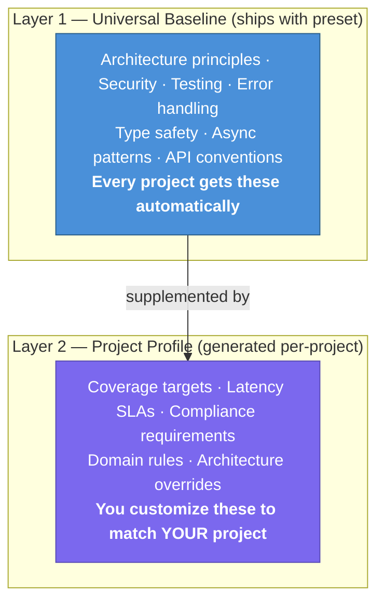

# Customizing the Plan Forge Framework

> **Purpose**: Guide for adapting this template to your specific project, tech stack, and team workflow.  
> **Also see**: [docs/COPILOT-VSCODE-GUIDE.md](docs/COPILOT-VSCODE-GUIDE.md) — How to run the pipeline in VS Code with Copilot

---

## After Running `setup.ps1`

The setup wizard copies preset files and generates your project-specific configuration. If you used `-Agent claude`, `-Agent cursor`, or `-Agent codex`, native files for those agents were also generated — including rich context files with all 16 guardrail files embedded, all prompts as native skills/commands, all 19 reviewer agents as invocable skills, and smart instructions that emulate Copilot's auto-loading and post-edit scanning. Copilot files are always installed.

Here's what to customize next:

### 1. Define Project Principles (Recommended)

Run the **Project Principles** prompt to declare your project's non-negotiable principles:

1. Open VS Code → Copilot Chat → Agent Mode
2. Use the prompt: `.github/prompts/project-principles.prompt.md`
3. Choose your path: **A)** Interview, **B)** Starter set for your stack, or **C)** Discover from codebase
4. The prompt generates `docs/plans/PROJECT-PRINCIPLES.md`

This creates binding declarations — what the project believes, what tech is locked in, what patterns are forbidden. Checked automatically in Steps 1, 2, and 5.

> **Not sure what your principles should be?** Pick Path B — it offers stack-specific starter principles you can accept, modify, or reject.
>
> **Want to see a real example?** See [docs/plans/examples/PROJECT-PRINCIPLES-EXAMPLE.md](docs/plans/examples/PROJECT-PRINCIPLES-EXAMPLE.md) (anonymized multi-tenant SaaS platform).

### 2. Generate a Project Profile (Recommended)

Run the **Project Profile** prompt to customize guardrails for your project:

1. Open VS Code → Copilot Chat → Agent Mode
2. Use the prompt: `.github/prompts/project-profile.prompt.md`
3. Answer the interview questions about your project's quality standards
4. The prompt generates `.github/instructions/project-profile.instructions.md`

**Project Principles vs Project Profile**: Principles = what the project *believes* (human declarations). Profile = how Copilot should *write code* (generated guardrails). Both optional, both complementary.

> **Want to see a real example?** See [docs/plans/examples/PROJECT-PROFILE-EXAMPLE.md](docs/plans/examples/PROJECT-PROFILE-EXAMPLE.md) (anonymized multi-tenant SaaS platform).

| | Project Principles | Project Profile |
|---|---|---|
| **What it is** | "We use PostgreSQL, not MongoDB" | "Use parameterized queries with Dapper" |
| **Who writes it** | You (or guided by the workshop) | Generated from interview answers |
| **Example: Testing** | "90% coverage on business logic — non-negotiable" | "Use xUnit with `[Fact]` and `[Theory]`, mock with NSubstitute" |
| **Example: Architecture** | "All data access goes through repositories — no direct SQL in services" | "Repositories return domain objects, not DTOs. Use async/await for all DB calls" |
| **Example: Security** | "No secrets in code — ever" | "Use `IConfiguration` for secrets, validate all input with FluentValidation" |
| **When it matters** | Rejects a PR that uses MongoDB when Postgres is committed | Tells Copilot *how* to write the Postgres query correctly |

This creates **project-specific** quality standards that supplement the universal baseline.

#### Two-Layer Guardrail Model



**Layer 1** ensures every project gets industry-standard guardrails — teams that don't know what to ask still get type safety, error handling, security basics, and architectural separation.

**Layer 2** lets experienced teams dial in project-specific constraints — a fintech API might require SOC2 compliance and P95 < 200ms, while a marketing site needs WCAG AA accessibility.

**Load order** (every agent session):
1. `.github/copilot-instructions.md` — Project overview (always loaded)
2. `architecture-principles.instructions.md` — Universal baseline (Layer 1)
3. `project-profile.instructions.md` — Project-specific (Layer 2, if present)
4. Domain-specific `*.instructions.md` — Per-file-type (existing behavior)

**If Layer 2 conflicts with Layer 1**: The project profile wins for that specific project. Example: Layer 1 says "TDD for business logic" → Layer 2 says "TDD for ALL code" → Layer 2 applies.

#### Customization Flow

```mermaid
flowchart LR
    A["Run Setup Wizard<br/><code>setup.ps1</code>"] --> B["Get Universal Baseline<br/><i>17 instruction files</i>"]
    B --> C["Run Project Profile Prompt<br/><i>optional, recommended</i>"]
    C --> D["Answer Interview<br/><i>testing, performance,<br/>security, domain rules</i>"]
    D --> E["Generated:<br/><code>project-profile.instructions.md</code>"]
    E --> F["AI loads BOTH layers<br/>every session"]

    style A fill:#D1ECF1,stroke:#0C5460,color:#333
    style B fill:#4A90D9,stroke:#2C5F8A,color:#fff
    style C fill:#FFF3CD,stroke:#C9A800,color:#333
    style D fill:#FFF3CD,stroke:#C9A800,color:#333
    style E fill:#7B68EE,stroke:#5A4CB5,color:#fff
    style F fill:#D4EDDA,stroke:#155724,color:#333
```



> **Skip this step** if the universal baseline is sufficient for your project. You can always run the profile prompt later.

### 2. Update `.github/copilot-instructions.md`

The wizard generates a starter file. Customize it with:

- **Project overview**: What your app does, who it's for
- **Tech stack details**: Specific versions, frameworks, libraries
- **Architecture patterns**: How your layers are organized
- **Domain-specific rules**: Business logic conventions, data models
- **Common patterns**: Code examples your team uses repeatedly

### 3. Add Domain-Specific Instruction Files

The presets include 17 instruction files (18 for TypeScript, which adds `frontend.instructions.md`). Add your own for project-specific domains:

```
.github/instructions/
├── architecture-principles.instructions.md  ← From shared
├── api-patterns.instructions.md             ← From preset
├── auth.instructions.md                     ← From preset
├── caching.instructions.md                  ← From preset
├── dapr.instructions.md                     ← From preset
├── database.instructions.md                 ← From preset
├── deploy.instructions.md                   ← From preset
├── errorhandling.instructions.md            ← From preset
├── frontend.instructions.md                 ← From preset (TypeScript only)
├── graphql.instructions.md                  ← From preset
├── messaging.instructions.md                ← From preset
├── multi-environment.instructions.md        ← From preset
├── observability.instructions.md            ← From preset
├── performance.instructions.md              ← From preset
├── project-principles.instructions.md       ← From preset (activates when PROJECT-PRINCIPLES.md exists)
├── security.instructions.md                 ← From preset
├── testing.instructions.md                  ← From preset
├── version.instructions.md                  ← From preset
├── git-workflow.instructions.md             ← From shared
│
├── your-domain.instructions.md              ← ADD: Your domain rules
├── your-api.instructions.md                 ← ADD: API conventions
└── your-ui.instructions.md                  ← ADD: UI patterns
```

Each instruction file should have YAML frontmatter:

```yaml
---
description: Short description of what this file covers
applyTo: 'path/glob/pattern/**/*.ext'
priority: HIGH
---
```

### How `applyTo` Works (Copilot Automatic Loading)

GitHub Copilot reads instruction files **automatically** based on the `applyTo` glob pattern in the YAML frontmatter. When you open a file matching the pattern, Copilot loads that instruction file into context.

**Key rules:**
- `applyTo: '**'` loads for ALL files (use sparingly — consumes context budget)
- `applyTo: '**/*.cs'` loads only when editing C# files
- `applyTo: 'docs/plans/**'` loads only when editing plan documents
- Multiple patterns: not currently supported — use one glob per file
- The `.github/copilot-instructions.md` file (no frontmatter) is loaded **every** session

**Common patterns by stack:**

| Stack | Pattern | Loads When |
|-------|---------|------------|
| .NET | `'**/*.cs'` | Any C# file |
| TypeScript | `'**/*.ts'` | Any TypeScript file |
| Python | `'**/*.py'` | Any Python file |
| SQL | `'**/*.sql'` | Any SQL migration |
| Docker | `'**/Dockerfile'`, `'docker-compose*.yml'` | Docker files |
| Plans | `'docs/plans/**'` | Plan documents |

**Context budget tip:** Each loaded instruction file consumes part of Copilot's context window. Keep instruction files under ~150 lines and use specific `applyTo` patterns instead of `'**'`.

### VS Code Settings (Optional)

Copy `templates/vscode-settings.json.template` to `.vscode/settings.json` in your project to get recommended Copilot settings:

```powershell
# Copy the template
cp templates/vscode-settings.json.template .vscode/settings.json
```

The template configures:
- Copilot agent mode enabled
- Code generation instruction file references
- Markdown word wrap for plan files
- File associations for `.instructions.md` files

### 3. Customize Prompt Templates, Agent Definitions & Skills

The presets include scaffolding recipes, reviewer roles, and multi-step procedures. Customize them for your project:

**Prompt templates** (`.github/prompts/`):
- Edit code examples to match your project's naming conventions, patterns, and frameworks
- Add project-specific validation rules, required fields, or domain constraints
- Reference your actual service interfaces and repository patterns

**Agent definitions** (`.github/agents/`):
- Add project-specific checklist items (e.g., "Verify tenant isolation in all queries")
- Reference your instruction files in the agent's Context Files list
- Customize anti-pattern examples to match your codebase

**Skills** (`.github/skills/`):
- Update build/test/deploy commands to match your CI/CD pipeline
- Add project-specific validation steps (e.g., "Run RLS tests after migration")
- Customize verification queries for your database schema

#### `azure-iac` Preset — Additional Customization

If you're using the `azure-iac` preset, two extra steps make the guardrails enterprise-ready for your org:

**1. Populate `org-rules.instructions.md`** (fills the "org-specific knowledge base" layer of the sweeper):

Run the `new-org-rules` prompt in Copilot Chat:
```
#file:.github/prompts/new-org-rules.prompt.md
```
This interviews you about your org's Azure standards (approved regions, SKUs, naming overrides, compliance frameworks, classification levels) and generates a fully-populated `.github/instructions/org-rules.instructions.md`.

**2. Tune the `azure-sweeper` for your environment** (`.github/agents/azure-sweeper.agent.md`):
- Add your subscription ID and default resource group scope to the agent's opening questions
- Adjust the Secure Score pass threshold (default: ≥ 70%) to match your team's target
- Add org-specific Resource Graph queries to Layer 6 for your custom orphan-detection rules

**3. Adjust WAF/CAF baselines** (`.github/instructions/waf.instructions.md`, `caf.instructions.md`):
- Mark which WAF pillars are highest priority for your workload type
- Update the mandatory tag list in `caf.instructions.md` to match your billing/CMDB taxonomy

**Run the sweeper** once your IaC is in place:
```
(Select azure-sweeper from the agent picker)
Sweep subscription <id> and generate a findings report with Bicep remediation code.
```

### 4. Create Agents with `/create-agent` and Use Handoffs

#### `/create-agent` — Interactive Agent Scaffolding

VS Code Copilot's `/create-agent` slash command scaffolds `.agent.md` files interactively. Describe a persona in natural language, and the AI generates a complete agent definition with frontmatter, tools, and instructions.

**When to use it:**
- Creating domain-specific reviewers beyond the 6 presets (e.g., "billing domain expert", "accessibility auditor")
- Extracting a useful agent persona from a conversation into a reusable `.agent.md` file
- Quickly prototyping a new agent role before refining it manually

**Example:**
```
/create-agent A billing domain expert that reviews invoice calculations,
tax logic, and payment gateway integrations for correctness.
```

This complements the preset agents — use `/create-agent` for project-specific roles, keep the presets for universal concerns (architecture, security, performance).

#### Pipeline Agents with Handoffs

The template includes **6 pipeline agents** that automate the full Specify → Pre-flight → Plan → Execute → Review → Ship workflow using `handoffs:` — a frontmatter property that wires agent-to-agent transitions with clickable buttons:

| Agent | Role | Hands Off To |
|-------|------|-------------|
| `specifier.agent.md` | Interviews user to define what & why (Step 0) | Plan Hardener |
| `plan-hardener.agent.md` | Runs pre-flight checks (Step 1) + hardens into execution contract (Step 2) | Executor |
| `executor.agent.md` | Executes slices with validation gates | Reviewer Gate |
| `reviewer-gate.agent.md` | Read-only audit for drift and violations | Shipper (PASS) / Executor (LOCKOUT) |
| `shipper.agent.md` | Commits, updates roadmap, captures postmortem, push/PR | (terminal) |

**How handoffs work:**
1. Start a chat with the Specifier agent — describe your feature idea
2. When the spec is complete, a **"Start Plan Hardening →"** button appears
3. Click it to switch to the Plan Hardener agent
4. When hardening is complete, a **"Start Execution →"** button appears
5. Click it to switch to the Executor agent with context carried over
6. When execution completes, a **"Run Review Gate →"** button appears
7. Click it to switch to the read-only Reviewer Gate
8. If the review passes, click **"Ship It →"** to switch to the Shipper agent
9. If the review fails (LOCKOUT), click **"Fix Issues →"** to return to the Executor

The `handoffs:` frontmatter looks like:
```yaml
handoffs:
  - agent: "executor"
    reason: "Plan is hardened — ready for execution."
    send: false  # User reviews the prompt before submitting
    prompt: "Execute the hardened plan slice-by-slice."
```

> **Note**: `send: false` means the user always reviews the handoff prompt before it's sent — no automatic execution.

These pipeline agents are functionally identical to the copy-paste prompts in the Runbook Instructions. Use whichever approach you prefer.

### 5. Configure `AGENTS.md`

The wizard generates a starter `AGENTS.md`. Add:

- **Background workers/services**: What they do, how they're configured
- **Event processing**: Pub/sub topics, message schemas
- **Scheduled tasks**: Cron patterns, what runs when
- **Agent communication**: How services talk to each other

### 6. Set Up Your Roadmap

Edit `docs/plans/DEPLOYMENT-ROADMAP.md`:

```markdown
## Active Phases

### Phase 1: <Your First Feature>
**Goal**: One-line description
**Plan**: [Phase-1-YOUR-FEATURE-PLAN.md](./Phase-1-YOUR-FEATURE-PLAN.md)
**Status**: 📋 Planned
```

---

## Customizing the Runbook Prompts

### Build & Test Commands

The runbook prompts use `{BUILD_CMD}` and `{TEST_CMD}` placeholders. If you used a preset, these are already filled in. For custom setups, search and replace:

| Placeholder | .NET | TypeScript | Python | Your Stack |
|-------------|------|------------|--------|------------|
| `{BUILD_CMD}` | `dotnet build` | `pnpm build` | `python -m build` | `???` |
| `{TEST_CMD}` | `dotnet test` | `pnpm test` | `pytest` | `???` |
| `{LINT_CMD}` | `dotnet format --verify-no-changes` | `pnpm lint` | `ruff check .` | `???` |
| `{TEST_FILTER}` | `--filter "Category=UnitTests"` | `-- --run --grep unit` | `-m unit` | `???` |

### Validation Gate Commands

Update the Execution Slice template's validation gates to match your stack:

```markdown
**Validation Gates**:
- [ ] `{BUILD_CMD}` passes with zero errors
- [ ] `{TEST_CMD}` — all pass
- [ ] `{LINT_CMD}` — no violations
```

### Anti-Pattern Grep

The runbook includes an optional anti-pattern scan. Customize for your language:

**C# / .NET:**
```bash
grep -rn "\.Result\b\|\.Wait()\|\.GetAwaiter().GetResult()" --include="*.cs"
```

**TypeScript / JavaScript:**
```bash
grep -rn "any\b\|as any\|@ts-ignore\|@ts-expect-error" --include="*.ts"
```

**Python:**
```bash
grep -rn "# type: ignore\|noqa\|bare except" --include="*.py"
```

---

## Customizing Pre-flight Checks

The Pre-flight Prompt in the Instructions file checks for guardrail files. Update the domain keyword → guardrail mapping for your project:

```text
5. DOMAIN GUARDRAILS — Scan <YOUR-PLAN>.md for keywords to identify relevant domains.
   For each domain detected, confirm the guardrail file exists:
   - UI/Component/Frontend → .github/instructions/frontend.instructions.md
   - Database/SQL/Repository → .github/instructions/database.instructions.md
   - API/Route/Controller → .github/instructions/api-patterns.instructions.md
   - Auth/OAuth/JWT/OIDC → .github/instructions/auth.instructions.md
   - GraphQL/Schema/Resolver → .github/instructions/graphql.instructions.md
   - Docker/K8s/Deploy → .github/instructions/deploy.instructions.md
   - Security/CORS/Secrets → .github/instructions/security.instructions.md
   - <YOUR DOMAIN> → .github/instructions/<your-domain>.instructions.md
```

---

## Customizing the Reviewer Gate

The Reviewer Gate checklist in the runbook is generic. Add project-specific checks:

```markdown
Review checklist:
1. SCOPE COMPLIANCE — Are all changes within the Scope Contract?
2. FORBIDDEN ACTIONS — Were any off-limits files touched?
3. ARCHITECTURE — Does the code follow layer separation?
4. ERROR HANDLING — Proper error types, no empty catch blocks?
5. SECURITY — Input validation? No secrets in code?
6. TESTING — New features covered by tests?
7. <YOUR CHECK> — Your project-specific rule
8. <YOUR CHECK> — Another project-specific rule
```

---

## Adding a New Tech Preset

To contribute a preset for a new tech stack:

1. Create `presets/your-stack/` directory
2. Add **instruction files** (`.github/instructions/` — 17 files):
   - `api-patterns.instructions.md` — REST conventions, error responses
   - `auth.instructions.md` — JWT/OIDC, RBAC, multi-tenant isolation, API keys
   - `caching.instructions.md` — Cache strategies
   - `dapr.instructions.md` — Dapr sidecar patterns, state stores, pub/sub
   - `database.instructions.md` — ORM/query patterns
   - `deploy.instructions.md` — Deployment patterns
   - `errorhandling.instructions.md` — Exception hierarchy, error boundaries
   - `graphql.instructions.md` — Schema design, resolvers, DataLoader
   - `messaging.instructions.md` — Pub/sub, queues, event-driven patterns
   - `multi-environment.instructions.md` — Dev/staging/prod config
   - `observability.instructions.md` — Logging, metrics, tracing
   - `performance.instructions.md` — Hot/cold path, allocation reduction
   - `security.instructions.md` — Security patterns
   - `testing.instructions.md` — Test framework patterns
   - `version.instructions.md` — Semantic versioning, release tagging   - `project-principles.instructions.md` — Auto-loads declared principles and forbidden patterns (activates when `docs/plans/PROJECT-PRINCIPLES.md` exists)

3. Add **prompt templates** (`.github/prompts/` — 15 files):
   - `bug-fix-tdd.prompt.md` — Red-Green-Refactor bug fix
   - `new-config.prompt.md` — Typed configuration with validation
   - `new-controller.prompt.md` — REST controller with auth, error mapping
   - `new-dockerfile.prompt.md` — Multi-stage Dockerfile
   - `new-dto.prompt.md` — Request/response DTOs with validation
   - `new-entity.prompt.md` — End-to-end entity scaffolding
   - `new-error-types.prompt.md` — Custom exception hierarchy
   - `new-event-handler.prompt.md` — Event handler with retry, DLQ
   - `new-graphql-resolver.prompt.md` — GraphQL resolver with DataLoader
   - `new-middleware.prompt.md` — Request pipeline middleware
   - `new-repository.prompt.md` — Data access layer
   - `new-service.prompt.md` — Service class with DI, logging
   - `new-test.prompt.md` — Unit/integration test
   - `new-worker.prompt.md` — Background worker/job   - `project-principles.prompt.md` — Guided workshop to define non-negotiable principles, tech commitments, and forbidden patterns

4. Add **agent definitions** (`.github/agents/` — 6 files):
   - `architecture-reviewer.agent.md` — Layer separation audit
   - `security-reviewer.agent.md` — OWASP Top 10 audit
   - `database-reviewer.agent.md` — SQL safety, N+1, naming
   - `performance-analyzer.agent.md` — Hot paths, allocations
   - `test-runner.agent.md` — Run tests, diagnose failures
   - `deploy-helper.agent.md` — Build, deploy, verify
5. Add **skills** (`.github/skills/` — 8 directories):
   - `database-migration/SKILL.md` — Generate → validate → deploy migrations
   - `staging-deploy/SKILL.md` — Build → push → migrate → verify
   - `test-sweep/SKILL.md` — Run all test suites, aggregate results
   - `dependency-audit/SKILL.md` — Scan for vulnerable, outdated, or license-conflicting packages
   - `code-review/SKILL.md` — Comprehensive review: architecture, security, testing, patterns
   - `release-notes/SKILL.md` — Generate release notes from git history and CHANGELOG
   - `api-doc-gen/SKILL.md` — Generate or update OpenAPI spec, validate consistency
   - `onboarding/SKILL.md` — Walk a new developer through setup, architecture, and first task
   - `health-check/SKILL.md` — Forge diagnostic: forge_smith → forge_validate → forge_sweep
   - `forge-execute/SKILL.md` — Guided plan execution: list plans → estimate → execute → report
6. Add `AGENTS.md` — Agent/worker patterns for this stack
7. Add `.github/copilot-instructions.md` — Stack-specific conventions
8. Add an example plan in `docs/plans/examples/Phase-YOUR-STACK-EXAMPLE.md`
9. Update `setup.ps1` and `setup.sh` to support the new preset name
10. Update `README.md` preset table

### Preset File Conventions

- Use the same file names across presets (consistency)
- **Instruction files**: Include frontmatter with `applyTo` globs matching the stack's file extensions
- **Prompt templates**: Include stack-specific code examples and tool references
- **Agent definitions**: Include stack-specific checklists, anti-patterns, and tool access rules
- **Skills**: Include stack-specific build/test/deploy commands
- Include at least 3 "do this" / "don't do this" examples per instruction file
- Reference the stack's actual tooling (test runners, linters, build tools)

---

## Setting Up Project Principles (Optional)

Define your project's non-negotiable principles, technology commitments, and forbidden patterns:

1. Open VS Code → Copilot Chat → Agent Mode
2. Use the prompt: `.github/prompts/project-principles.prompt.md`
3. Walk through the guided workshop — answer questions about identity, principles, tech, quality, forbidden patterns, and governance
4. The prompt generates `docs/plans/PROJECT-PRINCIPLES.md`

**Project Principles vs Project Profile**:
- **Project Principles** = what the project *believes* (human-authored declarations)
- **Project Profile** = how Copilot should *write code* (generated guardrails)
- Both are optional. Both auto-load. They complement each other.

---

## Using External Specifications (Optional)

If you already have specification files (from any spec-driven workflow), you can reference them as authoritative inputs:

1. In your hardened plan's Scope Contract, fill in the **Specification Source** section:
   ```markdown
   ### Specification Source (Optional)
   - Spec file: docs/specs/my-feature/spec.md
   - Requirements doc: docs/specs/my-feature/requirements.md
   ```
2. Step 2 (Harden) will map each execution slice to requirements via `Traces to:` fields
3. Step 5 (Review) will verify bidirectional traceability — every requirement has a slice, every slice has a requirement

Alternatively, use the **Requirements Register** directly in your plan for standalone traceability without external spec files.

---

## Installing Extensions (Optional)

Extensions let teams share custom guardrail files as portable packages.

See [docs/EXTENSIONS.md](docs/EXTENSIONS.md) for the full guide covering:
- Extension structure and manifest format
- Three installation methods (manual, setup script, CLI)
- How to create and distribute your own extensions

---

## Lifecycle Hooks (Automatic)

Plan Forge installs **lifecycle hooks** (`.github/hooks/plan-forge.json`) that run automatically during Copilot Agent sessions:

| Hook | When | What It Does |
|------|------|-------------|
| **SessionStart** | New session opens | Injects Project Principles, current phase, forbidden patterns, and Plan Forge version into context |
| **PreToolUse** | Before any file edit | Reads the active plan's Forbidden Actions and **blocks** edits to forbidden paths |
| **PostToolUse** | After any file edit | Scans the edited file for TODO/FIXME/stub markers and warns immediately |

**No configuration needed** — hooks are installed by `setup.ps1` and run automatically. To customize:
- Edit `.github/hooks/plan-forge.json` to add/remove hook events
- Edit `.github/hooks/scripts/*.sh` / `*.ps1` to change hook behavior
- Use `/create-hook` in Copilot Chat to generate new hooks with AI assistance

---

## Autonomous Execution

Plan Forge includes one-command plan execution with the `pforge run-plan` CLI and `forge_run_plan` MCP tool.

### Execution Modes

| Mode | Command | How It Works |
|------|---------|-------------|
| **Full Auto** | `pforge run-plan <plan>` | `gh copilot` CLI executes each slice with full project context |
| **Assisted** | `pforge run-plan --assisted <plan>` | You code in VS Code; orchestrator prompts and validates gates |
| **Estimate** | `pforge run-plan --estimate <plan>` | Shows slice count, token estimate, and cost — without executing |

### Model Routing

Configure which model executes which step type in `.forge.json`:

```json
{
  "modelRouting": {
    "execute": "gpt-5.2-codex",
    "review": "claude-sonnet-4.6",
    "default": "auto"
  }
}
```

Override for a single run: `pforge run-plan <plan> --model claude-opus-4.6`

### Parallel Execution

Mark independent slices with `[P]` in your hardened plan and they'll execute concurrently:

```markdown
### Slice 3: Auth Module [P] [scope: src/auth/**]
### Slice 4: User Module [P] [scope: src/user/**]
### Slice 5: Integration [depends: Slice 3, Slice 4]
```

Configure max parallelism in `.forge.json`:
```json
{ "maxParallelism": 3 }
```

### Dashboard

Monitor runs at `localhost:3100/dashboard`:
- **Progress** — live slice cards with WebSocket updates
- **Runs** — history table with cost/duration
- **Cost** — spend per model, monthly trends
- **Actions** — one-click smith, sweep, analyze
- **Replay** — browse agent session logs per slice
- **Config** — visual `.forge.json` editor

### Cost Tracking

Token usage is automatically logged per slice/model. View with:
- Dashboard Cost tab
- `forge_cost_report` MCP tool
- `.forge/cost-history.json` (raw data)

---

## Skill Slash Commands (Automatic)

After setup, ten skills are available as slash commands in Copilot Chat:

| Command | What It Does |
|---------|-------------|
| `/database-migration` | Generate, review, test, and deploy schema migrations |
| `/staging-deploy` | Build, push, migrate, deploy, and verify on staging |
| `/test-sweep` | Run all test suites and aggregate results |
| `/dependency-audit` | Scan dependencies for vulnerabilities, outdated packages, license issues |
| `/code-review` | Comprehensive review: architecture, security, testing, patterns |
| `/release-notes` | Generate release notes from git history and CHANGELOG |
| `/api-doc-gen` | Generate or update OpenAPI spec, validate spec-to-code consistency |
| `/onboarding` | Walk a new developer through project setup, architecture, and first task |
| `/health-check` | Forge diagnostic: forge_smith → forge_validate → forge_sweep |
| `/forge-execute` | Guided plan execution: list plans → estimate cost → execute → report |

Type `/` in the chat input to see these alongside your prompt templates. Add `user-invocable: false` to a skill's frontmatter to hide it from the menu while keeping it auto-invocable.

---

## Tuning for Different Models

Plan Forge's prompts are calibrated for Claude Opus 4.6 (the default model in VS Code Copilot as of 2026) and work well across all modern models. Below are model-specific tips for the best experience.

### Claude Opus 4.6 (Default — No Changes Needed)

Claude Opus 4.6 is significantly more responsive to instructions than earlier models. Key differences:

- **More proactive**: Follows instructions without being told twice. Language like "CRITICAL: You MUST..." that was needed for earlier models will cause overtriggering on Opus 4.6.
- **Adaptive thinking**: Automatically calibrates how much reasoning to apply based on task complexity. You don't need to say "think thoroughly" — the model does this naturally.
- **Overengineering tendency**: May add abstractions, extra files, or flexibility that wasn't requested. The `<implementation_discipline>` tags in Step 3 address this.
- **Parallel execution**: Excels at running multiple tool calls in parallel. Plan Forge's `[parallel-safe]` tagging maps directly to this capability.

### If the Model Over-Halts

If the agent pauses too frequently on minor ambiguities, add this to your `.github/copilot-instructions.md`:

```markdown
When you're deciding how to approach a problem, choose an approach and commit to it.
Avoid revisiting decisions unless you encounter information that directly contradicts
your reasoning. If you're weighing two approaches, pick one and proceed. You can
always course-correct later if the chosen approach fails.
```

### If the Model Over-Explores

If the agent spends too many tokens reading context before starting work, add:

```markdown
Gather enough context to proceed confidently, then move to implementation.
If multiple searches return overlapping results, you have enough context.
```

### If the Model Overengineers

The `<implementation_discipline>` block in Step 3 handles most cases. For persistent overengineering, add to your project profile:

```markdown
Keep solutions focused on what was explicitly requested. A bug fix doesn't need
surrounding code cleaned up. A simple feature doesn't need extra configurability.
Do not create helpers or abstractions for one-time operations.
```

### Context Budget Management

Claude 4.6 has strong context awareness and can track its remaining token budget. For long phases (10+ slices):

- Plan session breaks in Step 2: "Session break after Slice N"
- Keep instruction files under ~150 lines each
- Use targeted `applyTo` patterns instead of `'**'` (which loads on every file)
- In execution slices, reference only the Scope Contract section of the plan, not the full document

### Effort Parameter (API Users)

If using Claude 4.6 via the API (not VS Code Copilot), use the `effort` parameter instead of `budget_tokens`:

| Task | Recommended Effort |
|------|-------------------|
| Plan hardening (Step 2) | `high` |
| Slice execution (Step 3) | `medium` to `high` |
| Completeness sweep (Step 4) | `medium` |
| Review gate (Step 5) | `high` |

### GPT-4o / Codex

GPT-4o and Codex work well with Plan Forge prompts out of the box. Minor adjustments for best results:

- **Stronger directives**: GPT sometimes paraphrases instructions. If the agent improvises, add "Follow each step exactly as written. Do not skip or reorder steps." to your `.github/copilot-instructions.md`.
- **Context window**: GPT-4o has 128K tokens (vs Claude's 1M). For large plans with many guardrail files, keep instruction files under 100 lines and use specific `applyTo` patterns instead of `'**'`.
- **Codex for execution**: Codex excels at Step 3 (slice execution) — it's fast and focused. Less ideal for Step 0 (specification) which benefits from Claude's conversational depth.

### Gemini 2.5

Gemini has strong reasoning and a 1M token context window. Adjustments:

- **Verbosity**: Gemini tends to over-explain. Add to your context file: "Be concise. Do not explain your reasoning unless asked. Show code, not commentary."
- **Checklist adherence**: Gemini follows structured checklists well but may elaborate between items. The structured plan format works to your advantage here.
- **MCP support**: Gemini CLI supports MCP — the forge tools work natively.

### Switching Models Mid-Pipeline

You can use different models for different pipeline steps:

| Step | Best Model | Why |
|------|-----------|-----|
| Step 0 (Specify) | Claude | Best at conversational interviews and ambiguity detection |
| Step 2 (Harden) | Claude or GPT-4o | Both handle structured plan generation well |
| Step 3 (Execute) | Any / Codex | Execution is mechanical — all models handle it |
| Step 5 (Review) | Claude | Best at independent critical review |
| Step 6 (Ship) | Any | Commit + roadmap update is straightforward |

The 4-session isolation model makes this natural — each session can use a different model.

---

## Persistent Memory with OpenBrain (Optional)

Plan Forge's 3-session model is powerful, but each session starts fresh. [OpenBrain](https://github.com/srnichols/OpenBrain) adds **persistent semantic memory** — decisions, patterns, and lessons captured in one session are searchable in every future session, across any AI tool.

### Why This Changes Everything

Without memory, every session re-discovers what previous sessions already knew. Post-mortems sit in Markdown files nobody re-reads. The same mistakes repeat because lessons are effectively write-only.

With OpenBrain installed, knowledge **compounds across phases**:

```
Phase 1:  0 prior thoughts  →  captures 8 decisions
Phase 2:  8 thoughts loaded  →  avoids 2 prior mistakes, captures 12 more
Phase 3:  20 thoughts loaded →  reuses 3 patterns, captures 10 more
Phase 5:  40+ thoughts       →  agent has full project context from day one
```

Each phase costs less in rework because the agent already knows what worked, what failed, and why. A new team member (or a fresh Copilot session) gets the same institutional knowledge as someone who was there from the start.

### What Integrates with OpenBrain

When the extension is installed, **every pipeline touchpoint** participates — not just the extension files:

| Component | Search Before | Capture After |
|-----------|--------------|---------------|
| **8 pipeline prompts** (step0–step6 + profile) | ✅ Prior decisions, patterns, lessons | ✅ Specs, plans, reviews, postmortems |
| **6 pipeline agents** (specifier → shipper) | ✅ Phase context, TBD resolution | ✅ Decisions, outcomes, verdicts |
| **6 stack agents × 6 presets** (36 files) | ✅ Prior review findings, accepted risks | ✅ Review findings for trend tracking |
| **8 shared agents** (cross-stack reviewers) | ✅ Prior cross-cutting findings | ✅ API, accessibility, security, compliance, error handling findings |
| **5 azure-iac agents** (IaC reviewers) | ✅ Prior Bicep/Terraform/sweep findings | ✅ IaC review and sweep results |
| **10 skills (8 × 5 presets + 2 shared)** (42 files) | ✅ Prior failures, patterns, conventions | ✅ Outcomes, recurring issues |
| **3 azure-iac skills** (infra-deploy, infra-test, azure-sweep) | ✅ Deploy failures, test patterns, sweep history | ✅ Deploy/test/sweep outcomes |
| **SessionStart hook** | ✅ Reminds agent to search on session open | — |
| **Stop hook** | — | ✅ Reminds agent to capture before ending |

All calls include `project`, `created_by`, `source`, and `type` for full provenance tracking. **106 files total** with OpenBrain hooks — all gated behind "if configured."

### What it costs: Zero if not installed

Every integration is gated behind "if OpenBrain is configured." Without it, prompts, agents, hooks, and skills work identically. There is no new dependency, no behavior change, and no performance impact for users who don't opt in.

### Why This Matters: Better Code, Fewer Bugs, Less Rework

- **Agents stop re-discovering solved problems** — A convention captured in Phase 1 is found by the Executor in Phase 8 via a single search call. No human reminding needed.
- **Bugs get prevented, not just detected** — The Security Reviewer captures "missing rate limiting on /login." The next Executor building auth finds it *before* coding, saving a full review-fix-re-review cycle.
- **Lower token spend per phase** — One `search_thoughts()` returns 5–10 relevant decisions in ~500 tokens. Without memory, the agent reads 10+ files to reconstruct context (~5,000+ tokens). That difference multiplies across every slice, every phase.
- **Review quality compounds** — Each Review Gate captures findings with `type: "postmortem"`. Future reviews search those first — the agent already knows this codebase's weak spots.
- **Long-running projects** — "Why did we choose PostgreSQL over MongoDB?" gets an answer with exact reasoning, phase number, and who decided — months later.
- **Team rotation** — New member or new AI tool gets the same institutional knowledge as someone who was there from Phase 1.
- **Cross-tool portability** — A decision captured from Copilot is searchable from Claude, Cursor, ChatGPT, or a CI/CD pipeline. Your context travels with you.

### Setup

1. **Deploy OpenBrain** — [Docker Compose](https://github.com/srnichols/OpenBrain) (local), Supabase (cloud), Azure Container Apps (`deploy/azure/main.bicep`), or Kubernetes (production)
2. **Install the extension** (auto-configures `.vscode/mcp.json`):
   ```bash
   pforge ext install docs/plans/examples/extensions/plan-forge-memory
   ```
3. **Set your MCP key** — The install adds the OpenBrain server to `.vscode/mcp.json` pointing to `localhost:8080`. Set the key:
   ```bash
   # Linux / macOS
   export OPENBRAIN_KEY=your-mcp-access-key

   # Windows (PowerShell)
   $env:OPENBRAIN_KEY = "your-mcp-access-key"
   ```
   If OpenBrain runs on a different host, edit the `url` in `.vscode/mcp.json`:
   - **Tailscale**: `https://<your-machine>.<tailnet>.ts.net/sse?key=${env:OPENBRAIN_KEY}`
   - **Azure**: `https://openbrain-api.<region>.azurecontainerapps.io/sse?key=${env:OPENBRAIN_KEY}`

### What It Adds

| File | Purpose |
|------|---------|
| `persistent-memory.instructions.md` | Rules for when to search and capture decisions |
| `memory-reviewer.agent.md` | Audits whether key decisions were captured |
| `/search-project-history` | Search OpenBrain for prior decisions |
| `/capture-decision` | Structured decision capture with rationale |

### What It Does NOT Replace

OpenBrain supplements — it doesn't replace — hardened plans, instruction files, Project Principles, or Git history. Those remain the source of truth for scope and code. OpenBrain captures the *reasoning and context* behind decisions — the "why" that doesn't live anywhere else.

---

## Installing as a VS Code Plugin (Alternative to setup.ps1)

Instead of running `setup.ps1`, you can install Plan Forge as a **VS Code agent plugin**:

1. Open Command Palette → `Chat: Install Plugin From Source`
2. Enter: `https://github.com/srnichols/plan-forge`
3. Plan Forge's skills, agents, hooks, and prompts appear in chat

> **Note**: The plugin system is in Preview. For full control over installed files, use `setup.ps1`.

---

## CLI Quick Reference (Optional)

The `pforge` CLI is a convenience wrapper — every command shows the equivalent manual steps.

```
pforge init              Bootstrap project (delegates to setup.ps1/sh)
pforge check             Validate setup (delegates to validate-setup.ps1/sh)
pforge smith             Inspect the forge — environment, VS Code config, setup health, common problems
pforge status            Show phase status from DEPLOYMENT-ROADMAP.md
pforge new-phase <name>  Create plan file + add to roadmap
pforge branch <plan>     Create branch from plan's Branch Strategy
pforge sweep             Scan code for TODO/FIXME/stub markers (completeness check)
pforge diff <plan>       Compare changed files against plan's Scope Contract
pforge analyze <plan>    Cross-artifact analysis — requirement traceability, test coverage, scope compliance
pforge commit <plan> <N> Commit with conventional message from slice goal
pforge phase-status <plan> <status>  Update roadmap (planned|in-progress|complete|paused)
pforge ext search [q]    Search the community extension catalog
pforge ext add <name>    Download and install from catalog
pforge ext info <name>   Show extension details
pforge ext install <p>   Install extension from local path
pforge ext list          List installed extensions
pforge ext remove <name> Remove an extension
pforge help              Show all commands
```

---

## CI Validation (Optional)

Add automated plan validation to your PR workflow:

```yaml
# .github/workflows/plan-forge-validate.yml
name: Plan Forge Validate
on: [pull_request]
jobs:
  validate:
    runs-on: ubuntu-latest
    steps:
      - uses: actions/checkout@v4
      - uses: srnichols/plan-forge-validate@v1
```

This checks setup health, file counts, placeholders, orphans, and plan artifacts on every PR. See [docs/plans/examples/plan-forge-validate.yml](docs/plans/examples/plan-forge-validate.yml) for all options.

---

## Removing Template Scaffolding

After setup, you can safely delete these directories:

```
presets/          ← Only needed during setup
templates/        ← Only needed for manual setup
setup.ps1         ← Only needed once
CUSTOMIZATION.md  ← Keep or delete (your preference)
```

The essential files for ongoing use are:

```
docs/plans/                    ← Runbook + your plans
.github/instructions/          ← Guardrail files (17 per preset, 18 for TypeScript)
.github/prompts/               ← Scaffolding recipes (15 prompt templates)
.github/agents/                ← Reviewer/executor roles (19 agent definitions: 6 stack + 8 shared + 5 pipeline)
.github/skills/                ← Multi-step procedures (10 skills: 8 stack-specific + 2 shared)
.github/copilot-instructions.md
AGENTS.md
```
