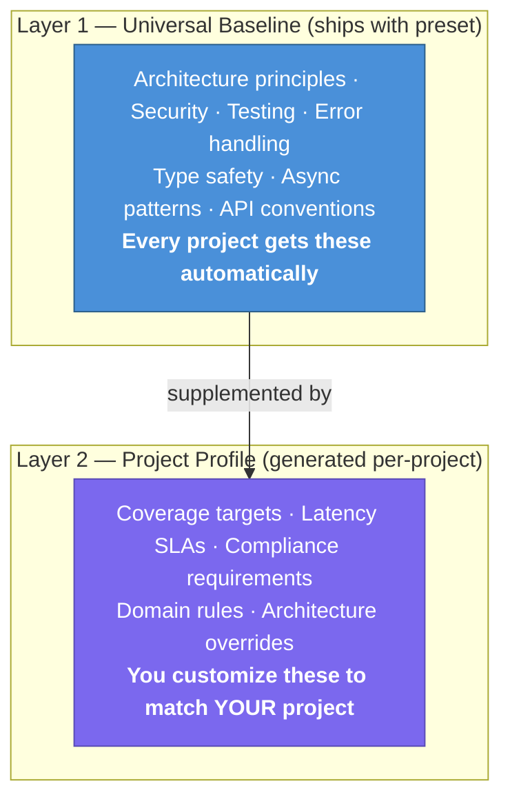

# Customizing the AI Plan Hardening Framework

> **Purpose**: Guide for adapting this template to your specific project, tech stack, and team workflow.  
> **Also see**: [docs/COPILOT-VSCODE-GUIDE.md](docs/COPILOT-VSCODE-GUIDE.md) — How to run the pipeline in VS Code with Copilot

---

## After Running `setup.ps1`

The setup wizard copies preset files and generates your project-specific configuration. Here's what to customize next:

### 1. Generate a Project Profile (Recommended)

Run the **Project Profile** prompt to customize guardrails for your project:

1. Open VS Code → Copilot Chat → Agent Mode
2. Use the prompt: `.github/prompts/project-profile.prompt.md`
3. Answer the interview questions about your project's quality standards
4. The prompt generates `.github/instructions/project-profile.instructions.md`

This creates **project-specific** quality standards that supplement the universal baseline.

#### Two-Layer Guardrail Model



**Layer 1** ensures every project gets industry-standard guardrails — teams that don't know what to ask still get type safety, error handling, security basics, and architectural separation.

**Layer 2** lets experienced teams dial in project-specific constraints — a fintech API might require SOC2 compliance and P95 < 200ms, while a marketing site needs WCAG AA accessibility.

**Load order** (every agent session):
1. `.github/copilot-instructions.md` — Project overview (always loaded)
2. `architecture-principles.instructions.md` — Universal baseline (Layer 1)
3. `project-profile.instructions.md` — Project-specific (Layer 2, if present)
4. Domain-specific `*.instructions.md` — Per-file-type (existing behavior)

**If Layer 2 conflicts with Layer 1**: The project profile wins for that specific project. Example: Layer 1 says "TDD for business logic" → Layer 2 says "TDD for ALL code" → Layer 2 applies.

#### Customization Flow

```mermaid
flowchart LR
    A["Run Setup Wizard<br/><code>setup.ps1</code>"] --> B["Get Universal Baseline<br/><i>15 instruction files</i>"]
    B --> C["Run Project Profile Prompt<br/><i>optional, recommended</i>"]
    C --> D["Answer Interview<br/><i>testing, performance,<br/>security, domain rules</i>"]
    D --> E["Generated:<br/><code>project-profile.instructions.md</code>"]
    E --> F["AI loads BOTH layers<br/>every session"]

    style A fill:#D1ECF1,stroke:#0C5460,color:#333
    style B fill:#4A90D9,stroke:#2C5F8A,color:#fff
    style C fill:#FFF3CD,stroke:#C9A800,color:#333
    style D fill:#FFF3CD,stroke:#C9A800,color:#333
    style E fill:#7B68EE,stroke:#5A4CB5,color:#fff
    style F fill:#D4EDDA,stroke:#155724,color:#333
```



> **Skip this step** if the universal baseline is sufficient for your project. You can always run the profile prompt later.

### 2. Update `.github/copilot-instructions.md`

The wizard generates a starter file. Customize it with:

- **Project overview**: What your app does, who it's for
- **Tech stack details**: Specific versions, frameworks, libraries
- **Architecture patterns**: How your layers are organized
- **Domain-specific rules**: Business logic conventions, data models
- **Common patterns**: Code examples your team uses repeatedly

### 3. Add Domain-Specific Instruction Files

The presets include 15 instruction files (16 for TypeScript, which adds `frontend.instructions.md`). Add your own for project-specific domains:

```
.github/instructions/
├── architecture-principles.instructions.md  ← From preset
├── api-patterns.instructions.md             ← From preset
├── auth.instructions.md                     ← From preset
├── caching.instructions.md                  ← From preset
├── dapr.instructions.md                     ← From preset
├── database.instructions.md                 ← From preset
├── deploy.instructions.md                   ← From preset
├── errorhandling.instructions.md            ← From preset
├── frontend.instructions.md                 ← From preset (TypeScript only)
├── graphql.instructions.md                  ← From preset
├── messaging.instructions.md                ← From preset
├── multi-environment.instructions.md        ← From preset
├── observability.instructions.md            ← From preset
├── performance.instructions.md              ← From preset
├── security.instructions.md                 ← From preset
├── testing.instructions.md                  ← From preset
├── version.instructions.md                  ← From preset
├── git-workflow.instructions.md             ← From shared
│
├── your-domain.instructions.md              ← ADD: Your domain rules
├── your-api.instructions.md                 ← ADD: API conventions
└── your-ui.instructions.md                  ← ADD: UI patterns
```

Each instruction file should have YAML frontmatter:

```yaml
---
description: Short description of what this file covers
applyTo: 'path/glob/pattern/**/*.ext'
priority: HIGH
---
```

### How `applyTo` Works (Copilot Automatic Loading)

GitHub Copilot reads instruction files **automatically** based on the `applyTo` glob pattern in the YAML frontmatter. When you open a file matching the pattern, Copilot loads that instruction file into context.

**Key rules:**
- `applyTo: '**'` loads for ALL files (use sparingly — consumes context budget)
- `applyTo: '**/*.cs'` loads only when editing C# files
- `applyTo: 'docs/plans/**'` loads only when editing plan documents
- Multiple patterns: not currently supported — use one glob per file
- The `.github/copilot-instructions.md` file (no frontmatter) is loaded **every** session

**Common patterns by stack:**

| Stack | Pattern | Loads When |
|-------|---------|------------|
| .NET | `'**/*.cs'` | Any C# file |
| TypeScript | `'**/*.ts'` | Any TypeScript file |
| Python | `'**/*.py'` | Any Python file |
| SQL | `'**/*.sql'` | Any SQL migration |
| Docker | `'**/Dockerfile'`, `'docker-compose*.yml'` | Docker files |
| Plans | `'docs/plans/**'` | Plan documents |

**Context budget tip:** Each loaded instruction file consumes part of Copilot's context window. Keep instruction files under ~150 lines and use specific `applyTo` patterns instead of `'**'`.

### VS Code Settings (Optional)

Copy `templates/vscode-settings.json.template` to `.vscode/settings.json` in your project to get recommended Copilot settings:

```powershell
# Copy the template
cp templates/vscode-settings.json.template .vscode/settings.json
```

The template configures:
- Copilot agent mode enabled
- Code generation instruction file references
- Markdown word wrap for plan files
- File associations for `.instructions.md` files

### 3. Customize Prompt Templates, Agent Definitions & Skills

The presets include scaffolding recipes, reviewer roles, and multi-step procedures. Customize them for your project:

**Prompt templates** (`.github/prompts/`):
- Edit code examples to match your project's naming conventions, patterns, and frameworks
- Add project-specific validation rules, required fields, or domain constraints
- Reference your actual service interfaces and repository patterns

**Agent definitions** (`.github/agents/`):
- Add project-specific checklist items (e.g., "Verify tenant isolation in all queries")
- Reference your instruction files in the agent's Context Files list
- Customize anti-pattern examples to match your codebase

**Skills** (`.github/skills/`):
- Update build/test/deploy commands to match your CI/CD pipeline
- Add project-specific validation steps (e.g., "Run RLS tests after migration")
- Customize verification queries for your database schema

### 4. Create Agents with `/create-agent` and Use Handoffs

#### `/create-agent` — Interactive Agent Scaffolding

VS Code Copilot's `/create-agent` slash command scaffolds `.agent.md` files interactively. Describe a persona in natural language, and the AI generates a complete agent definition with frontmatter, tools, and instructions.

**When to use it:**
- Creating domain-specific reviewers beyond the 6 presets (e.g., "billing domain expert", "accessibility auditor")
- Extracting a useful agent persona from a conversation into a reusable `.agent.md` file
- Quickly prototyping a new agent role before refining it manually

**Example:**
```
/create-agent A billing domain expert that reviews invoice calculations,
tax logic, and payment gateway integrations for correctness.
```

This complements the preset agents — use `/create-agent` for project-specific roles, keep the presets for universal concerns (architecture, security, performance).

#### Pipeline Agents with Handoffs

The template includes **3 pipeline agents** that automate the Plan → Execute → Review workflow using `handoffs:` — a frontmatter property that wires agent-to-agent transitions with clickable buttons:

| Agent | Role | Hands Off To |
|-------|------|-------------|
| `plan-hardener.agent.md` | Hardens draft plans into execution contracts | Executor |
| `executor.agent.md` | Executes slices with validation gates | Reviewer Gate |
| `reviewer-gate.agent.md` | Read-only audit for drift and violations | (terminal) |

**How handoffs work:**
1. Start a chat with the Plan Hardener agent
2. When hardening is complete, a **"Start Execution →"** button appears
3. Click it to switch to the Executor agent with context carried over
4. When execution completes, a **"Run Review Gate →"** button appears
5. Click it to switch to the read-only Reviewer Gate

The `handoffs:` frontmatter looks like:
```yaml
handoffs:
  - agent: "executor"
    reason: "Plan is hardened — ready for execution."
    send: false  # User reviews the prompt before submitting
    prompt: "Execute the hardened plan slice-by-slice."
```

> **Note**: `send: false` means the user always reviews the handoff prompt before it's sent — no automatic execution.

These pipeline agents are functionally identical to the copy-paste prompts in the Runbook Instructions. Use whichever approach you prefer.

### 5. Configure `AGENTS.md`

The wizard generates a starter `AGENTS.md`. Add:

- **Background workers/services**: What they do, how they're configured
- **Event processing**: Pub/sub topics, message schemas
- **Scheduled tasks**: Cron patterns, what runs when
- **Agent communication**: How services talk to each other

### 6. Set Up Your Roadmap

Edit `docs/plans/DEPLOYMENT-ROADMAP.md`:

```markdown
## Active Phases

### Phase 1: <Your First Feature>
**Goal**: One-line description
**Plan**: [Phase-1-YOUR-FEATURE-PLAN.md](./Phase-1-YOUR-FEATURE-PLAN.md)
**Status**: 📋 Planned
```

---

## Customizing the Runbook Prompts

### Build & Test Commands

The runbook prompts use `{BUILD_CMD}` and `{TEST_CMD}` placeholders. If you used a preset, these are already filled in. For custom setups, search and replace:

| Placeholder | .NET | TypeScript | Python | Your Stack |
|-------------|------|------------|--------|------------|
| `{BUILD_CMD}` | `dotnet build` | `pnpm build` | `python -m build` | `???` |
| `{TEST_CMD}` | `dotnet test` | `pnpm test` | `pytest` | `???` |
| `{LINT_CMD}` | `dotnet format --verify-no-changes` | `pnpm lint` | `ruff check .` | `???` |
| `{TEST_FILTER}` | `--filter "Category=UnitTests"` | `-- --run --grep unit` | `-m unit` | `???` |

### Validation Gate Commands

Update the Execution Slice template's validation gates to match your stack:

```markdown
**Validation Gates**:
- [ ] `{BUILD_CMD}` passes with zero errors
- [ ] `{TEST_CMD}` — all pass
- [ ] `{LINT_CMD}` — no violations
```

### Anti-Pattern Grep

The runbook includes an optional anti-pattern scan. Customize for your language:

**C# / .NET:**
```bash
grep -rn "\.Result\b\|\.Wait()\|\.GetAwaiter().GetResult()" --include="*.cs"
```

**TypeScript / JavaScript:**
```bash
grep -rn "any\b\|as any\|@ts-ignore\|@ts-expect-error" --include="*.ts"
```

**Python:**
```bash
grep -rn "# type: ignore\|noqa\|bare except" --include="*.py"
```

---

## Customizing Pre-flight Checks

The Pre-flight Prompt in the Instructions file checks for guardrail files. Update the domain keyword → guardrail mapping for your project:

```text
5. DOMAIN GUARDRAILS — Scan <YOUR-PLAN>.md for keywords to identify relevant domains.
   For each domain detected, confirm the guardrail file exists:
   - UI/Component/Frontend → .github/instructions/frontend.instructions.md
   - Database/SQL/Repository → .github/instructions/database.instructions.md
   - API/Route/Controller → .github/instructions/api-patterns.instructions.md
   - Auth/OAuth/JWT/OIDC → .github/instructions/auth.instructions.md
   - GraphQL/Schema/Resolver → .github/instructions/graphql.instructions.md
   - Docker/K8s/Deploy → .github/instructions/deploy.instructions.md
   - Security/CORS/Secrets → .github/instructions/security.instructions.md
   - <YOUR DOMAIN> → .github/instructions/<your-domain>.instructions.md
```

---

## Customizing the Reviewer Gate

The Reviewer Gate checklist in the runbook is generic. Add project-specific checks:

```markdown
Review checklist:
1. SCOPE COMPLIANCE — Are all changes within the Scope Contract?
2. FORBIDDEN ACTIONS — Were any off-limits files touched?
3. ARCHITECTURE — Does the code follow layer separation?
4. ERROR HANDLING — Proper error types, no empty catch blocks?
5. SECURITY — Input validation? No secrets in code?
6. TESTING — New features covered by tests?
7. <YOUR CHECK> — Your project-specific rule
8. <YOUR CHECK> — Another project-specific rule
```

---

## Adding a New Tech Preset

To contribute a preset for a new tech stack:

1. Create `presets/your-stack/` directory
2. Add **instruction files** (`.github/instructions/` — 15 files):
   - `api-patterns.instructions.md` — REST conventions, error responses
   - `auth.instructions.md` — JWT/OIDC, RBAC, multi-tenant isolation, API keys
   - `caching.instructions.md` — Cache strategies
   - `dapr.instructions.md` — Dapr sidecar patterns, state stores, pub/sub
   - `database.instructions.md` — ORM/query patterns
   - `deploy.instructions.md` — Deployment patterns
   - `errorhandling.instructions.md` — Exception hierarchy, error boundaries
   - `graphql.instructions.md` — Schema design, resolvers, DataLoader
   - `messaging.instructions.md` — Pub/sub, queues, event-driven patterns
   - `multi-environment.instructions.md` — Dev/staging/prod config
   - `observability.instructions.md` — Logging, metrics, tracing
   - `performance.instructions.md` — Hot/cold path, allocation reduction
   - `security.instructions.md` — Security patterns
   - `testing.instructions.md` — Test framework patterns
   - `version.instructions.md` — Semantic versioning, release tagging
3. Add **prompt templates** (`.github/prompts/` — 14 files):
   - `bug-fix-tdd.prompt.md` — Red-Green-Refactor bug fix
   - `new-config.prompt.md` — Typed configuration with validation
   - `new-controller.prompt.md` — REST controller with auth, error mapping
   - `new-dockerfile.prompt.md` — Multi-stage Dockerfile
   - `new-dto.prompt.md` — Request/response DTOs with validation
   - `new-entity.prompt.md` — End-to-end entity scaffolding
   - `new-error-types.prompt.md` — Custom exception hierarchy
   - `new-event-handler.prompt.md` — Event handler with retry, DLQ
   - `new-graphql-resolver.prompt.md` — GraphQL resolver with DataLoader
   - `new-middleware.prompt.md` — Request pipeline middleware
   - `new-repository.prompt.md` — Data access layer
   - `new-service.prompt.md` — Service class with DI, logging
   - `new-test.prompt.md` — Unit/integration test
   - `new-worker.prompt.md` — Background worker/job
4. Add **agent definitions** (`.github/agents/` — 6 files):
   - `architecture-reviewer.agent.md` — Layer separation audit
   - `security-reviewer.agent.md` — OWASP Top 10 audit
   - `database-reviewer.agent.md` — SQL safety, N+1, naming
   - `performance-analyzer.agent.md` — Hot paths, allocations
   - `test-runner.agent.md` — Run tests, diagnose failures
   - `deploy-helper.agent.md` — Build, deploy, verify
5. Add **skills** (`.github/skills/` — 3 directories):
   - `database-migration/SKILL.md` — Generate → validate → deploy migrations
   - `staging-deploy/SKILL.md` — Build → push → migrate → verify
   - `test-sweep/SKILL.md` — Run all test suites, aggregate results
6. Add `AGENTS.md` — Agent/worker patterns for this stack
7. Add `.github/copilot-instructions.md` — Stack-specific conventions
8. Add an example plan in `docs/plans/examples/Phase-YOUR-STACK-EXAMPLE.md`
9. Update `setup.ps1` and `setup.sh` to support the new preset name
10. Update `README.md` preset table

### Preset File Conventions

- Use the same file names across presets (consistency)
- **Instruction files**: Include frontmatter with `applyTo` globs matching the stack's file extensions
- **Prompt templates**: Include stack-specific code examples and tool references
- **Agent definitions**: Include stack-specific checklists, anti-patterns, and tool access rules
- **Skills**: Include stack-specific build/test/deploy commands
- Include at least 3 "do this" / "don't do this" examples per instruction file
- Reference the stack's actual tooling (test runners, linters, build tools)

---

## Setting Up Project Principles (Optional)

Define your project's non-negotiable principles, technology commitments, and forbidden patterns:

1. Open VS Code → Copilot Chat → Agent Mode
2. Use the prompt: `.github/prompts/project-principles.prompt.md`
3. Walk through the guided workshop — answer questions about identity, principles, tech, quality, forbidden patterns, and governance
4. The prompt generates `docs/plans/PROJECT-PRINCIPLES.md`

**Project Principles vs Project Profile**:
- **Project Principles** = what the project *believes* (human-authored declarations)
- **Project Profile** = how Copilot should *write code* (generated guardrails)
- Both are optional. Both auto-load. They complement each other.

---

## Using External Specifications (Optional)

If you already have specification files (from any spec-driven workflow), you can reference them as authoritative inputs:

1. In your hardened plan's Scope Contract, fill in the **Specification Source** section:
   ```markdown
   ### Specification Source (Optional)
   - Spec file: docs/specs/my-feature/spec.md
   - Requirements doc: docs/specs/my-feature/requirements.md
   ```
2. Step 2 (Harden) will map each execution slice to requirements via `Traces to:` fields
3. Step 5 (Review) will verify bidirectional traceability — every requirement has a slice, every slice has a requirement

Alternatively, use the **Requirements Register** directly in your plan for standalone traceability without external spec files.

---

## Installing Extensions (Optional)

Extensions let teams share custom guardrail files as portable packages.

See [docs/EXTENSIONS.md](docs/EXTENSIONS.md) for the full guide covering:
- Extension structure and manifest format
- Three installation methods (manual, setup script, CLI)
- How to create and distribute your own extensions

---

## CLI Quick Reference (Optional)

The `pharden` CLI is a convenience wrapper — every command shows the equivalent manual steps.

```
pharden init              Bootstrap project (delegates to setup.ps1/sh)
pharden check             Validate setup (delegates to validate-setup.ps1/sh)
pharden status            Show phase status from DEPLOYMENT-ROADMAP.md
pharden new-phase <name>  Create plan file + add to roadmap
pharden branch <plan>     Create branch from plan's Branch Strategy
pharden ext install <p>   Install an extension
pharden ext list          List installed extensions
pharden ext remove <name> Remove an extension
pharden help              Show all commands
```

---

## Removing Template Scaffolding

After setup, you can safely delete these directories:

```
presets/          ← Only needed during setup
templates/        ← Only needed for manual setup
setup.ps1         ← Only needed once
CUSTOMIZATION.md  ← Keep or delete (your preference)
```

The essential files for ongoing use are:

```
docs/plans/                    ← Runbook + your plans
.github/instructions/          ← Guardrail files (15 per preset, 16 for TypeScript)
.github/prompts/               ← Scaffolding recipes (14 prompt templates)
.github/agents/                ← Reviewer/executor roles (11 agent definitions)
.github/skills/                ← Multi-step procedures (3 skills)
.github/copilot-instructions.md
AGENTS.md
```
