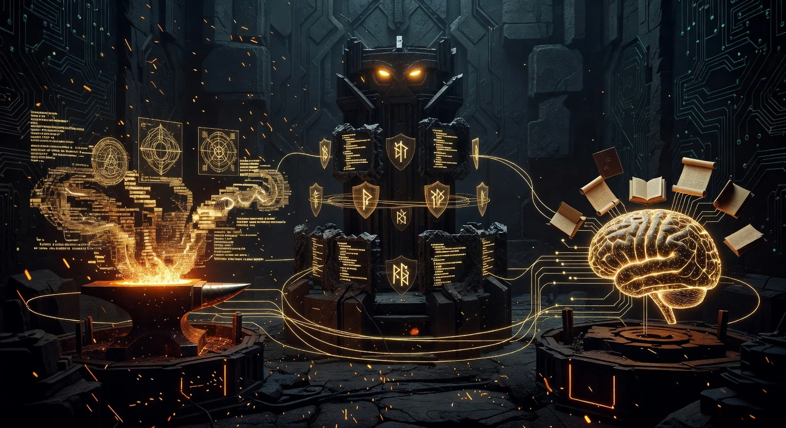
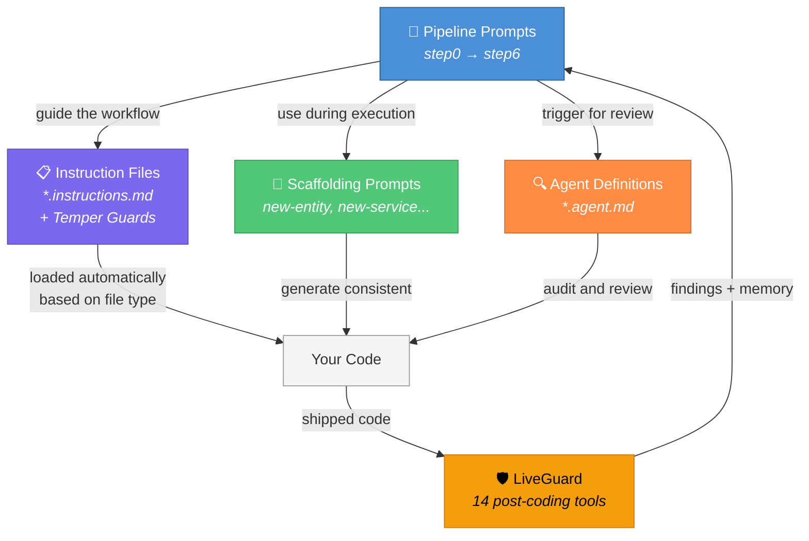
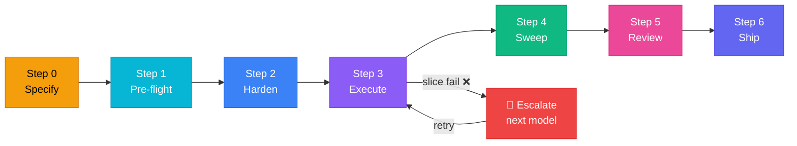
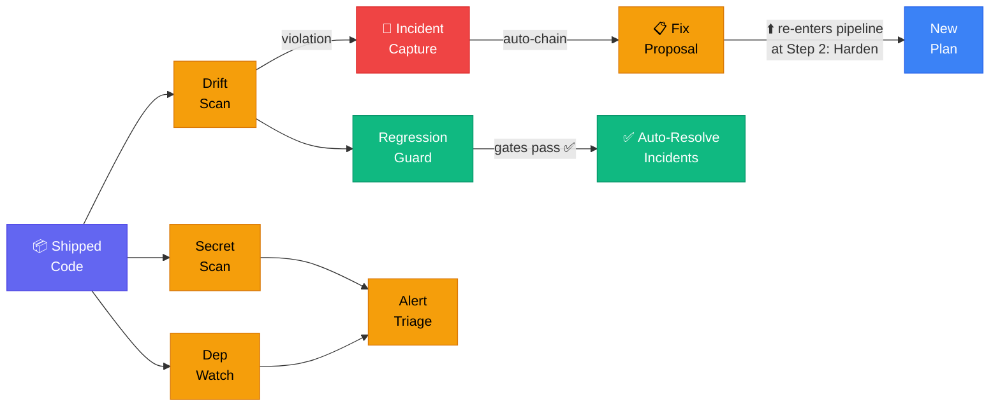
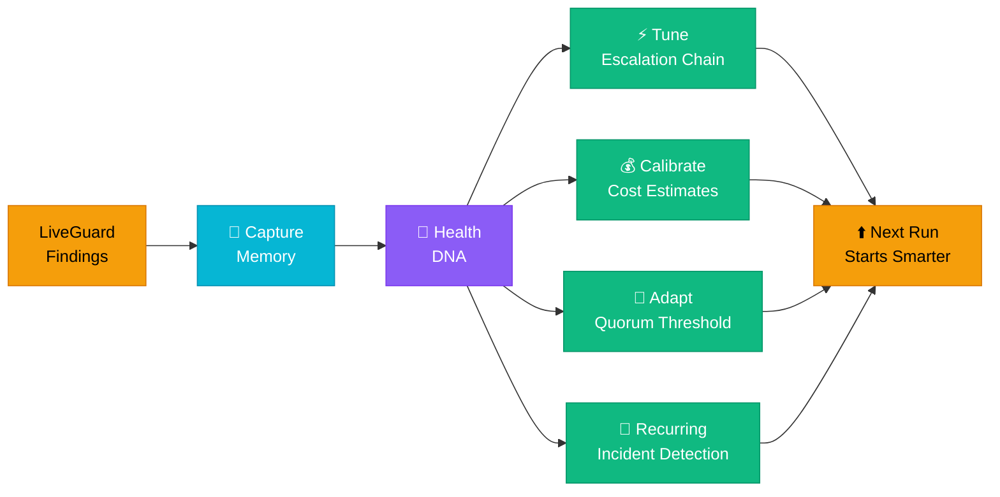
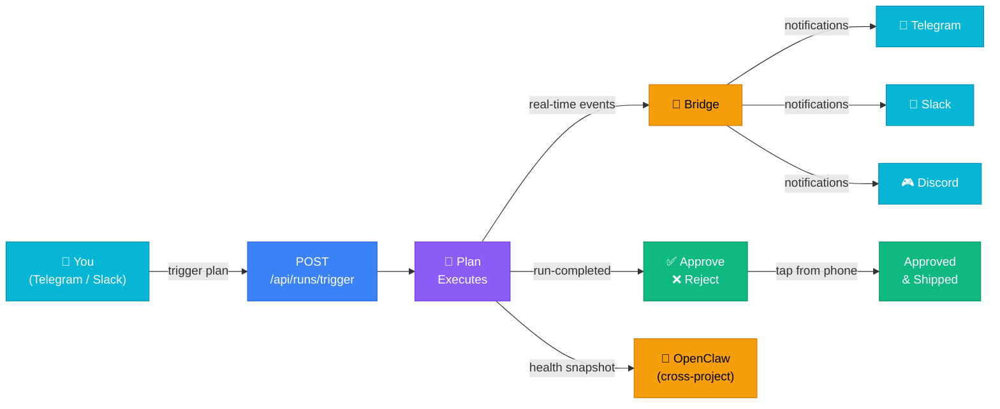
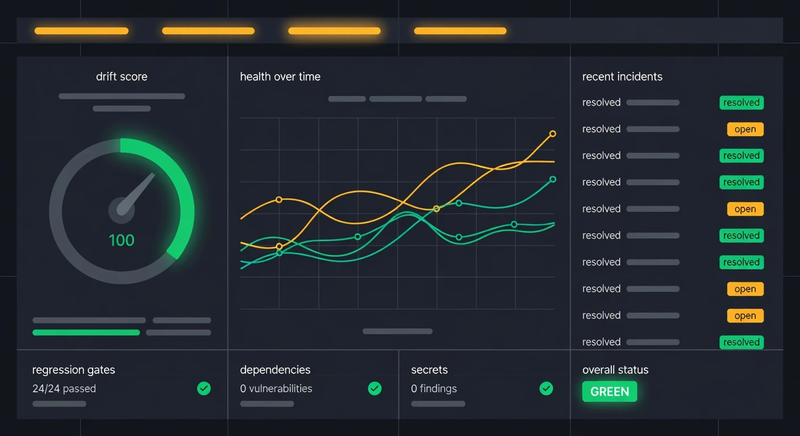

# Plan Forge

<picture>
  <source media="(prefers-color-scheme: dark)" srcset="docs/assets/plan-forge-logo.svg">
  <source media="(prefers-color-scheme: light)" srcset="docs/assets/plan-forge-logo-light.svg">
  
</picture>

> **A blacksmith doesn't hand raw iron to a customer. They heat it, hammer it, and temper it until it holds its edge. Then they watch — because a blade that isn't maintained will dull.**
>
> Plan Forge does the same for AI-driven development. Your rough ideas go in as raw metal — and come out as **hardened execution contracts** that AI coding agents follow without deviation. After the code ships, **LiveGuard watches the gates** — detecting drift, incidents, and vulnerabilities. And every finding feeds back, so **the forge gets smarter every run**.
>
> *Forge the plan. Guard the gates. Learn from every build.*

[](LICENSE)

**[Website](https://planforge.software/)** · **[Quick Start](https://planforge.software/#quickstart)** · **[Manual](https://planforge.software/manual/)** · **[Documentation](https://planforge.software/docs.html)** · **[FAQ](https://planforge.software/faq.html)** · **[Extensions](https://planforge.software/extensions.html)** · **[Spec Kit Interop](https://planforge.software/speckit-interop.html)**

```
41 MCP Tools (+2 Watcher) · 14 LiveGuard · 6 Crucible (v2.37-dev) · 19 Agents · 12 Skills · 9 Presets · 7 Adapters · 864 Tests
```

---

## Start Here

| You are... | Start with |
|------------|------------|
| **Brand new to AI guardrails** | Read [What Is This?](#what-is-this) below → Run [Quick Start](#quick-start) |
| **A developer using VS Code + Copilot** | Run [Quick Start](#quick-start) → Read [COPILOT-VSCODE-GUIDE.md](docs/COPILOT-VSCODE-GUIDE.md) |
| **An AI agent setting up a project** | Read [AGENT-SETUP.md](AGENT-SETUP.md) (your entry point) |
| **Just browsing / evaluating** | Keep reading — or visit [planforge.software](https://planforge.software/) |

---

## Beyond Vibe Coding

AI coding tools generate code fast — but without structure, that code is untestable, insecure, and impossible to maintain. And even when the build is clean, software doesn't stop changing. Dependencies acquire CVEs. Configuration drifts. Regression gates go stale. Incidents repeat.

**Plan Forge exists because "it works" isn't enough.** This framework gives AI agents structure during the build, watches the codebase after you ship, and learns from every run — so the next session starts smarter than the last.

> *Vibe coding gets you a prototype. Plan Forge gets you a product — and keeps it healthy.*

**Verified**: 12 phases self-built, 864/864 self-tests, 65 MCP tools, zero manual rollbacks. See [docs/capabilities.md](docs/capabilities.md).

### A/B Test Results (April 2026)

Same app, same model (Claude Opus 4.6), same time (~7 min). Only difference: Run A had Plan Forge.

| Metric | Plan Forge | Vibe Coding |
|--------|-----------|-------------|
| **Tests** | **60** | 13 |
| **Interfaces** | **6** | 0 |
| **DTOs** | **9** | 0 |
| **Quality Score** | **99/100** | **44/100** |

[Read the full results →](https://planforge.software/blog/ab-test-plan-forge-vs-vibe-coding.html)

---

## What Is This?

Plan Forge is three things: a **build pipeline** that hardens plans into execution contracts, a **post-coding guard** that watches your codebase after you ship, and a **learning system** that gets smarter every run.



### 🔨 Build — The Pipeline

A 7-step workflow that breaks features into verifiable slices, locks scope, and validates at every boundary.

```
Specify → Pre-flight → Harden → Execute → Sweep → Review → Ship
```

- **Scope contracts** — forbidden actions, in-scope paths, validation gates
- **Temper Guards** — tables of common AI shortcuts paired with rebuttals
- **4-session isolation** — the executor never reviews its own work
- **Autonomous execution** — `forge_run_plan` runs plans end-to-end with DAG scheduling

### 🛡️ Guard — LiveGuard

14 post-coding intelligence tools that watch your codebase after the forge stops building.

- **Drift scoring** — architecture guardrail violations scored 0–100
- **Secret scanning** — Shannon entropy analysis with key-pattern matching
- **Dependency monitoring** — CVE detection for npm + .NET projects
- **Regression guard** — validation gates from plans, hotspot-prioritized
- **Incident tracking** — capture, auto-escalate recurring patterns, MTTR
- **One-call health check** — `forge_liveguard_run` replaces 8 separate tool calls:

```json
{
  "drift":      { "score": 100, "appViolations": 0 },
  "secrets":    { "findings": 0 },
  "regression": { "gates": 24, "passed": 24 },
  "deps":       { "vulnerabilities": 0 },
  "tempering":  { "openBugs": 0, "status": "green" },
  "overallStatus": "green"
}
```

- **Tempering** — closed-loop bug validation: discovers bugs → classifies → generates fix plans → re-runs scanners to verify → marks fixed. 9 scanner types, mutation testing, and anomaly detection for unaddressed bugs.

### 🧠 Learn — Self-Recursive Intelligence

The system gets smarter every run. No configuration needed — just use it.

| Feature | What it learns from | What it improves |
|---------|-------------------|-----------------|
| **Auto-tune escalation** | Model success rates | Best model moves to position 1 |
| **Cost calibration** | Estimate vs actual costs | Budget accuracy improves each run |
| **Adaptive quorum** | Which slices needed consensus | Token spend self-optimizes |
| **Recurring incidents** | Incident history by file | Auto-escalates systemic issues |
| **Fix outcome tracking** | Did the fix work? | Learns which fix patterns work |
| **Health DNA** | All metrics combined | Detects project decay early |

Every LiveGuard finding is auto-captured to persistent memory. Pipeline prompts search this memory before acting — so the next session starts with context, not blank.

---

## How the Pieces Fit Together



> Pipeline prompts drive the workflow. Instruction files protect the code. Agents review it. LiveGuard watches after it ships — and feeds findings back into the next session.

---

## The Full Lifecycle

Three phases, stacked. Each feeds into the next.

### 🔨 Phase 1: Build



> ⬇️ **Ship** hands off to LiveGuard. Fix proposals re-enter at **Harden** ⬆️

### 🛡️ Phase 2: Guard (LiveGuard)



> ⬇️ Every finding is captured to memory. Memory feeds back into **Build** ⬆️

### 🧠 Phase 3: Learn (Self-Improving)



> ⬇️ All phases emit events to the **Bridge**. You control the forge remotely ⬆️

### 📡 Phase 4: Operate (Human-in-the-Loop Remote Orchestration)



- **Trigger remotely** — start plan runs from Telegram, Slack, CI/CD, OpenClaw, or Claude CoWork via `POST /api/runs/trigger`
- **Real-time notifications** — slice progress, failures, and completion pushed to your phone
- **Approve/reject from anywhere** — Telegram inline buttons or Slack action buttons — no VS Code needed
- **OpenClaw bridge** — health snapshots POSTed to external analytics for cross-project monitoring
- **Works with**: Copilot, Claude CoWork, Cursor, any tool that can call an HTTP endpoint

### How the Pieces Fit

| Piece | What It Is | Count |
|-------|-----------|-------|
| **Pipeline Steps** | Specify → Pre-flight → Harden → Execute → Sweep → Review → Ship | 7 |
| **Instruction Files** | Rules that auto-load by file type + Temper Guards that prevent shortcuts | 17-18/preset |
| **Scaffolding Prompts** | Templates for generating code patterns consistently | 15/preset |
| **Agent Definitions** | Specialized AI reviewer personas (independent audit) | 19 |
| **Skills** | Multi-step procedures via `/` slash commands | 12 |
| **Lifecycle Hooks** | Automatic actions: 4 core (SessionStart, PreToolUse, PostToolUse, Stop) + 3 LiveGuard (PreDeploy, PostSlice, PreAgentHandoff) | 7 |
| **LiveGuard Tools** | Post-coding intelligence: drift, incidents, secrets, deps, health, triage, fix proposals, composite health check | 14 |
| **MCP Tools (total)** | All forge operations exposed as MCP tool calls | 34 |

### The Feedback Loops

```
Escalation chain reorders by success rate ──────────────┐
Cost estimates calibrate from actuals ──────────────────┤
Quorum threshold adapts from history ───────────────────┤── The forge gets smarter
Recurring incidents auto-escalate ──────────────────────┤
Fix proposals track outcomes (effective/ineffective) ───┤
Health DNA detects decay before it manifests ───────────┘
```

---

## Dashboard

`localhost:3100/dashboard` — 15 real-time tabs powered by WebSocket hub.



**FORGE**: Progress · Runs · Replay · Cost · Extensions · Config · Traces · Skills
**LIVEGUARD**: Health · Incidents · Triage · Security · Env

---

## Quick Start

### Prerequisites

- **VS Code** with **GitHub Copilot** (free, Pro, or Enterprise)
- **Git** installed

### 1. Clone and Run Setup

```bash
git clone https://github.com/srnichols/plan-forge.git my-project-plans
cd my-project-plans
```

```powershell
# Windows (PowerShell)
.\setup.ps1 -Preset dotnet          # or: typescript, python, java, go, swift, rust, php, azure-iac

# Mac / Linux
./setup.sh --preset dotnet
```

Setup copies all framework files, installs MCP dependencies, and generates config. Zero manual steps.

### 2. Start Planning

1. Open VS Code → Copilot Chat → **Agent Mode**
2. Describe your feature → the pipeline guides you through 7 steps
3. LiveGuard watches automatically after you ship

See [docs/CLI-GUIDE.md](docs/CLI-GUIDE.md) for all presets, flags, and multi-agent options.

---

## What's Included

### 9 Tech-Stack Presets

| Preset | Stack | Preset | Stack |
|--------|-------|--------|-------|
| `dotnet` | .NET / C# / ASP.NET Core | `swift` | Swift / SwiftUI / Vapor |
| `typescript` | TypeScript / React / Node | `rust` | Rust / Axum / Tokio |
| `python` | Python / FastAPI / Django | `php` | PHP / Laravel / Symfony |
| `java` | Java / Spring Boot | `azure-iac` | Bicep / Terraform / azd |
| `go` | Go / Chi / Gin | | |

### 7 AI Agent Adapters

One setup command, every tool: `setup.ps1 -Agent all`

GitHub Copilot (primary) · Claude Code · Cursor · Codex CLI · Gemini CLI · Windsurf · Generic

### MCP Server (43 Tools)

`pforge-mcp/server.mjs` — 20 core tools + 14 LiveGuard tools + 2 Watcher tools (v2.34/v2.35). Live dashboard at `localhost:3100/dashboard`. REST API for external integrations.

Key tools: `forge_run_plan` · `forge_liveguard_run` · `forge_analyze` · `forge_capabilities` · `forge_smith` · `forge_cost_report`

### Optional Capabilities

| Feature | How to Enable | What It Does |
|---------|--------------|-------------|
| **Quorum mode** | Automatic (complexity ≥ 6) | 3 models analyze in parallel, reviewer synthesizes. Self-tuning threshold. |
| **Auto-escalation** | Built-in | Model fails → auto-promotes. Chain reorders by success rate. |
| **Cost tracking** | Built-in | Per-slice tokens, 23-model pricing, `--estimate` with historical calibration. |
| **OpenBrain memory** | Configure MCP endpoint | 13 tools auto-capture findings. 4 prompts search before acting. |
| **Extensions** | `pforge ext add <name>` | HIPAA, SaaS multi-tenancy, etc. |
| **CI validation** | `srnichols/plan-forge-validate@v1` | GitHub Action for plan quality gates. |
| **Notifications** | Configure in `.forge.json` | Slack, Discord, Telegram, webhooks via bridge. |
| **Spec Kit bridge** | Auto-detected | Import specs + constitution from Spec Kit projects. |

---

## Documentation

| Resource | Purpose |
|----------|---------|
| **[docs/COPILOT-VSCODE-GUIDE.md](docs/COPILOT-VSCODE-GUIDE.md)** | VS Code + Copilot walkthrough |
| **[docs/CLI-GUIDE.md](docs/CLI-GUIDE.md)** | `pforge` CLI reference |
| **[docs/capabilities.md](docs/capabilities.md)** | Full feature reference — all 43 tools, agents, skills |
| **[CUSTOMIZATION.md](CUSTOMIZATION.md)** | Adapt guardrails for your project |
| **[planforge.software/manual/](https://planforge.software/manual/)** | Interactive web manual (17 chapters + 6 appendices) |
| **[planforge.software/faq.html](https://planforge.software/faq.html)** | FAQ |
| **[AGENT-SETUP.md](AGENT-SETUP.md)** | AI agent entry point |

---

## When to Use the Full Pipeline

| Change Size | Do This |
|-------------|--------|
| **Micro** (<30 min) | Just commit — no pipeline needed |
| **Small** (30–120 min) | Optional — light hardening only |
| **Medium** (2–8 hrs) | **Full pipeline — all steps** |
| **Large** (1+ days) | **Full pipeline + branch-per-slice** |

---

## Git Workflow

```bash
git commit -m "<type>(<scope>): <description>"   # feat, fix, refactor, test, docs, chore
```

See [.github/instructions/git-workflow.instructions.md](.github/instructions/git-workflow.instructions.md) for conventions.

---

## Contributing

See [CONTRIBUTING.md](CONTRIBUTING.md). For extensions: [extensions/PUBLISHING.md](extensions/PUBLISHING.md). For skills: [docs/SKILL-BLUEPRINT.md](docs/SKILL-BLUEPRINT.md).

---

## License

[MIT](LICENSE) — use these guardrails in your projects, teams, and tools.
