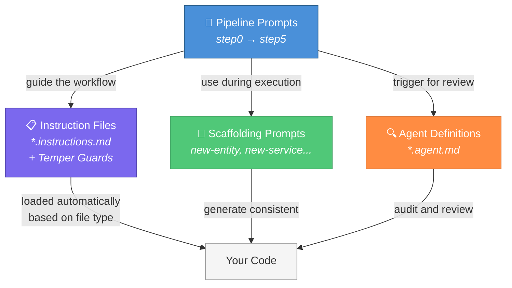

# Plan Forge

<picture>
  <source media="(prefers-color-scheme: dark)" srcset="docs/assets/plan-forge-logo.svg">
  <source media="(prefers-color-scheme: light)" srcset="docs/assets/plan-forge-logo-light.svg">
  
</picture>

> **A blacksmith doesn't hand raw iron to a customer. They heat it, hammer it, and temper it until it holds its edge.**
>
> Plan Forge does the same for AI-driven development. Your rough ideas go in as raw metal — and come out as **hardened execution contracts** that AI coding agents follow without scope creep, skipped tests, or silent rewrites.
>
> *Forge the plan. Harden the scope. Ship with confidence.*

[](LICENSE)

**[Website](https://planforge.software/)** · **[Quick Start](https://planforge.software/#quickstart)** · **[Manual](https://planforge.software/manual/)** · **[Documentation](https://planforge.software/docs.html)** · **[FAQ](https://planforge.software/faq.html)** · **[Extensions](https://planforge.software/extensions.html)** · **[Spec Kit Interop](https://planforge.software/speckit-interop.html)**

---

## Start Here

| You are... | Start with |
|------------|------------|
| **Brand new to AI guardrails** | Read [What Is This?](#what-is-this) below → Run [Quick Start](#quick-start) |
| **A developer using VS Code + Copilot** | Run [Quick Start](#quick-start) → Read [COPILOT-VSCODE-GUIDE.md](docs/COPILOT-VSCODE-GUIDE.md) |
| **An AI agent setting up a project** | Read [AGENT-SETUP.md](AGENT-SETUP.md) (your entry point) |
| **Just browsing / evaluating** | Keep reading — or visit [planforge.software](https://planforge.software/) |

---

## Beyond Vibe Coding

AI coding tools make it easy to generate code fast. But fast isn't the same as good. Without structure, AI-generated code is untestable, insecure, architecturally inconsistent, and impossible to maintain at scale. That's fine for prototypes — it's not fine for production systems.

**Plan Forge exists because "it works" isn't enough.** This framework teaches the AI your standards so you move fast *and* build right — with guardrails that enforce best practices whether you're a junior developer or a senior architect.

> *Vibe coding gets you a prototype. Plan Forge gets you a product.*

**Verified**: 11 phases self-built, 577/577 self-tests, 34 MCP tools, zero manual rollbacks. See [docs/capabilities.md](docs/capabilities.md) for the full metrics table.

### A/B Test Results (April 2026)

We built the same .NET app twice — same requirements, same model (Claude Opus 4.6), same time (~7 min). The only difference: Run A had Plan Forge, Run B didn't.

| Metric | Plan Forge | Vibe Coding |
|--------|-----------|-------------|
| **Tests** | **60** | 13 |
| **Interfaces** | **6** | 0 |
| **DTOs** | **9** | 0 |
| **Quality Score** | **99/100** | **44/100** |

Speed was comparable. Quality was not. [Read the full results →](https://planforge.software/blog/ab-test-plan-forge-vs-vibe-coding.html)

---

## What Is This?

When you use AI coding tools (like GitHub Copilot, Cursor, or Claude) to build software, they're great at writing code — but they tend to go off-script. They'll add features you didn't ask for, skip tests, make architecture decisions without telling you, and forget what they were doing halfway through.

**This framework fixes that** with:
- **A step-by-step workflow** that breaks big features into small, verifiable chunks
- **Guardrails** — rule files that tell the AI *how* to write code (with Temper Guards that prevent shortcut-taking)
- **An independent review step** where a fresh AI session checks the work

### How the Pieces Fit Together



| Piece | What It Is | Analogy |
|-------|-----------|---------|
| **Pipeline Prompts** | Step-by-step workflow templates (Step 0–6) | The recipe |
| **Instruction Files** | Rules that auto-load when editing specific file types | The rulebook (+ Temper Guards that prevent agent shortcuts) |
| **Scaffolding Prompts** | Templates for generating common code patterns | Cookie cutters |
| **Agent Definitions** | Specialized AI reviewer personas | Expert reviewers |
| **Skills** | Multi-step executable procedures via `/` slash commands | Power tools |
| **Lifecycle Hooks** | Automatic actions during agent sessions | Safety rails |

> **You don't need to understand all of this upfront.** Run the setup wizard, follow the numbered step prompts, and the framework guides you.

---

## Quick Start

### Prerequisites

- **VS Code** with **GitHub Copilot** (free, Pro, or Enterprise)
- **Git** installed

### 1. Install the Plugin (Recommended)

- [**Install in VS Code**](vscode://chat-plugin/install?source=srnichols/plan-forge) (requires VS Code 1.113+)

### 2. Clone and Run Setup

```bash
git clone https://github.com/srnichols/plan-forge.git my-project-plans
cd my-project-plans
```

```powershell
.\setup.ps1 -Preset dotnet          # or: typescript, python, java, go, swift, rust, php, azure-iac
```

See [docs/CLI-GUIDE.md](docs/CLI-GUIDE.md) for all presets, flags, and multi-agent options (`-Agent claude,cursor,all`).

### 3. Start Planning

1. Open VS Code → Copilot Chat → **Agent Mode**
2. Select the **Specifier** agent → describe your feature
3. Click through the pipeline: **Specify → Harden → Execute → Review → Ship**

Or attach `.github/prompts/step0-specify-feature.prompt.md` for the prompt-based flow. See [docs/COPILOT-VSCODE-GUIDE.md](docs/COPILOT-VSCODE-GUIDE.md) for the full walkthrough.

---

## What's Included

### 9 Tech-Stack Presets

| Preset | Stack | Preset | Stack |
|--------|-------|--------|-------|
| `dotnet` | .NET / C# / ASP.NET Core | `swift` | Swift / SwiftUI / Vapor |
| `typescript` | TypeScript / React / Node | `rust` | Rust / Axum / Tokio |
| `python` | Python / FastAPI / Django | `php` | PHP / Laravel / Symfony |
| `java` | Java / Spring Boot | `azure-iac` | Bicep / Terraform / azd |
| `go` | Go / Chi / Gin | | |

### Per Preset (app presets)

| Category | Count | Examples |
|----------|-------|---------|
| **Instruction files** | 17-18 | architecture, security, testing, database, API patterns, error handling, Temper Guards + Warning Signs |
| **Agents** | 19-22 | 6 stack-specific + 8 cross-stack + 6 pipeline (specifier → shipper) |
| **Prompt templates** | 15 | new-entity, new-service, new-controller, bug-fix-tdd, project-principles |
| **Skills** | 13 | /database-migration, /security-audit, /forge-quench, /forge-execute |

Full details: [docs/capabilities.md](docs/capabilities.md) · [CUSTOMIZATION.md](CUSTOMIZATION.md)

### Pipeline (7 Steps, 4 Sessions)

```
Step 0: Specify → Step 1: Pre-flight → Step 2: Harden → Step 3: Execute → Step 4: Sweep → Step 5: Review → Step 6: Ship
```

The executor doesn't self-audit — a fresh session reviews the work. See [docs/COPILOT-VSCODE-GUIDE.md](docs/COPILOT-VSCODE-GUIDE.md) for session management.

### MCP Server (34 Tools)

`pforge-mcp/server.mjs` exposes forge operations as MCP tools: `forge_run_plan`, `forge_analyze`, `forge_sweep`, `forge_smith`, `forge_cost_report`, `forge_liveguard_run`, and more. Live dashboard at `localhost:3100/dashboard`.

### When to Use the Full Pipeline

| Change Size | Do This |
|-------------|---------|
| **Micro** (<30 min) | Just commit — no pipeline needed |
| **Small** (30–120 min) | Optional — light hardening only |
| **Medium** (2–8 hrs) | **Full pipeline — all steps** |
| **Large** (1+ days) | **Full pipeline + branch-per-slice** |

---

## Documentation

| Resource | Purpose |
|----------|---------|
| **[CUSTOMIZATION.md](CUSTOMIZATION.md)** | Adapt guardrails for your project — profiles, presets, agents, skills |
| **[docs/COPILOT-VSCODE-GUIDE.md](docs/COPILOT-VSCODE-GUIDE.md)** | VS Code + Copilot walkthrough — sessions, context, memory |
| **[docs/CLI-GUIDE.md](docs/CLI-GUIDE.md)** | `pforge` CLI reference — all commands and flags |
| **[docs/capabilities.md](docs/capabilities.md)** | Full feature reference — tools, agents, skills, presets, telemetry |
| **[docs/SKILL-BLUEPRINT.md](docs/SKILL-BLUEPRINT.md)** | Skill format spec for contributors |
| **[docs/plans/AI-Plan-Hardening-Runbook-Instructions.md](docs/plans/AI-Plan-Hardening-Runbook-Instructions.md)** | Copy-paste prompts for any AI tool |
| **[docs/QUICKSTART-WALKTHROUGH.md](docs/QUICKSTART-WALKTHROUGH.md)** | Hands-on first-feature tutorial |
| **[planforge.software/manual/](https://planforge.software/manual/)** | Interactive web manual |
| **[planforge.software/faq.html](https://planforge.software/faq.html)** | FAQ (20+ questions) |

---

## Optional Capabilities

| Feature | How to Enable | Details |
|---------|--------------|---------|
| **Multi-agent** | `setup.ps1 -Agent claude,cursor,all` | Claude, Cursor, Codex, Gemini, Windsurf adapters |
| **Quorum mode** | Automatic (complexity ≥ 7) | 3 models analyze in parallel, reviewer synthesizes |
| **Cost tracking** | Built-in | Per-slice tokens, 23-model pricing, `--estimate` |
| **OpenBrain memory** | Configure MCP endpoint | Cross-session decision history |
| **Extensions** | `pforge ext add <name>` | HIPAA, SaaS multi-tenancy, etc. |
| **CI validation** | `srnichols/plan-forge-validate@v1` | GitHub Action for plan quality gates |
| **Spec Kit bridge** | Auto-detected | Import specs + constitution from Spec Kit projects |

See [CUSTOMIZATION.md](CUSTOMIZATION.md) for configuration details.

---

## Git Workflow

```bash
git add -A
git commit -m "<type>(<scope>): <description>"
git push origin main
```

Types: `feat`, `fix`, `refactor`, `test`, `docs`, `chore`. See [.github/instructions/git-workflow.instructions.md](.github/instructions/git-workflow.instructions.md).

---

## Contributing

See [CONTRIBUTING.md](CONTRIBUTING.md). For extensions, see [extensions/PUBLISHING.md](extensions/PUBLISHING.md). For skills, follow [docs/SKILL-BLUEPRINT.md](docs/SKILL-BLUEPRINT.md).

---

## License

[MIT](LICENSE) — use these guardrails in your projects, teams, and tools.
