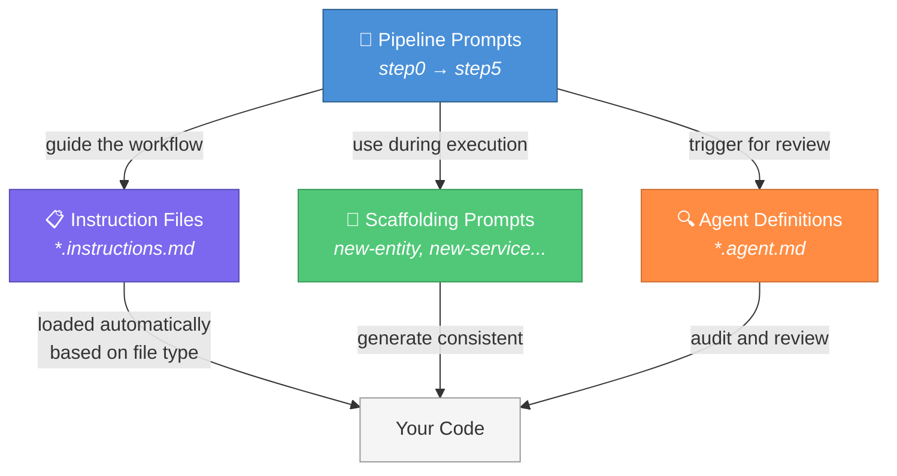
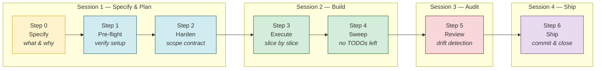

# Plan Forge

<picture>
  <source media="(prefers-color-scheme: dark)" srcset="docs/assets/plan-forge-logo.svg">
  <source media="(prefers-color-scheme: light)" srcset="docs/assets/plan-forge-logo-light.svg">
  
</picture>

> **A blacksmith doesn't hand raw iron to a customer. They heat it, hammer it, and temper it until it holds its edge.**
>
> Plan Forge does the same for AI-driven development. Your rough ideas go in as raw metal — and come out as **hardened execution contracts** that AI coding agents follow without scope creep, skipped tests, or silent rewrites.
>
> *Forge the plan. Harden the scope. Ship with confidence.*

[](LICENSE)

**[Website](https://srnichols.github.io/plan-forge/)** · **[Quick Start](https://srnichols.github.io/plan-forge/#quickstart)** · **[Documentation](https://srnichols.github.io/plan-forge/docs.html)** · **[FAQ](https://srnichols.github.io/plan-forge/faq.html)** · **[Extensions](https://srnichols.github.io/plan-forge/extensions.html)** · **[Spec Kit Interop](https://srnichols.github.io/plan-forge/speckit-interop.html)**

---

## Start Here

| You are... | Start with |
|------------|------------|
| **Brand new to AI guardrails** | Read [What Is This?](#what-is-this-plain-english) → Run [`setup.ps1`](#2-run-the-setup-wizard) → Follow [docs/QUICKSTART-WALKTHROUGH.md](docs/QUICKSTART-WALKTHROUGH.md) |
| **A developer using VS Code + Copilot** | Run [`setup.ps1`](#2-run-the-setup-wizard) → Read [CUSTOMIZATION.md](CUSTOMIZATION.md) → Read [docs/COPILOT-VSCODE-GUIDE.md](docs/COPILOT-VSCODE-GUIDE.md) |
| **An AI agent setting up a project** | Read [AGENT-SETUP.md](AGENT-SETUP.md) (your entry point) |
| **A CLI-first developer** | Run [`setup.ps1`](#2-run-the-setup-wizard) → Read [docs/CLI-GUIDE.md](docs/CLI-GUIDE.md) |
| **Just browsing / evaluating** | Keep reading — [What Is This?](#what-is-this-plain-english) below |

---

## Beyond Vibe Coding

AI coding tools make it easy to generate code fast. But fast isn't the same as good. Without structure, AI-generated code tends to be untestable, insecure, architecturally inconsistent, and impossible to maintain at scale. That's fine for prototypes — it's not fine for production systems.

**Plan Forge exists because "it works" isn't enough.** Enterprise-grade software needs separation of concerns, proper error handling, security at every boundary, tenant isolation, comprehensive testing, and architecture that a team can reason about six months from now. These aren't optional extras — they're the difference between a demo and a system.

This framework doesn't slow you down. It teaches the AI your standards so you **move fast *and* build right** — with guardrails that enforce best practices whether you're a junior developer learning the craft or a senior architect protecting the system.

### The Bottom Line

| Without guardrails | With Plan Forge |
|-------------------|----------------|
| Agent writes code that passes once, breaks in production | Code follows your architecture from the first line |
| 30–50% of AI-generated code needs rework after review | Independent review catches drift *before* merge |
| Agent re-discovers solved problems every session | Persistent memory (OpenBrain) loads prior decisions in seconds |
| Context window wasted on exploration and backtracking | Hardened plan tells the agent exactly what to build — less tokens, faster results |
| "It works on my machine" shipped to staging | Validation gates (build + test) pass at every slice boundary |
| Post-mortems written, never read again | Lessons automatically searched at the start of every future phase |

**For developers**: fewer `git revert` moments, less time re-explaining decisions to the AI, more time shipping.
**For managers**: measurable checkpoints per slice, independent review before merge, architecture that holds up at scale — not just today but six months from now.

At its core, Plan Forge is a **specification-driven framework**. Every feature starts as a spec (Step 0), passes pre-flight verification (Step 1), gets hardened into a binding execution contract (Step 2), is built slice-by-slice against that contract (Step 3), is swept for completeness to eliminate stubs and deferred work (Step 4), and is independently verified for spec compliance (Step 5). The spec is the source of truth — not the code, not the AI's interpretation. Already use a spec-driven workflow? Plan Forge picks up where your specs end and ensures they're actually followed.

> *Vibe coding gets you a prototype. Plan Forge gets you a product.*

---

## What Is This? (Plain English)

When you use AI coding tools (like GitHub Copilot, Cursor, or Claude) to build software, they're great at writing code — but they tend to go off-script. They'll add features you didn't ask for, skip tests, make architecture decisions without telling you, and forget what they were doing halfway through.

**This template fixes that.** It gives you:

- **A step-by-step workflow** that breaks big features into small, verifiable chunks
- **Guardrails** — rule files that tell the AI *how* to write code (security practices, testing standards, architecture patterns) so you don't have to remember everything yourself
- **An independent review step** where a fresh AI session checks the work for mistakes and scope creep

Think of it like giving your AI assistant a checklist, a rulebook, and a supervisor — all at once.

### How the Pieces Fit Together

This template installs four types of files into your project. Each serves a different role:



| Piece | What It Is | Analogy |
|-------|-----------|---------|
| **Pipeline Prompts** | Step-by-step workflow templates (Step 0–5) | The recipe — tells you what to do and in what order |
| **Instruction Files** | Rules that auto-load when editing specific file types | The rulebook — coding standards, security, testing, architecture |
| **Scaffolding Prompts** | Templates for generating common code patterns | Cookie cutters — consistent entities, services, controllers, tests |
| **Agent Definitions** | Specialized AI reviewer personas (security, architecture, etc.) | Expert reviewers — each focuses on one thing and checks it deeply |
| **Skills** | Multi-step executable procedures invoked via `/` slash commands | Power tools — chain multiple operations with validation between steps |
| **Lifecycle Hooks** | Shell commands that run automatically at agent lifecycle points | Safety rails — enforce rules without human intervention |

### Agents vs Skills: What's the Difference?

Both agents and skills extend Copilot, but they serve different purposes:

| | Agents (`.github/agents/*.agent.md`) | Skills (`.github/skills/*/SKILL.md`) |
|---|---|---|
| **Purpose** | **Review and audit** — read-only analysis | **Do work** — multi-step executable procedures |
| **How invoked** | Select from agent picker or reference with `#file:` | Type `/skill-name` as a slash command in chat |
| **Tools available** | Read + Search only (no file edits) | Full tool access (read, write, terminal, search) |
| **Example** | "Review this code for security issues" | "Run all tests and report results" |
| **Runs when** | You ask for a review or the pipeline triggers one | You invoke the slash command or the agent loads it automatically |
| **Output** | Findings table with severity ratings | Executed actions with status report |

**Quick rule**: Agents *look at* your code. Skills *do things* to your project.

**Installed counts** (per preset after setup):
- **Stack-specific agents**: 6 for app presets (dotnet/typescript/python/java/go) · **5** for `azure-iac` (bicep-reviewer, terraform-reviewer, security-reviewer, deploy-helper, azure-sweeper)
- **7 shared agents** — API contracts, accessibility, multi-tenancy, CI/CD, observability, dependency, compliance
- **5 pipeline agents** — specifier, plan-hardener, executor, reviewer-gate, shipper
- **Skills**: 8 for app presets (database-migration, staging-deploy, test-sweep + dependency-audit, code-review, release-notes, api-doc-gen, onboarding) · **3** for `azure-iac` (infra-deploy, infra-test, azure-sweep)

> **You don't need to understand all of this upfront.** Run the setup wizard, follow the numbered step prompts, and the framework guides you through.

> **A note on "agent"**: This word appears in three contexts — **Agent Mode** (VS Code Copilot's code-editing mode), **Agent Definitions** (`.github/agents/*.agent.md` — reviewer/executor personas), and **Background Agents** (`AGENTS.md` — workers, scheduled tasks). They're different things. When in doubt, context clues: `.agent.md` files = reviewer personas, `AGENTS.md` = background workers.

> **AI Agents**: If you're an AI coding agent installing this framework, skip to [AGENT-SETUP.md](AGENT-SETUP.md).

---

## Three Ways to Run the Pipeline

The same pipeline (Specify → Plan → Execute → Review → Ship) can be run three different ways. Pick the one that matches your tool and preference:

| Approach | How It Works | Best For | Requires |
|----------|-------------|----------|----------|
| **Pipeline Agents** (recommended) | Select the **Specifier** agent → click handoff buttons through the chain | Smoothest experience — context carries over, click-through flow | VS Code + GitHub Copilot |
| **Prompt Templates** | Attach `.github/prompts/step0-*.prompt.md` through `step6-*.prompt.md` in Copilot Chat | Learning the pipeline — you see exactly what each step does | VS Code + GitHub Copilot |
| **Copy-Paste Prompts** | Copy prompts from `docs/plans/AI-Plan-Hardening-Runbook-Instructions.md` | Works in **any AI tool** — Claude, Cursor, ChatGPT, terminal agents | Any AI tool |

### Which Should I Use?

```
Are you using VS Code + GitHub Copilot?
  │
  ├─ YES → Do you want click-through flow with handoff buttons?
  │          ├─ YES → Use Pipeline Agents (select Specifier from agent picker)
  │          └─ NO  → Use Prompt Templates (attach step*.prompt.md files)
  │
  └─ NO → Use Copy-Paste Prompts (works in any AI tool)
```

**All three produce identical results.** The pipeline steps, guardrails, and validation gates are the same — only the delivery mechanism differs.

- **Pipeline Agents** = least friction (click buttons, context auto-carries)
- **Prompt Templates** = most visible (you see the full prompt, great for learning)
- **Copy-Paste Prompts** = most portable (works anywhere, not just VS Code)

You can mix approaches — use agents for execution and copy-paste for review in a different tool. The Quickstart walkthrough demonstrates the Prompt Template approach, then shows the Agent alternative.

---

## The Problem

AI coding agents (Copilot, Cursor, Claude, etc.) are powerful but drift-prone. Without guardrails, they:
- **Silently expand scope** — "I'll also add..." (you didn't ask for that)
- **Make undiscussed decisions** — picks a database pattern without telling you
- **Skip validation** — ships code that doesn't build or pass tests
- **Lose context** — forgets requirements halfway through long sessions

These problems get worse the less technical your team is — you may not even notice the drift until it's too late.

## The Solution

A **7-step pipeline** (Step 0–6) with **4 sessions** that converts rough ideas into shipped, reviewed code:



**In plain English:** You describe what you want → the AI creates a detailed plan → the plan gets locked down so nothing can drift → the AI builds it in small checkpointed chunks → a fresh AI session reviews everything for mistakes → the Shipper commits, updates the roadmap, and captures lessons learned.

### Why Separate Sessions?

The executor shouldn't self-audit — that's like grading your own exam. Fresh context eliminates blind spots. Each session loads the same guardrails but brings independent judgment.

### Two-Layer Guardrails

Every project gets two layers of automatic protection:

- **Layer 1 — Universal Baseline**: Ships with every preset. Architecture principles, security, testing, error handling, type safety, async patterns. You get these whether you ask or not.
- **Layer 2 — Project Profile**: Generated per-project via an interview prompt. Coverage targets, latency SLAs, compliance requirements, domain-specific rules. You customize these to match your needs.
- **Domain Instructions**: Auto-load by file type — `database.instructions.md` loads when editing SQL, `security.instructions.md` loads when editing auth code. No action needed.

See [CUSTOMIZATION.md](CUSTOMIZATION.md) for details on generating a project profile, the full guardrail model diagram, and the layer conflict resolution rules.

### Using with GitHub Copilot in VS Code?

See **[docs/COPILOT-VSCODE-GUIDE.md](docs/COPILOT-VSCODE-GUIDE.md)** for a complete walkthrough — how Agent Mode works, how instruction files auto-load, managing context budget, using memory to bridge sessions, and troubleshooting tips.

---

## Quick Start

### Prerequisites

Before you begin, make sure you have:

- **VS Code** (or VS Code Insiders) installed — [download here](https://code.visualstudio.com/)
- **GitHub Copilot** extension installed and signed in (requires a Copilot subscription)
- **Git** installed — [download here](https://git-scm.com/)
- A project you want to add guardrails to (or a new empty project)

> **New to VS Code + Copilot?** See [docs/COPILOT-VSCODE-GUIDE.md](docs/COPILOT-VSCODE-GUIDE.md) for a walkthrough of Agent Mode, how to open the chat panel, and how to use prompt templates.

### 1. Use This Template

Click **"Use this template"** on GitHub, or clone and run the setup wizard:

```bash
git clone https://github.com/srnichols/plan-forge.git my-project-plans
cd my-project-plans
```

### 2. Run the Setup Wizard

The wizard bootstraps your `.github/instructions/`, `AGENTS.md`, and `copilot-instructions.md` based on your tech stack:

```powershell
# PowerShell (Windows/macOS/Linux)
.\setup.ps1

# Or specify a preset directly
.\setup.ps1 -Preset dotnet
.\setup.ps1 -Preset typescript
.\setup.ps1 -Preset python
.\setup.ps1 -Preset java
.\setup.ps1 -Preset go
.\setup.ps1 -Preset azure-iac

# Add support for additional AI agents (optional)
.\setup.ps1 -Preset dotnet -Agent claude          # Copilot + Claude Code
.\setup.ps1 -Preset dotnet -Agent claude,cursor    # Copilot + Claude + Cursor
.\setup.ps1 -Preset dotnet -Agent all              # Copilot + Claude + Cursor + Codex
```

```bash
# Bash (macOS/Linux)
chmod +x setup.sh
./setup.sh

# Or specify a preset directly
./setup.sh --preset dotnet
./setup.sh --preset typescript

# Add support for additional AI agents (optional)
./setup.sh --preset dotnet --agent claude           # Copilot + Claude Code
./setup.sh --preset dotnet --agent claude,cursor    # Copilot + Claude + Cursor
./setup.sh --preset dotnet --agent all              # Copilot + Claude + Cursor + Codex
```

### 3. Available Presets

| Preset | Stack | Build Cmd | Test Cmd |
|--------|-------|-----------|----------|
| `dotnet` | .NET / C# / Blazor / ASP.NET Core | `dotnet build` | `dotnet test` |
| `typescript` | TypeScript / React / Node.js / Express | `pnpm build` | `pnpm test` |
| `python` | Python / FastAPI / Django | `pytest` | `pytest --cov` |
| `java` | Java / Spring Boot / Gradle / Maven | `./gradlew build` | `./gradlew test` |
| `go` | Go / Chi / Gin / Standard Library | `go build ./...` | `go test ./...` |
| `azure-iac` | Azure Bicep / Terraform / PowerShell / azd | `az bicep build` | `Invoke-Pester` |
| `custom` | Any stack | (you configure) | (you configure) |

### Instruction Files Per Preset

App presets (dotnet / typescript / python / java / go) include **16 instruction files** (17 for TypeScript) that auto-load based on the file being edited:

| Instruction File | Purpose |
|------------------|---------|
| `api-patterns.instructions.md` | REST conventions, pagination, error responses (RFC 9457) |
| `auth.instructions.md` | JWT/OIDC, RBAC, multi-tenant isolation, API keys, auth testing |
| `caching.instructions.md` | Redis, in-memory cache, TTL strategies, cache-aside pattern |
| `dapr.instructions.md` | Dapr sidecar patterns, state stores, pub/sub, service invocation |
| `database.instructions.md` | ORM/query patterns, migrations, connection management |
| `deploy.instructions.md` | Dockerfiles, health checks, container optimization |
| `errorhandling.instructions.md` | Exception hierarchy, ProblemDetails, error boundaries |
| `frontend.instructions.md` | Component patterns, state management, accessibility *(TypeScript only)* |
| `graphql.instructions.md` | Schema design, resolvers, DataLoader, auth context |
| `messaging.instructions.md` | Pub/sub, job queues, event-driven patterns, retry/DLQ |
| `multi-environment.instructions.md` | Dev/staging/production config, environment detection, feature flags |
| `observability.instructions.md` | OpenTelemetry, structured logging, metrics, health checks |
| `performance.instructions.md` | Hot/cold path analysis, allocation reduction, query optimization |
| `security.instructions.md` | Input validation, secret management, CORS, rate limiting |
| `testing.instructions.md` | Unit tests, integration tests, test containers |
| `version.instructions.md` | Semantic versioning, commit-driven bumps, release tagging |
| `project-principles.instructions.md` | Auto-loads declared principles and forbidden patterns (activates after running the Project Principles workshop) |

The `azure-iac` preset instead includes **12 IaC-specific instruction files**:

| Instruction File | Purpose |
|------------------|---------|
| `bicep.instructions.md` | Bicep patterns, linter config, modules, secure params |
| `terraform.instructions.md` | Provider versions, OIDC auth, remote state, `for_each` patterns |
| `powershell.instructions.md` | Az module, `CmdletBinding`, PSScriptAnalyzer, error handling |
| `azd.instructions.md` | `azure.yaml` schema, azd tags, hooks, `azd pipeline config` |
| `naming.instructions.md` | CAF abbreviations, `uniqueString()`, character limits per resource type |
| `security.instructions.md` | Key Vault refs, managed identity, RBAC, network isolation, storage hardening |
| `testing.instructions.md` | Pester 5, ARM TTK, Bicep lint, what-if, integration tests |
| `deploy.instructions.md` | GitHub Actions + Azure DevOps YAML, OIDC auth, approval gates, rollback |
| `waf.instructions.md` | Azure Well-Architected Framework — Reliability, Security, Cost, Ops Excellence, Performance |
| `caf.instructions.md` | Cloud Adoption Framework — management groups, subscription design, mandatory tags, PIM |
| `landing-zone.instructions.md` | Azure Landing Zone baselines — identity, network, policy, management, security, tagging |
| `policy.instructions.md` | Azure Policy effects, assignments, initiatives, exemptions, remediation tasks |

### Prompt Templates Per Preset

App presets include **15 prompt templates** (`.github/prompts/`) that agents use as scaffolding recipes:

| Prompt Template | Purpose |
|-----------------|--------|
| `bug-fix-tdd.prompt.md` | Red-Green-Refactor bug fix with regression test |
| `new-config.prompt.md` | Typed configuration with validation, environment binding |
| `new-controller.prompt.md` | REST controller with auth, error mapping, OpenAPI docs |
| `new-dockerfile.prompt.md` | Multi-stage Dockerfile with security best practices |
| `new-dto.prompt.md` | Request/response DTOs with validation rules |
| `new-entity.prompt.md` | Scaffold end-to-end: migration, model, repository, service, tests |
| `new-error-types.prompt.md` | Custom exception hierarchy with global error handler |
| `new-event-handler.prompt.md` | Event/message handler with retry, DLQ, idempotency |
| `new-graphql-resolver.prompt.md` | GraphQL resolver with DataLoader, auth context |
| `new-middleware.prompt.md` | Request pipeline middleware with ordering conventions |
| `new-repository.prompt.md` | Data access layer with parameterized queries, connection pooling |
| `new-service.prompt.md` | Service class with interface, DI, logging, validation |
| `new-test.prompt.md` | Unit/integration test with naming conventions, traits, mocking |
| `new-worker.prompt.md` | Background worker/job with retry, graceful shutdown, health checks |
| `project-principles.prompt.md` | Guided workshop to define non-negotiable project principles and forbidden patterns |

The `azure-iac` preset includes **6 IaC-specific prompts**:

| Prompt Template | Purpose |
|-----------------|--------|
| `new-bicep-module.prompt.md` | Scaffold a Bicep module with parameters, resources, outputs, linter config |
| `new-terraform-module.prompt.md` | Scaffold a Terraform module with versions.tf, variables, locals, outputs |
| `new-pester-test.prompt.md` | Pester 5 unit test for PowerShell/Az cmdlets |
| `new-pipeline.prompt.md` | GitHub Actions or Azure DevOps pipeline with OIDC, what-if, approval gates |
| `new-azd-service.prompt.md` | Add a new service/environment to an `azure.yaml` azd project |
| `new-org-rules.prompt.md` | Populate `org-rules.instructions.md` from your org’s standards |

### Agent Definitions Per Preset

App presets include **6 stack-specific agent definitions** (`.github/agents/`) — specialized reviewer/executor roles:

| Agent | Purpose |
|-------|--------|
| `architecture-reviewer.agent.md` | Audit layer separation, pattern violations, coupling |
| `security-reviewer.agent.md` | OWASP Top 10, injection, auth gaps, secret exposure |
| `database-reviewer.agent.md` | SQL safety, N+1 queries, naming, indexing, migrations |
| `performance-analyzer.agent.md` | Hot paths, allocations, async anti-patterns, caching gaps |
| `test-runner.agent.md` | Run tests, analyze failures, diagnose root causes |
| `deploy-helper.agent.md` | Build, push, migrate, deploy, verify health checks |

The `azure-iac` preset includes **5 IaC-specific agents**:

| Agent | Purpose |
|-------|--------|
| `bicep-reviewer.agent.md` | PR review of Bicep templates — naming, security, tags, linter |
| `terraform-reviewer.agent.md` | PR review of Terraform — providers, state, OIDC, security |
| `security-reviewer.agent.md` | OWASP Cloud Top 10, credential exposure, network isolation audit |
| `deploy-helper.agent.md` | Guided Bicep / Terraform / azd deployments with pre-flight and rollback |
| `azure-sweeper.agent.md` | **Enterprise governance sweep**: WAF + CAF + Landing Zone + Policy + Org Rules + Resource Graph + Telemetry + Remediation codegen |

### SaaS & Cross-Stack Agents (Shared)

In addition, the setup wizard installs **7 cross-stack agents** for SaaS-critical concerns:

| Agent | Purpose |
|-------|--------|
| `api-contract-reviewer.agent.md` | API versioning, backward compatibility, OpenAPI compliance, pagination, rate limiting |
| `accessibility-reviewer.agent.md` | WCAG 2.2 compliance, semantic HTML, ARIA, keyboard nav, color contrast |
| `multi-tenancy-reviewer.agent.md` | Tenant isolation, data leakage prevention, RLS, cache separation |
| `cicd-reviewer.agent.md` | Pipeline safety, environment promotion, secrets, rollback strategies |
| `observability-reviewer.agent.md` | Structured logging, distributed tracing, metrics, health checks, alerting |
| `dependency-reviewer.agent.md` | Supply chain security, CVEs, outdated packages, license conflicts |
| `compliance-reviewer.agent.md` | GDPR, CCPA, SOC2, PII handling, audit logging |

### Pipeline Agents (Shared)

In addition to the preset reviewer agents, the template includes **5 pipeline agents** that automate the full Specify → Pre-flight → Plan → Execute → Review → Ship workflow with handoff buttons:

| Agent | Purpose | Hands Off To |
|-------|---------|--------------|
| `specifier.agent.md` | Interview user to define what & why (Step 0) | Plan Hardener |
| `plan-hardener.agent.md` | Run pre-flight checks (Step 1) + harden into execution contract (Step 2) | Executor |
| `executor.agent.md` | Execute slices with validation gates | Reviewer Gate |
| `reviewer-gate.agent.md` | Read-only audit for drift and violations | Shipper (PASS) / Executor (LOCKOUT) |
| `shipper.agent.md` | Commit, update roadmap, capture postmortem, push/PR | (terminal) |

These are stack-independent and use `handoffs:` frontmatter to chain sessions with clickable buttons.

> **Tip**: Use `/create-agent` in VS Code Copilot to create additional project-specific agents interactively. See [CUSTOMIZATION.md](CUSTOMIZATION.md) for details.

### Skills Per Preset

App presets (dotnet / typescript / python / java / go) include **8 skills**:

| Skill | Slash Command | Purpose |
|-------|-------------|--------|
| `database-migration/` | `/database-migration` | Generate → validate → deploy schema migrations |
| `staging-deploy/` | `/staging-deploy` | Build images → run migrations → apply manifests → verify |
| `test-sweep/` | `/test-sweep` | Run all test suites with aggregated pass/fail reporting |
| `dependency-audit/` | `/dependency-audit` | Scan for vulnerable, outdated, or license-conflicting packages |
| `code-review/` | `/code-review` | Comprehensive review: architecture, security, testing, patterns |
| `release-notes/` | `/release-notes` | Generate release notes from git history and CHANGELOG |
| `api-doc-gen/` | `/api-doc-gen` | Generate or update OpenAPI spec, validate spec-to-code consistency |
| `onboarding/` | `/onboarding` | Walk a new developer through setup, architecture, and first task |

The `azure-iac` preset includes **3 IaC-specific skills**:

| Skill | Slash Command | Purpose |
|-------|----------|--------|
| `infra-deploy/` | `/infra-deploy` | Pre-flight → what-if/plan → deploy → verify (Bicep, Terraform, azd) |
| `infra-test/` | `/infra-test` | PSScriptAnalyzer → Bicep lint → Pester → what-if → Terraform validate |
| `azure-sweep/` | `/azure-sweep` | Full 8-layer governance sweep: WAF + CAF + Landing Zone + Policy + Org Rules + Resource Graph + Telemetry + Remediation codegen |

### 4. Start Planning

Now you're ready to build your first feature with the pipeline. Here's how:

**One-time setup** (do this once per project):
1. Open VS Code → Copilot Chat panel (click the chat icon in the sidebar)
2. Switch to **Agent Mode** (dropdown at the top of the chat panel)
3. Click the **attach file** button (📎) and select `.github/prompts/project-profile.prompt.md`
4. Send it — the AI will interview you about your project's needs and generate a profile

**For each new feature:**
1. In Copilot Chat, attach `.github/prompts/step0-specify-feature.prompt.md` — describe what you want to build
2. Write a plan document in `docs/plans/` based on the specification
3. Attach `.github/prompts/step1-preflight-check.prompt.md` — verifies your setup is ready
4. Attach `.github/prompts/step2-harden-plan.prompt.md` — locks down the plan
5. **Start a new chat session**, then attach `.github/prompts/step3-execute-slice.prompt.md` — builds the feature
6. Attach `.github/prompts/step4-completeness-sweep.prompt.md` — checks for leftover TODOs
7. **Start another new chat session**, then attach `.github/prompts/step5-review-gate.prompt.md` — independent review
8. **Start a final session**, then attach `.github/prompts/step6-ship.prompt.md` — commit, update roadmap, push

> **First time?** See [docs/QUICKSTART-WALKTHROUGH.md](docs/QUICKSTART-WALKTHROUGH.md) for a hands-on tutorial that walks you through every step.
>
> **Tip**: The step prompts are numbered so they appear in order when you browse the file picker. You can also copy-paste the equivalent prompts from `docs/plans/AI-Plan-Hardening-Runbook-Instructions.md` if you prefer.

---

## Ongoing Usage: Building Features with the Pipeline

Once the framework is installed, here's how you use it day-to-day for any new feature or significant change.

### Quick Reference

| Resource | Location | Purpose |
|----------|----------|---------|
| **Pipeline prompts** (Step 0–5) | `.github/prompts/step*.prompt.md` | Self-documenting workflow — browse the file picker |
| **Copy-paste prompts** (all steps) | `docs/plans/AI-Plan-Hardening-Runbook-Instructions.md` | Alternative: copy-paste into agent chat |
| **Project Profile generator** | `.github/prompts/project-profile.prompt.md` | One-time: customize guardrails for your project |
| **Full runbook** (templates + examples) | `docs/plans/AI-Plan-Hardening-Runbook.md` | Deep reference |
| **VS Code walkthrough** | `docs/COPILOT-VSCODE-GUIDE.md` | Session management, context tips, memory bridging |
| **Worked examples** | `docs/plans/examples/` | .NET, TypeScript, Python, Java, Go |
| **Pipeline agents** | `.github/agents/specifier.agent.md` → `plan-hardener.agent.md` → `executor.agent.md` → `reviewer-gate.agent.md` → `shipper.agent.md` | Click-through alternative to copy-paste |

### Daily Workflow Prompt

> **Copy-paste this into your AI agent** whenever you have a new feature to build:

```
I need to build a new feature using the Plan Forge Pipeline.

1. Read docs/plans/AI-Plan-Hardening-Runbook-Instructions.md for the full workflow
2. Read docs/plans/DEPLOYMENT-ROADMAP.md for current project status
3. Ask me if I have an existing doc/spec to start from (or start fresh)
4. Help me draft a plan in docs/plans/ for this feature: <DESCRIBE YOUR FEATURE>
5. Walk me through the pipeline:
   - Step 0: Specify the feature (use .github/prompts/step0-specify-feature.prompt.md)
   - Step 1: Run pre-flight checks
   - Step 2: Harden the plan (add Scope Contract, Execution Slices, Definition of Done)
   - Step 3: Execute slice-by-slice with validation gates
   - Step 4: Completeness sweep (eliminate TODOs, stubs, mocks)
   - Step 5: Independent review & drift detection (new session)
   - Step 6: Ship — commit, update roadmap, capture postmortem

Use 4 sessions to prevent context bleed:
- Session 1: Steps 0–2 (Specify, Pre-flight, Plan Hardening)
- Session 2: Steps 3-4 (Execution)
- Session 3: Step 5 (Review)
- Session 4: Step 6 (Ship)

Remind me when to start a new session. Start with Step 0 now.
```

### Alternative: Pipeline Agents (No Copy-Pasting)

Instead of prompts, use the pipeline agents that chain automatically with handoff buttons:

1. Start a chat with the **Specifier** agent — describe your feature idea
2. Click **"Start Plan Hardening →"** when the spec is complete
3. Click **"Start Execution →"** when hardening is done
4. Click **"Run Review Gate →"** when execution is done
5. Click **"Ship It →"** when the review passes (commits, updates roadmap, captures postmortem)

If the review finds critical issues, click **"Fix Issues →"** to return to the Executor, then re-run the Review Gate.

Both approaches produce identical results — agents just make session transitions smoother.

### When to Use the Full Pipeline vs Skip It

| Change Size | Examples | Do This |
|-------------|----------|---------|
| **Micro** (<30 min) | Bug fix, config tweak | Just commit — no pipeline needed |
| **Small** (30–120 min) | Single-file change | Optional — light hardening only |
| **Medium** (2–8 hrs) | Multi-file feature, new API | **Full pipeline — all 5 steps** |
| **Large** (1+ days) | New module, schema redesign | **Full pipeline + branch-per-slice** |

---

## Repo Structure

```
plan-forge/
├── README.md                          ← You are here
├── AGENT-SETUP.md                     ← AI agent entry point (autonomous setup)
├── LICENSE
├── setup.ps1                          ← Setup wizard (PowerShell, supports -AutoDetect)
├── setup.sh                           ← Setup wizard (Bash, supports --auto-detect)
├── validate-setup.ps1                 ← Post-setup validator (PowerShell)
├── validate-setup.sh                  ← Post-setup validator (Bash)
├── action.yml                         ← GitHub Action for CI plan validation
├── scripts/validate-action.sh         ← CI validation script (used by action.yml)
├── mcp/server.mjs                     ← MCP server — exposes forge tools to any MCP client
├── mcp/package.json                   ← MCP server dependencies
├── CUSTOMIZATION.md                   ← How to adapt for your stack
│
├── docs/
│   ├── COPILOT-VSCODE-GUIDE.md        ← How to use with Copilot in VS Code
│   └── plans/                         ← Core pipeline documents
│   ├── README.md                      ← "How We Plan & Build"
│   ├── AI-Plan-Hardening-Runbook.md   ← Full runbook (prompts + templates)
│   ├── AI-Plan-Hardening-Runbook-Instructions.md  ← Step-by-step guide
│   ├── DEPLOYMENT-ROADMAP-TEMPLATE.md ← Skeleton for your roadmap
│   └── examples/
│       ├── Phase-DOTNET-EXAMPLE.md    ← .NET worked example
│       ├── Phase-TYPESCRIPT-EXAMPLE.md ← TypeScript worked example
│       ├── Phase-PYTHON-EXAMPLE.md    ← Python worked example
│       ├── Phase-JAVA-EXAMPLE.md      ← Java worked example
│       └── Phase-GO-EXAMPLE.md        ← Go worked example
│
├── .github/
│   ├── copilot-instructions.md        ← Minimal (setup wizard fills this)
│   └── instructions/
│       ├── ai-plan-hardening-runbook.instructions.md  ← Auto-loads for plans
│       ├── architecture-principles.instructions.md    ← Universal principles
│       └── git-workflow.instructions.md               ← Commit conventions
│
├── presets/                           ← Tech-specific starter files
│   ├── dotnet/                        ← .NET / C# / Blazor / ASP.NET
│   │   └── .github/
│   │       ├── instructions/          ← 16 instruction files (17 for TypeScript)
│   │       ├── prompts/               ← 15 scaffolding prompts + 8 pipeline prompts (step0–step6 + project-profile)
│   │       ├── agents/                ← 6 stack-specific agent definitions
│   │       └── skills/                ← 8 multi-step skills
│   ├── typescript/                    ← TypeScript / React / Node / Express
│   ├── python/                        ← Python / FastAPI / Django
│   ├── java/                          ← Java / Spring Boot / Gradle / Maven
│   ├── go/                            ← Go / Chi / Gin / Standard Library
│   ├── azure-iac/                     ← Azure Bicep / Terraform / PowerShell / azd
│   │   └── .github/
│   │       ├── instructions/          ← 12 IaC instruction files (incl. WAF/CAF/Landing Zone/Policy)
│   │       ├── prompts/               ← 6 IaC prompt templates
│   │       ├── agents/                ← 5 IaC agents (incl. azure-sweeper)
│   │       └── skills/                ← 3 IaC skills (infra-deploy, infra-test, azure-sweep)
│   └── shared/                        ← Files common to ALL presets
│
└── templates/                         ← Raw templates for manual setup
    ├── AGENTS.md.template
    ├── copilot-instructions.md.template
    └── vscode-settings.json.template   ← VS Code / Copilot settings
```

---

## What the Setup Wizard Does

Running `setup.ps1` (PowerShell) or `setup.sh` (Bash) with a preset:

1. **Copies preset instruction files** from `presets/{stack}/` to your project root (16 files for app presets — 17 for TypeScript which adds `frontend.instructions.md`; 12 for `azure-iac`)
2. **Copies prompt templates** for scaffolding new entities, services, tests, and Project Principles (15 for app presets, 6 for `azure-iac`)
3. **Copies agent definitions** for architecture review, security audit, testing (6 stack-specific + 7 shared + 5 pipeline agents; `azure-iac` gets 5 stack-specific including the enterprise-grade `azure-sweeper`)
4. **Copies skill workflows** — 8 for app presets (database-migration, staging-deploy, test-sweep, dependency-audit, code-review, release-notes, api-doc-gen, onboarding); `azure-iac` gets 3 (infra-deploy, infra-test, azure-sweep)
5. **Generates `AGENTS.md`** with patterns for your tech stack
6. **Generates `.github/copilot-instructions.md`** with stack-specific conventions
7. **Copies shared instruction files** (git-workflow, architecture principles)
8. **Copies the core plan docs** to `docs/plans/`
9. **Creates `.forge.json`** with your build/test commands for reference

**Agent mode**: Pass `-AutoDetect` (PowerShell) or `--auto-detect` (Bash) to auto-detect the tech stack from project marker files (`.csproj`, `package.json`, `pyproject.toml`, etc.).

After running the wizard, you can **delete the `presets/` and `templates/` directories** — they're only needed during setup.

---

## Updating Plan Forge

Already using Plan Forge and want the latest prompts, agents, and workflow improvements?

### If You Have `pforge update` (v1.2.1+)

```powershell
# Clone the latest source (one-time)
git clone https://github.com/srnichols/plan-forge.git ../plan-forge

# Preview what will change
.\pforge.ps1 update ../plan-forge --dry-run

# Apply updates
.\pforge.ps1 update ../plan-forge
```

### If You're on an Older Version (no `update` command)

Run this one-liner from your project root to bootstrap:

```powershell
# PowerShell — downloads latest pforge.ps1, then runs update
Invoke-WebRequest -Uri "https://raw.githubusercontent.com/srnichols/plan-forge/master/pforge.ps1" -OutFile pforge.ps1
git clone https://github.com/srnichols/plan-forge.git ../plan-forge
.\pforge.ps1 update ../plan-forge
```

```bash
# Bash — same thing
curl -sL https://raw.githubusercontent.com/srnichols/plan-forge/master/pforge.sh -o pforge.sh && chmod +x pforge.sh
git clone https://github.com/srnichols/plan-forge.git ../plan-forge
./pforge.sh update ../plan-forge
```

**What gets updated**: Pipeline prompts, pipeline agents, shared instructions, runbook docs, lifecycle hooks.

**What's never touched**: Your `copilot-instructions.md`, project profile, project principles, DEPLOYMENT-ROADMAP, AGENTS.md, plan files, and stack-specific instruction files.

See [docs/CLI-GUIDE.md → `pforge update`](docs/CLI-GUIDE.md#pforge-update-source-path) for full details.

---

## When to Use This Pipeline

| Change Size | Examples | Recommendation |
|-------------|----------|----------------|
| **Micro** (<30 min) | Bug fix, config tweak, copy change | **Skip** — direct commit |
| **Small** (30–120 min) | Single-file feature, simple migration | **Optional** — light hardening |
| **Medium** (2–8 hrs) | Multi-file feature, new API endpoint | **Full pipeline** — all 5 steps |
| **Large** (1+ days) | New module, schema redesign | **Full pipeline + branch-per-slice** |

> **Rule of thumb**: If the work touches 3+ files or takes more than 2 hours, run the full pipeline.

---

## Optional Capabilities

These features are all **opt-in** — skip any that don't apply. Existing workflows work identically without them.

| Capability | What It Adds | How to Enable |
|-----------|-------------|---------------|
| **Project Principles** | Declare non-negotiable principles, tech commitments, and forbidden patterns. Checked in Steps 1, 2, and 5. | Run `.github/prompts/project-principles.prompt.md` |
| **External Specification Support** | Reference existing specification files as authoritative inputs. Slices trace back to requirements. | Add a "Specification Source" to your Scope Contract |
| **Requirements Traceability** | Map requirements (REQ-001, REQ-002) to execution slices. Step 5 verifies bidirectional coverage. | Add a Requirements Register to your hardened plan |
| **Branch Strategy** | Declare trunk / feature-branch / branch-per-slice. Preflight checks you're on the right branch. | Add a Branch Strategy to your Scope Contract |
| **Extensions** | Share custom reviewers, prompts, and instruction files as installable packages. | See [docs/EXTENSIONS.md](docs/EXTENSIONS.md) |
| **CLI Wrapper** | `pforge` commands for init, status, new-phase, branch, and extension management. | See [docs/CLI-GUIDE.md](docs/CLI-GUIDE.md) |
| **Lifecycle Hooks** | Auto-enforce Forbidden Actions (PreToolUse), inject Project Principles at session start, warn on TODO/FIXME after edits. | Installed automatically with setup — see `.github/hooks/` |
| **Agent Plugin** | Install Plan Forge as a VS Code agent plugin from a Git URL — no setup scripts needed. | `Chat: Install Plugin From Source` → repo URL |
| **Skill Slash Commands** | App presets: `/database-migration`, `/staging-deploy`, `/test-sweep`, `/dependency-audit`, `/code-review`, `/release-notes`, `/api-doc-gen`, `/onboarding`. Azure IaC: `/infra-deploy`, `/infra-test`, `/azure-sweep`. | Type `/` in Copilot Chat to see available skills |
| **Claude 4.6 Tuning** | Guidance for calibrating prompt intensity, managing context budgets, and controlling thinking depth with Claude Opus 4.6. Prevents over-halting, over-exploring, and overengineering. | See [CUSTOMIZATION.md → Tuning for Claude Opus 4.6](CUSTOMIZATION.md#tuning-for-claude-opus-46) |
| **Session Memory Capture** | Step 6 (Ship) automatically saves conventions, lessons, and forbidden patterns to `/memories/repo/`. Step 2 (Harden) reads them so each phase builds on prior experience. | Built-in — no setup needed |
| **Persistent Memory (OpenBrain)** | Capture decisions across sessions, search project history semantically, bridge the 3-session model with long-term context. | Install `plan-forge-memory` extension + [OpenBrain](https://github.com/srnichols/OpenBrain) MCP server |
| **Unified System (Plan Forge + OpenBrain + OpenClaw)** | Full automated development system — OpenClaw orchestrates Plan Forge pipelines via Copilot CLI ACP, OpenBrain provides shared memory, you control everything from WhatsApp/Slack/Telegram. | See [docs/UNIFIED-SYSTEM-ARCHITECTURE.md](docs/UNIFIED-SYSTEM-ARCHITECTURE.md) |

---

## Documentation Map

After setup, read these in order:

| Order | Document | Time | Purpose |
|-------|----------|------|---------|
| 1 | [CUSTOMIZATION.md](CUSTOMIZATION.md) | 10 min | Define Project Principles + generate Project Profile |
| 2 | [docs/COPILOT-VSCODE-GUIDE.md](docs/COPILOT-VSCODE-GUIDE.md) | 15 min | How Agent Mode, sessions, and context budgeting work |
| 3 | [docs/plans/AI-Plan-Hardening-Runbook-Instructions.md](docs/plans/AI-Plan-Hardening-Runbook-Instructions.md) | Reference | Copy-paste prompts for the 6-step pipeline |
| — | [docs/CLI-GUIDE.md](docs/CLI-GUIDE.md) | Optional | CLI commands for project management |
| — | [docs/EXTENSIONS.md](docs/EXTENSIONS.md) | Optional | Share custom guardrails as installable packages |
| — | [docs/UNIFIED-SYSTEM-ARCHITECTURE.md](docs/UNIFIED-SYSTEM-ARCHITECTURE.md) | Optional | Integrate Plan Forge + [OpenBrain](https://github.com/srnichols/OpenBrain) + [OpenClaw](https://github.com/openclaw/openclaw) into a unified automated development system — orchestration, persistent memory, and multi-channel control via Copilot CLI ACP |
| — | [docs/plans/AI-Plan-Hardening-Runbook.md](docs/plans/AI-Plan-Hardening-Runbook.md) | Reference | Deep-dive: templates, protocols, worked examples |

---

## Key Concepts

### What Is a "Hardened Plan"?

A hardened plan is a regular feature plan that's been locked down with strict boundaries so the AI can't go off-script. Think of it like the difference between telling someone "build me a house" vs giving them architectural blueprints with exact measurements, approved materials, and inspection checkpoints.

### 6 Mandatory Template Blocks

Every hardened plan must contain these sections. Each one prevents a specific type of AI drift:

| Block | What It Does | What It Prevents |
|-------|-------------|------------------|
| **Scope Contract** | Lists what's in, what's out, and what's forbidden (placed first in plan for optimal long-context performance) | AI adding features you didn't ask for |
| **Required Decisions** | Resolves all ambiguities before coding starts | AI guessing when it should ask |
| **Execution Slices** | Breaks work into 30-120 min chunks with checkpoints | AI losing track in long sessions |
| **Re-anchor Checkpoints** | Drift detection between slices (lightweight 4-question check by default, full re-anchor every 3rd slice or on violation) | AI gradually wandering off-plan |
| **Definition of Done** | Measurable criteria — build passes, tests pass, no TODOs | AI declaring "done" when it's not |
| **Post-Mortem** | Records what worked and what drifted | Same mistakes happening next time |

### Parallel Execution

Slices can be tagged `[parallel-safe]` or `[sequential]`:
- Parallel slices in the same group run concurrently (different agent sessions)
- A **Parallel Merge Checkpoint** runs after each group
- If any parallel slice fails, all slices in that group halt

### Stop Conditions

The pipeline has built-in "emergency brakes." Execution halts immediately if:
- A Required Decision is still TBD (don't code what you haven't decided)
- The agent needs to guess about behavior or architecture (ask, don't assume)
- A Validation Gate fails — build breaks, tests fail (fix before moving on)
- Work exceeds the current slice boundary (stay focused)
- A Forbidden Action would be triggered (some things are off-limits for a reason)

---

## Frequently Asked Questions

### "I'm brand new to AI coding tools. Is this for me?"

Yes. The template is designed so you don't need to know best practices upfront — the guardrails (instruction files) teach the AI the rules for you. Run the setup wizard, pick your tech stack, and the AI will follow industry standards automatically. You learn by seeing what it produces.

### "What's a prompt template and how do I use one?"

A prompt template is a file that contains pre-written instructions for the AI. In VS Code:
1. Open Copilot Chat (sidebar icon)
2. Switch to **Agent Mode** (dropdown at the top)
3. Click the **attach file** button (📎 paperclip icon)
4. Navigate to `.github/prompts/` and pick a file (e.g., `step0-specify-feature.prompt.md`)
5. Press Enter — the AI reads the template and starts following its instructions

You don't need to write complex prompts yourself. The templates do it for you.

### "What if I don't use VS Code?"

Plan Forge has **advanced integration with VS Code + GitHub Copilot** (auto-loading instructions, pipeline agents with handoff buttons, lifecycle hooks). It also generates **rich native files for Claude Code, Cursor, and Codex CLI** via the `-Agent` parameter — including all 16 guardrail files embedded in context, all prompts as native skills/commands, all 18 reviewer agents as invocable skills, and smart instructions that emulate Copilot's auto-loading, post-edit scanning, and forbidden path checking. For any other AI tool, the copy-paste prompts from the runbook work identically.

### "Do I need to use every step every time?"

No. Use the "When to Use" table as a guide:
- **Small fix** (< 30 min)? Just commit directly. No pipeline needed.
- **Medium feature** (2–8 hours)? Use the full pipeline — it'll save you rework.
- **Large feature** (1+ days)? Definitely use it, with branch-per-slice for safety.

Step 0 (Specify) and the Project Profile are both optional. Start with Steps 1–5 and add the others when you're comfortable.

### "What's a 'session' and why do I need to start new ones?"

A session is a single conversation with the AI (one Copilot Chat thread). The pipeline uses 3 separate sessions because an AI that wrote the code shouldn't review its own work — it has blind spots about its own decisions. Starting a fresh session gives you an independent reviewer. In VS Code, just click the **+** button in the Copilot Chat panel to start a new session.

### "What if the AI ignores the guardrails?"

This can happen if the context window is full (too many files loaded). Tips:
- Keep instruction files under ~150 lines each
- Use specific `applyTo` patterns (not `'**'` on everything)
- Explicitly reference the relevant instruction file in your prompt: `#file:.github/instructions/security.instructions.md`

See [docs/COPILOT-VSCODE-GUIDE.md](docs/COPILOT-VSCODE-GUIDE.md) for more troubleshooting tips.

### "I work in a monorepo — will Copilot find the Plan Forge files?"

If you open a subfolder of a monorepo (not the repo root), Copilot won't find `.github/` by default. Enable this VS Code setting:

```json
"chat.useCustomizationsInParentRepositories": true
```

This tells Copilot to walk up to the `.git` root and discover all instruction files, prompts, agents, skills, and hooks from parent directories.

**CLI in monorepos**: The `pforge` CLI auto-detects the repo root by walking up to the nearest `.git` directory. Run it from any subfolder — it will find `.forge.json`, `docs/plans/`, and `.github/` at the repo root automatically.

---

## Extension Ecosystem

Browse and install community extensions from the terminal:

```bash
pforge ext search                    # Show all extensions
pforge ext search compliance         # Filter by keyword
pforge ext add saas-multi-tenancy    # Download + install
pforge ext info plan-forge-memory    # Show details first
```

The catalog uses a Spec Kit-compatible format — extensions marked `speckit_compatible` work in both tools. See [docs/EXTENSIONS.md](docs/EXTENSIONS.md) and [extensions/PUBLISHING.md](extensions/PUBLISHING.md) for creating your own.

---

## Spec Kit Interop

Plan Forge integrates seamlessly with [Spec Kit](https://github.com/github/spec-kit):

- **Step 0 auto-detects** Spec Kit artifacts (`specs/*/spec.md`, `plan.md`, `memory/constitution.md`) and offers to import them as Plan Forge execution contracts
- **Project Principles Path D** converts Spec Kit constitutions to `PROJECT-PRINCIPLES.md`
- **Extension catalog** uses the same format as Spec Kit's `catalog.community.json`
- Use Spec Kit to **write the spec**, Plan Forge to **enforce it**

See [Spec Kit + Plan Forge integration guide](https://srnichols.github.io/plan-forge/speckit-interop.html) for the combined workflow.

---

## MCP Server (Optional)

Expose Plan Forge operations as native MCP tools — any agent with MCP support can invoke `forge_smith`, `forge_sweep`, `forge_diff`, etc. as function calls instead of terminal commands.

Setup installs `mcp/server.mjs` automatically and generates `.vscode/mcp.json` (Copilot) and `.claude/mcp.json` (Claude). To activate:

```bash
cd mcp && npm install    # Install MCP dependencies (one-time)
```

8 tools available: `forge_smith`, `forge_validate`, `forge_sweep`, `forge_status`, `forge_diff`, `forge_ext_search`, `forge_ext_info`, `forge_new_phase`. Composable with OpenBrain for persistent memory in the same MCP config.

---

## CI/CD Integration

Add automated plan validation to your PR workflow with the Plan Forge GitHub Action:

```yaml
# .github/workflows/plan-forge-validate.yml
name: Plan Forge Validate
on: [pull_request]
jobs:
  validate:
    runs-on: ubuntu-latest
    steps:
      - uses: actions/checkout@v4
      - uses: srnichols/plan-forge-validate@v1
        with:
          sweep: true              # Run TODO/FIXME sweep
          fail-on-warnings: false  # Warnings don't block merge
```

The action checks setup health, file counts, placeholders, orphaned agents, plan artifacts, and code cleanliness. See [docs/plans/examples/plan-forge-validate.yml](docs/plans/examples/plan-forge-validate.yml) for a complete example.

---

## Troubleshooting

| Problem | Cause | Fix |
|---------|-------|-----|
| `validate-setup` shows **TODO** placeholders | Fresh install — expected | Edit `.github/copilot-instructions.md` and replace `<YOUR PROJECT NAME>`, `<YOUR BUILD COMMAND>`, etc. |
| `.github/agents/` directory not found | Setup hasn't run yet, or `custom` preset was used | Run `setup.ps1` with a stack preset (dotnet, typescript, etc.) |
| AI ignores instruction files | Context window full — too many files loaded | Keep instruction files under ~150 lines; use specific `applyTo` patterns instead of `'**'` |
| Copilot doesn't load instruction files | `applyTo` glob doesn't match the file you're editing | Check the frontmatter pattern; test with `'**'` temporarily |
| `pforge` command not found | CLI scripts not in repo root | Copy `pforge.ps1`/`pforge.sh` from the template, or use manual steps |
| "Not inside a git repository" from CLI | Running `pforge` outside a git-initialized directory | `cd` into your project root, or run `git init` first |
| Setup overwrites existing files | Used `-Force` flag on a brownfield project | Re-run without `-Force`; see AGENT-SETUP.md Section 2 for merge guidance |
| Plan hardening agent drifts | Missing or stale instruction files | Run `pforge smith` to inspect the forge, or `pforge check` to verify guardrail files |
| Framework files outdated | New version of Plan Forge available | Run `pforge update <source-path>` — see [CLI Guide](docs/CLI-GUIDE.md#pforge-update-source-path) |

For CLI-specific issues, see [docs/CLI-GUIDE.md → Troubleshooting](docs/CLI-GUIDE.md#troubleshooting).

---

## For AI Agents: Autonomous Setup

> **If you are an AI coding agent** tasked with incorporating this framework into a project, read **[AGENT-SETUP.md](AGENT-SETUP.md)** for the full setup procedure — auto-detection rules, greenfield vs brownfield decision trees, exact non-interactive commands, merge strategies for existing guardrails, and a post-setup validator.

<details>
<summary><b>Quick Start Prompt for AI Agents</b> (click to expand)</summary>

Copy-paste this prompt into your AI coding agent to install the framework:

```
Read the Plan Forge repo at https://github.com/srnichols/plan-forge

1. Read AGENT-SETUP.md for the full setup instructions
2. Auto-detect my project's tech stack from its marker files (e.g. .csproj, package.json, pyproject.toml, go.mod, pom.xml)
3. Clone the template repo to a temp directory
4. Run the setup script against my project with the detected preset:
   - PowerShell: .\setup.ps1 -Preset <detected> -ProjectPath "<my-project>" -ProjectName "<my-project-name>" -Force
   - Bash: ./setup.sh --preset <detected> --path "<my-project>" --name "<my-project-name>" --force
5. Replace all placeholders (<YOUR PROJECT NAME>, <YOUR TECH STACK>, <DATE>, build/test/lint commands) in the generated files with my actual project details
6. Run the validation script to confirm setup is correct
7. Clean up the cloned template repo

After setup, explain what was installed and how to start using the planning pipeline.
```

</details>

---

## Roadmap

See [ROADMAP.md](ROADMAP.md) for planned features and how to influence priorities.

---

## Contributing

1. Fork the repo
2. Create a feature branch (`git checkout -b preset/rust`)
3. Add your preset in `presets/your-stack/`
4. Update `setup.ps1` and `setup.sh` to support the new preset
5. Update `validate-setup.ps1` and `validate-setup.sh` with preset-specific file checks
6. Add a worked example in `docs/plans/examples/`
7. Submit a PR

---

## Author

**Scott Nichols** — Cloud Solutions Architect  
GitHub: [@srnichols](https://github.com/srnichols)  
LinkedIn: [srnichols](https://www.linkedin.com/in/srnichols/)

---

## License

MIT — see [LICENSE](LICENSE) for details.
