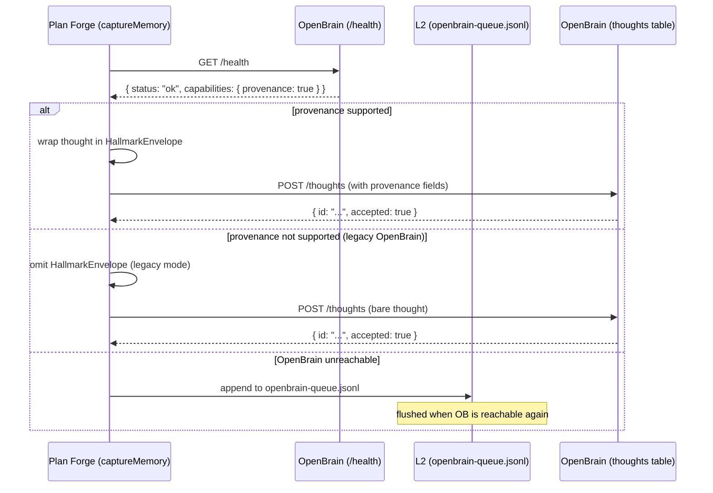

# Plan Forge Memory Architecture

> **Status**: Design reference  
> **Since**: v2.35  
> **Audience**: contributors adding new MCP tools, skills, or storage surfaces

> **v3.x Memory Architecture** — This document reflects the v3.x memory subsystem, which builds on the L1/L2/L3 tier model with four major additions: **Hallmark provenance envelopes** (every L3 write is tagged with source, hash, and capability negotiation result — originally landed in v2.95.0), **Anvil Δ-only memoization** (write-through cache layer between tools and L1/L2 — v2.95.0), the **Lattice code index** (parallel structural index for call-graph and cross-reference queries — v2.95.0), and **`forge_sync_memories` / `forge_sync_instructions`** (the Copilot Memory bridge that pushes decisions and lessons upward into `.github/copilot-memory-hints.md` and regenerates `copilot-instructions.md` — v2.99/v3.0). See the plan files for design rationale: [Phase-HALLMARK-CONTRACT](plans/Phase-HALLMARK-CONTRACT-PLAN.md) · [Phase-ANVIL](plans/Phase-ANVIL-PLAN.md) · [Phase-LATTICE](plans/Phase-LATTICE-PLAN.md) · [Phase-PROVENANCE](plans/Phase-PROVENANCE-PLAN.md). The Hallmark schema is defined in [`pforge-sdk/schemas/hallmark-provenance.v1.json`](../pforge-sdk/schemas/hallmark-provenance.v1.json).

---

## TL;DR

Plan Forge has **three tiers of memory**, organised by substrate, not by feature:

| Tier | Name | Backing | Lifetime | Query model | Cost |
|------|------|---------|----------|-------------|------|
| **L1** | Hub (volatile) | process RAM (`activeHub.history`) | server process | event replay | free |
| **L2** | Structured (left brain) | files on disk (`.forge/`, `.github/`, `docs/plans/`) | repo | exact lookup | free |
| **L3** | Semantic (right brain) | OpenBrain (Postgres + pgvector) | cross-project, forever | fuzzy / associative | network + embed |

**v3.x additions** layered on top of this hierarchy:

| Component | Where it sits | What it does |
|-----------|--------------|-------------|
| **Anvil** | Between tools and L1/L2 | Δ-only write-through cache — skips identical writes, merges delta |
| **Lattice** | Parallel to L2/L3 | Structural code index — callers, callees, blast radius, cross-references |
| **Hallmark** | Envelope on every L3 write | Provenance stamp — source file, content hash, capability negotiation result |
| **Slag-Heap DLQ** | Below L3 | Dead-letter queue for failed or rejected L3 writes |

Every MCP tool **must** write to L2. Tools whose output has cross-project or cross-time value **should** also write to L3. L1 is emitted automatically by any tool that publishes to the hub.

This mirrors a CPU memory hierarchy — fastest/smallest at L1, slowest/largest at L3 — and an operator's two-brain metaphor: deterministic filing cabinets on the left, associative recall on the right.

---

## Why three tiers

The framing that led here:

> *"On one side we have semantic search with Postgres, and on the other are our static files and configurations — two types of memory."*

That split is clean: files vs embeddings. But once you trace the data path of a running tool (`forge_run_plan`, `forge_watch_live`), a third surface appears: the **in-process hub buffer** that replays recent events to newly-connected WebSocket clients. It's neither a file nor a DB — it's RAM — and it has its own lifetime and query semantics. Naming it L1 makes the full hierarchy honest.

---

## L1 — Hub (volatile)

**Backing**: `activeHub.history` — a bounded ring buffer in the MCP server process.  
**Lifetime**: until the server restarts.  
**Query model**: "give me the last N events" on WebSocket connect; live stream thereafter.  
**Consumers**: dashboard tabs, `forge_watch_live`, external WS subscribers.

**Writers**: every tool that publishes a hub event. Examples:

| Event | Emitted by |
|-------|-----------|
| `slice-started` / `slice-completed` | orchestrator |
| `quorum-*` | quorum runner |
| `escalated` | escalation chain |
| `skill-step-*` | skill runner |
| `watch-snapshot-completed` / `watch-anomaly-detected` / `watch-advice-generated` | watcher |
| LiveGuard `health-*`, `incident-*`, `drift-*`, etc. | LiveGuard tools |

**Schema**: see [`pforge-mcp/EVENTS.md`](../pforge-mcp/EVENTS.md).

**Rule**: L1 is the *only* tier that streams. Dashboards and live tailers read from L1. Don't tail L2; don't tail L3.

---

## L2 — Structured (left brain)

**Backing**: files on disk. Known schemas. Append-only (`.jsonl`) or overwrite (`.json`).  
**Lifetime**: repo lifetime. Version-controlled where appropriate, gitignored where volatile.  
**Query model**: exact lookup — you know the path, you read the file.  
**Consumers**: every MCP tool, every agent, every skill, every hook, every CI job.

### The L2 map

| Path | Writer | Shape | Purpose |
|------|--------|-------|---------|
| `.forge.json` | user / `pforge update` | JSON | Project policy (thresholds, presets, hooks) |
| `.forge/runs/<id>/events.log` | orchestrator | text | Per-run truth log |
| `.forge/runs/<id>/slice-N.json` | orchestrator | JSON | Per-slice artifact |
| `.forge/runs/<id>/summary.json` | orchestrator | JSON | Run outcome |
| `.forge/model-performance.json` | orchestrator | JSON | Escalation-chain input |
| `.forge/quorum-history.json` | orchestrator | JSONL | Adaptive threshold input |
| `.forge/health-dna.json` | LiveGuard health | JSON fingerprint | Health scoring |
| `.forge/liveguard-memories.jsonl` | 10 LG tools via `captureMemory()` | JSONL | Local LG history (mirrors L3 captures) |
| `.forge/watch-history.jsonl` | watcher | JSONL | Watcher snapshot history |
| `.forge/drift-history.json` | drift report | JSON | Drift trend |
| `.forge/fix-proposals.json` | fix proposal | JSON | Fix-plan index |
| `.forge/regression-history.json` | regression guard | JSONL | Gate history |
| `.forge/deploy-journal.jsonl` | deploy journal | JSONL | Deploy log |
| `.forge/secret-scan-cache.json` | secret scan | JSON | Scan cache |
| `.forge/incidents/*.json` | incident capture | JSON per incident | Incident ledger |
| `.forge/openbrain-queue.jsonl` | `captureMemory()` | JSONL | **Bridge** — flush buffer for L3 when OpenBrain is unreachable |
| `.forge/anvil/` | Anvil cache | JSON per hash | **Δ-only cache** — content-addressed write-through cache |
| `.forge/anvil/dlq/` | Slag-Heap DLQ | JSON per entry | **Dead-letter queue** — rejected or failed L3 writes |
| `.forge/lattice/` | Lattice indexer | JSON per symbol | **Code index** — callers, callees, blast radius, cross-refs |
| `.github/instructions/*.md` | repo | markdown | Agent guardrails |
| `.github/agents/*.md` | repo | markdown | Agent personas |
| `.github/hooks/**` | repo | scripts + JSON | Lifecycle hooks |
| `.github/prompts/*.prompt.md` | repo | markdown | Pipeline prompts |
| `docs/plans/*.md` | user | markdown | Feature plans |
| `docs/plans/PROJECT-PRINCIPLES.md` | user | markdown | Project invariants |
| `VERSION` | release tooling | text | Current version |
| `presets/**` | repo | JSON + scripts | Stack-specific defaults |
| `templates/**` | repo | templates | Bootable scaffolding |

### Properties

- **Fast**: no network, no embedding, no ANN search.
- **Exact**: same path, same bytes, byte-identical reads.
- **Deterministic**: reproducible, diffable, auditable.
- **Offline**: works with zero external dependencies.
- **Bootable**: a fresh clone + `pforge check` is fully functional on L2 alone.

### Costs

- No search — you either know the path or you don't find it.
- No cross-project recall — each repo's `.forge/` is its own island.
- No inference — two JSONL lines describing the same problem look like two separate records.

### Rule

**Every MCP tool writes to L2.** If a tool doesn't produce an L2 artifact, its output is lost when the hub flushes. L2 is the durable floor.

---

## L3 — Semantic (right brain)

**Backing**: [OpenBrain](https://github.com/srnichols/openbrain) — Postgres + pgvector with an HTTP API.  
**Lifetime**: cross-project, cross-session, indefinite (subject to OpenBrain retention policy).  
**Query model**: semantic search via `search_thoughts`. Returns by meaning, not by path.  
**Consumers**: four pipeline prompts (step0/1/3/5) via `buildMemorySearchBlock`; any agent calling `search_thoughts` directly.

### What lives in L3

Not raw events — **distilled thoughts**. Each thought is a short natural-language record with:

- `content`: the insight in prose
- `metadata`: `{ project, phase, tool, severity, tags[], runId? }`
- `embedding`: vector (computed server-side)

### Writers today (10 tools)

Any tool calling `captureMemory()` in `pforge-mcp/server.mjs`:

- `forge_run_plan` (run summaries)
- `forge_drift_report`
- `forge_secret_scan`
- `forge_env_diff`
- `forge_regression_guard`
- `forge_fix_proposal`
- `forge_liveguard_run`
- `forge_incident_capture`
- `forge_incident_triage`
- `forge_deploy_journal`

Plus cost-anomaly thoughts from `forge_cost_report` escalations and run-summary thoughts assembled via `buildRunSummaryThought`.

### Properties

- **Semantic**: "we've seen this kind of failure before" works; filename matching doesn't matter.
- **Cross-project**: a lesson from project A surfaces when editing project B.
- **Cross-time**: survives repo deletes, branch prunes, cache clears.
- **Associative**: related thoughts cluster even when vocabulary differs.

### Costs

- **Network**: every write and read is an HTTP call to OpenBrain.
- **Embedding compute**: not free; not always fast.
- **Non-deterministic**: top-K search is a ranking, not a lookup. Two identical queries may re-rank if the corpus changes.
- **Optional**: OpenBrain is not required. Plan Forge must always degrade to L2-only when `openbrain.endpoint` is unset.

### The bridge — `openbrain-queue.jsonl`

When `captureMemory()` is called but OpenBrain is unreachable, thoughts are written to `.forge/openbrain-queue.jsonl` (L2). A background flush replays the queue when OpenBrain is reachable again. This keeps L3 writes non-blocking and tolerant of network failure — L2 is always the floor.

### Rule

**L3 is opt-in.** A tool should only write to L3 if its output has reusable semantic value (failure patterns, decisions, recurring gotchas). Don't flood L3 with transient state — that's what L2 is for.

---

## The dual-write pattern

Every MCP tool should follow this shape (v3.x: Anvil sits in the write path):

```
┌─────────────────────────────────────────────────────┐
│  Tool executes                                      │
│    │                                                │
│    ├─► L1 event (if publishes to hub)               │
│    │                                                │
│    ├─► Anvil cache (Δ-only) ──► L2 file write       │
│    │   (skips if content unchanged)  (always)       │
│    │                                                │
│    ├─► Lattice index update                         │
│    │   (if tool emits code symbols)                 │
│    │                                                │
│    └─► Hallmark envelope ──► L3 thought capture     │
│        (provenance stamp)   (OpenBrain configured + │
│                              semantic value)        │
└─────────────────────────────────────────────────────┘
```

And when reading before acting:

```
┌────────────────────────────────────────────────────┐
│  Tool prepares                                     │
│    │                                               │
│    ├─◄ Anvil cache hit (Δ check, avoids L2 read)   │
│    │   → falls through to L2 on cache miss         │
│    │                                               │
│    ├─◄ Lattice query (callers, blast, cross-ref)   │
│    │   (if tool needs structural code context)     │
│    │                                               │
│    └─◄ L3 semantic search                          │
│        (prior art, cross-project)                  │
└────────────────────────────────────────────────────┘
```

---

## Hallmark Provenance Envelope

Every L3 write in v3.x is wrapped in a **Hallmark provenance envelope** before it reaches OpenBrain. The envelope adds:

| Field | Value | Purpose |
|-------|-------|---------|
| `source_file` | path of the originating file or tool | traceability back to L2 |
| `source_file_hash` | SHA-256 of the source content at capture time | detect stale thoughts when source changes |
| `code_hash` | SHA-256 of the primary code symbol (if applicable) | detect drift for code-indexed thoughts |
| `capability_negotiated` | `true` / `false` | whether OpenBrain advertised provenance support |
| `schema_version` | `"hallmark-provenance.v1"` | forward compatibility |

**Schema**: [`pforge-sdk/schemas/hallmark-provenance.v1.json`](../pforge-sdk/schemas/hallmark-provenance.v1.json)

Thoughts without a Hallmark envelope are still accepted by OpenBrain (backward compat) but are flagged as `legacy` in the database. Use `forge_hallmark_verify` to audit coverage.

**New tools**: `forge_hallmark_show` · `forge_hallmark_verify`

---

## Anvil Δ-only Memoization

Anvil is a **write-through cache** that sits between MCP tools and the L1/L2 storage surfaces. Its core job: skip writes when content hasn't changed.

### Problem it solves

Many tool chains call `captureMemory()` on every invocation, even when the output is identical to the previous run (e.g., `forge_health_trend` on a quiet codebase). Before Anvil, every call produced a new JSONL line, a new hub event, and a new OpenBrain HTTP round-trip. On a busy codebase this generates thousands of near-identical records per day.

### How it works

```
Tool output ──► Anvil ──► hash(output)
                   │
                   ├── hit?  → skip write, return cached result
                   │
                   └── miss? → write L2 + L1 + (optionally) L3, store hash
```

Anvil uses a **content-addressed hash** (SHA-256 of the serialized output). The cache is stored at `.forge/anvil/` (gitignored). The DLQ for failed writes lives at `.forge/anvil/dlq/`.

### Cache semantics

- **Write-through**: a cache miss always writes to L2/L3 (Anvil never holds the only copy).
- **Δ-only**: only the hash is stored, not the full content — cache hits are cheap.
- **No eviction TTL**: entries age out when the source file hash changes (Hallmark integration).
- **DLQ**: writes that fail (e.g., OpenBrain unreachable) land in `.forge/anvil/dlq/` for replay.

**New tools**: `forge_anvil_stat` · `forge_anvil_clear` · `forge_anvil_rebuild` · `forge_anvil_get` · `forge_anvil_invalidate` · `forge_anvil_warm` · `forge_anvil_dlq_list` · `forge_anvil_dlq_drain`

**Gitignore entries (in `templates/.gitignore`)**: `.forge/anvil/` · `.forge/anvil/dlq/`

---

## Lattice Code Index

Lattice is a **parallel structural index** alongside L2 and L3. Where L3 answers "have we seen this problem before?", Lattice answers "what calls this function?" and "what would break if I change this symbol?".

### What Lattice indexes

| Index type | Example query | Use case |
|------------|--------------|---------|
| **Callers** | "who calls `captureMemory`?" | Impact analysis before refactor |
| **Callees** | "what does `forge_run_plan` call?" | Dependency tracing |
| **Blast radius** | "if I change `ProviderRegistry`, what breaks?" | Pre-slice risk scoring |
| **Cross-references** | "where is `HallmarkEnvelope` referenced?" | Documentation cross-linking |
| **Symbol stat** | "how many callers does `buildRunSummaryThought` have?" | Complexity metric |

### Storage

Lattice data lives at `.forge/lattice/` — a set of JSON files (one per indexed symbol or module). Like Anvil, it is gitignored and rebuilt on demand.

### Integration with plans

The plan runner calls `forge_lattice_blast` before each slice to compute a blast-radius score for the files in the slice's Scope Contract. A high blast score (> 0.7) triggers an automatic warning in the slice gate output.

**New tools**: `forge_lattice_index` · `forge_lattice_query` · `forge_lattice_callers` · `forge_lattice_blast` · `forge_lattice_stat`

**Gitignore entry**: `.forge/lattice/`

---

## Capability Negotiation with OpenBrain

Before writing a provenance-stamped thought, Plan Forge checks whether the connected OpenBrain instance supports the Hallmark envelope schema. This is **capability negotiation**.

### Flow



### Rules

1. **Capability check is cached** for the server process lifetime. Plan Forge does not ping `/health` on every write.
2. **Fallback is always L2**. If OpenBrain is unreachable or returns an error, the thought is queued in `.forge/openbrain-queue.jsonl`.
3. **Legacy mode is transparent**. A bare thought (no Hallmark envelope) is accepted by both old and new OpenBrain. Tools do not need to know which mode is active.
4. **Capability flag in config**: if `openbrain.disableProvenance: true` in `.forge.json`, Plan Forge skips capability negotiation and always writes bare thoughts.

---

## Slag-Heap DLQ

The **Slag-Heap** is the dead-letter queue (DLQ) for failed or rejected L3 writes. It is separate from the `openbrain-queue.jsonl` (which handles network-unreachable writes) — the Slag-Heap catches writes that OpenBrain explicitly rejects (e.g., schema validation failures, quota exceeded, provenance hash mismatch).

### Storage

`.forge/anvil/dlq/` — one JSON file per failed write. Each file contains:

| Field | Content |
|-------|---------|
| `thought` | the original thought payload |
| `envelope` | the Hallmark envelope (if present) |
| `error` | the rejection reason from OpenBrain |
| `timestamp` | ISO-8601 capture time |
| `retryCount` | number of replay attempts |

### Replay

`forge_anvil_dlq_drain` replays DLQ entries against OpenBrain. Entries that fail after 3 retries are archived to `.forge/anvil/dlq/archived/` and removed from the active queue.

### Monitoring

`forge_anvil_dlq_list` returns the current DLQ depth and the most recent error reasons. A non-zero DLQ depth appears as a warning in `pforge smith` output.

---

## Tool audit — where we are today

As of v3.5.1, dual-write coverage across 88 MCP tools:

| Bucket | Count | Status |
|--------|-------|--------|
| L2-only | 26 | default; fine for transient state |
| L2 + L3 | 10 | LiveGuard tools + `forge_run_plan` |
| L2 + L3 + Hallmark | 10 | all L3 writers now stamp provenance |
| L1 + L2 | many | any tool emitting hub events |
| L1 + L2 + L3 | subset of the 10 above | full stack |
| **Anvil-managed** | all L2 writers | Δ-only cache in write path |
| **Lattice-indexed** | code-emitting tools | structural index on every symbol write |

### Candidates for L3 promotion

Left-only today, would benefit from right-brain writes:

| Tool | L3 value | Why |
|------|----------|-----|
| `forge_watch` / `forge_watch_live` | **High** | Only cross-project observer. Anomaly patterns are highly reusable. |
| `forge_cost_report` | **High** | "We keep overspending on this slice shape" is a classic semantic signal. |
| `forge_diagnose` | Medium | Failure modes recur; diagnosis text is reusable. |
| `forge_sweep` | Medium | Stub/TODO patterns recur across repos. |
| `forge_run_skill` | Medium | Skill failure modes are cross-project. |
| `forge_plan_status` | Low | Transient. Stay L2. |
| `forge_ext_search` | Low | Already indexed by the catalog. |
| `forge_generate_image` | None | No semantic value in image paths. |

---

## Design rules

1. **L2 is the floor.** If a tool can't write L2, it doesn't persist. Fix that first.
2. **L3 is the ceiling.** Opt-in, gracefully degrades to L2-only when OpenBrain is absent. No tool ever hard-requires OpenBrain.
3. **L1 is ephemeral.** Never rely on L1 for correctness — it's replay-buffer-grade, not storage-grade.
4. **Queue before cross-tier writes.** L3 writes go through `captureMemory()` which hits `openbrain-queue.jsonl` first (L2) — so L3 failure never blocks a tool.
5. **Read pattern mirrors write pattern.** Recent-state? L2 (via Anvil cache). Associative? L3. Structural? Lattice. Live feed? L1.
6. **One schema per surface.** L2 files have documented shapes. L1 events are in `EVENTS.md`. L3 thought metadata is keyed by `{ project, phase, tool, tags }`. Hallmark envelope schema is in `hallmark-provenance.v1.json`.
7. **New tool checklist.** Before merging a new MCP tool, confirm: (a) its L2 artifact is defined; (b) its L1 event is in `EVENTS.md` if it publishes; (c) its L3 value is explicitly declared — even if the answer is "none"; (d) if it writes L3, confirm it uses `captureMemory()` so Hallmark stamping is automatic; (e) if it emits code symbols, confirm it notifies the Lattice indexer.
8. **Anvil is automatic.** Tools do not call Anvil directly — `captureMemory()` routes through Anvil. If you call the file system directly (bypassing `captureMemory()`), Anvil cannot deduplicate your writes.
9. **Lattice is advisory.** Blast-radius scores from Lattice inform slice gates but never block a run. A missing Lattice index means the score is skipped, not that the run fails.
10. **Capability negotiation is cached.** Check OpenBrain's `/health` once per server process start. Don't check on every write — it adds latency for every `captureMemory()` call.

---

## Cognitive-science parallel

The three tiers map roughly to established memory-systems theory:

| Plan Forge | Human memory analogue |
|-----------|----------------------|
| L1 Hub buffer | working memory / short-term store |
| L2 Files + configs | declarative + procedural memory (explicit, rule-following) |
| L3 OpenBrain thoughts | semantic memory (associative, meaning-indexed) |

It's not a literal equivalence — it's just that the same pressures (fast/small vs slow/large, exact vs fuzzy, session-local vs lifetime) produce the same shape of hierarchy whether the substrate is neurons or silicon.

---

## Roadmap implications

Three concrete items drop out of this architecture:

1. **v2.95.0 (released)** — Hallmark provenance, Anvil Δ-only memoization, Lattice code index, Slag-Heap DLQ, and capability negotiation with OpenBrain. 15 new MCP tools. See the Phase plans for full details.
2. **v2.96 (shipped in v3.x)** — Wire `forge_watch` / `forge_watch_live` through `captureMemory()`. The only cross-project observer now has semantic memory; Lattice blast scoring covers watcher anomalies.
3. **v2.99 / v3.0 (released)** — Copilot bridge: `forge_sync_memories` (writes `.github/copilot-memory-hints.md` from forge decisions/trajectories/auto-skills) and `forge_sync_instructions` (regenerates `.github/copilot-instructions.md` from project profile + principles + `.forge.json`). Completes the Copilot integration trilogy.
4. **v3.6+ (design)** — Retrofit the remaining L3 candidates (`forge_diagnose`, `forge_sweep`, `forge_run_skill`). Add an `l3Writes` field to each tool's declaration in `tools.json` so coverage is auditable. Consider an L4: shared OpenBrain tenant across an organisation, so lessons from project A surface to project B without any local OpenBrain.

---

## Related files

- [`pforge-mcp/memory.mjs`](../pforge-mcp/memory.mjs) — OpenBrain integration module (`captureMemory`, `buildMemorySearchBlock`, `buildRunSummaryThought`, `loadProjectContext`).
- [`pforge-mcp/server.mjs`](../pforge-mcp/server.mjs) — tool handlers. `captureMemory()` helper at top of file.
- [`pforge-mcp/EVENTS.md`](../pforge-mcp/EVENTS.md) — L1 event schemas.
- [`pforge-mcp/tools.json`](../pforge-mcp/tools.json) — tool manifest.
- [`pforge-sdk/schemas/hallmark-provenance.v1.json`](../pforge-sdk/schemas/hallmark-provenance.v1.json) — Hallmark envelope schema.
- [`docs/UNIFIED-SYSTEM-ARCHITECTURE.md`](UNIFIED-SYSTEM-ARCHITECTURE.md) — broader system context.
- [`docs/plans/Phase-HALLMARK-CONTRACT-PLAN.md`](plans/Phase-HALLMARK-CONTRACT-PLAN.md) — Hallmark design rationale.
- [`docs/plans/Phase-ANVIL-PLAN.md`](plans/Phase-ANVIL-PLAN.md) — Anvil design rationale.
- [`docs/plans/Phase-LATTICE-PLAN.md`](plans/Phase-LATTICE-PLAN.md) — Lattice design rationale.

---

## QA & Validation

The v3.x memory subsystem (Hallmark, Anvil, Lattice, Slag-Heap DLQ, capability negotiation, Copilot sync bridge) is covered by two validation surfaces:

### Operator smoke script

Run after any checkout to verify the 15 new MCP tools are registered and the gitignore template is correct:

```bash
# Bash / macOS / Linux / WSL
bash scripts/memory-qa-smoke.sh

# PowerShell (Windows / cross-platform pwsh)
pwsh scripts/memory-qa-smoke.ps1
```

Both scripts exit 0 on success, non-zero (= number of failed checks) on failure. Each failing check prints `[FAIL] <check-name> - <reason>`. Checks that require an optional dependency (MCP server, OpenBrain) print `[SKIP] <name> - <reason>` and do not count as failures when the dependency is absent.

### End-to-end testbed scenario

The scenario `memory-upgrade-e2e` exercises the full memory stack in a single in-process run:

```bash
# Discover and run via the testbed surface
pforge mcp-call forge_testbed_happypath '{"scenario":"memory-upgrade-e2e"}'
```

The scenario spins up a mock-OpenBrain, runs a 3-slice fixture plan, indexes the fixture project via Lattice, and verifies Anvil hits, Hallmark records, and DLQ behaviour. Its summary JSON exposes `{ anvilHits, anvilMisses, latticeChunks, hallmarkRecords, dlqCount }`. Source: [`pforge-mcp/testbed/scenarios/memory-upgrade-e2e.mjs`](../pforge-mcp/testbed/scenarios/memory-upgrade-e2e.mjs).
