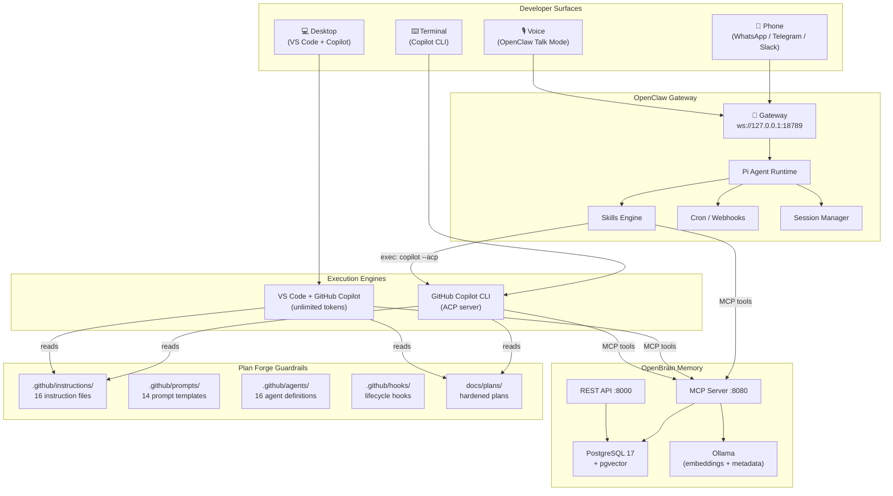
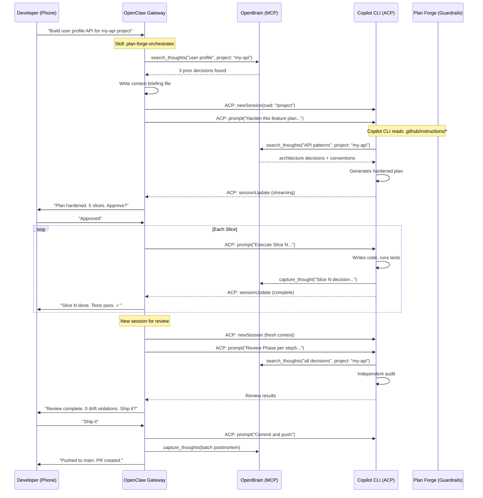
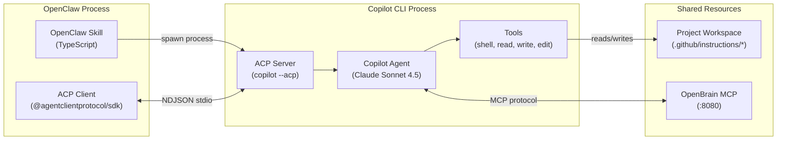
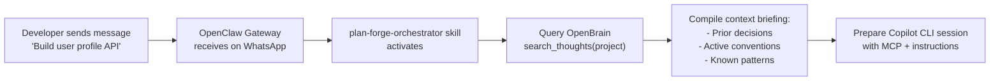
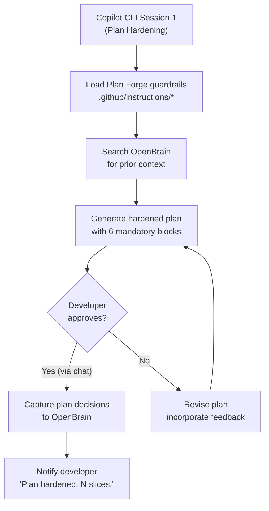
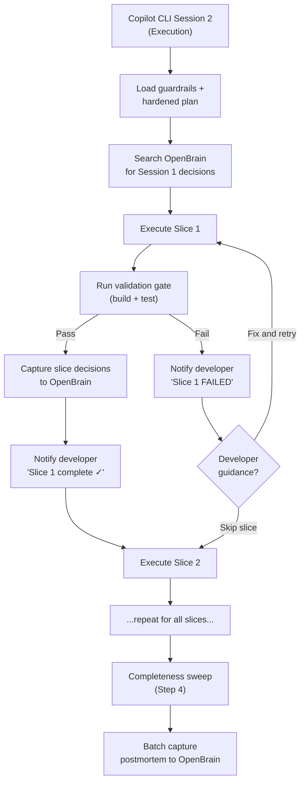
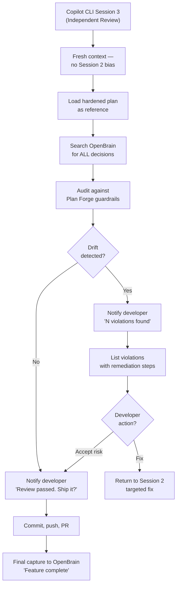
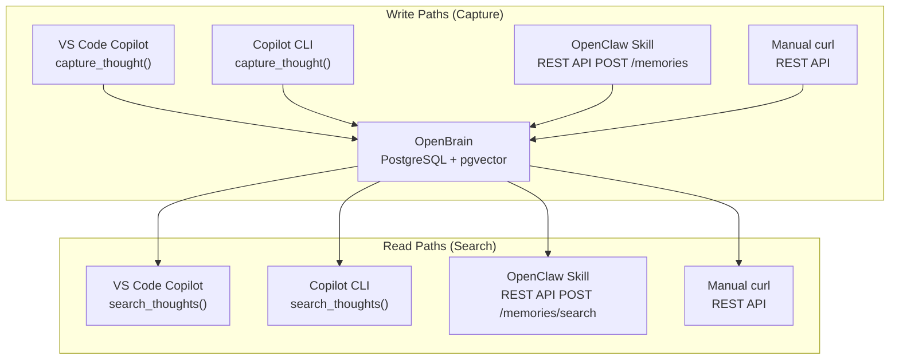
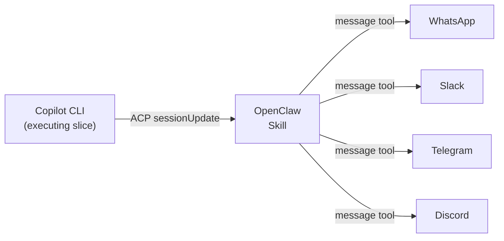

# Unified System Architecture: Plan Forge + OpenBrain + OpenClaw

> **Purpose**: A complete reference for integrating Plan Forge, OpenBrain, and OpenClaw into a single automated development system — where AI agents plan, build, remember, and communicate across every surface you use.
>
> **Last Updated**: 2026-03-24

---

## Table of Contents

- [Executive Summary](#executive-summary)
- [The Three Projects](#the-three-projects)
- [Why All Three Together](#why-all-three-together)
- [System Architecture](#system-architecture)
- [Component Interaction Map](#component-interaction-map)
- [Integration Layer: Copilot CLI + ACP](#integration-layer-copilot-cli--acp)
- [Data Flow: Full Feature Lifecycle](#data-flow-full-feature-lifecycle)
- [Deployment Topology](#deployment-topology)
- [Workspace Layout](#workspace-layout)
- [OpenClaw Skills for Plan Forge + OpenBrain](#openclaw-skills-for-plan-forge--openbrain)
- [VS Code Copilot Integration](#vs-code-copilot-integration)
- [Copilot CLI Integration](#copilot-cli-integration)
- [OpenBrain as Shared Memory Fabric](#openbrain-as-shared-memory-fabric)
- [Session Management: The 3-Session Model Enhanced](#session-management-the-3-session-model-enhanced)
- [Notification and Approval Flows](#notification-and-approval-flows)
- [Security Model](#security-model)
- [Configuration Reference](#configuration-reference)
- [Phased Rollout Plan](#phased-rollout-plan)
- [Worked Example: End-to-End Feature Build](#worked-example-end-to-end-feature-build)

---

## Executive Summary

Each project solves one critical problem in AI-assisted development:

| Project | Problem Solved | Analogy |
|---------|---------------|---------|
| **Plan Forge** | AI agents drift without guardrails | The **blueprint** — what to build, how, and when to stop |
| **OpenBrain** | Every AI session starts from zero | The **memory** — why we decided, what we learned, what failed |
| **OpenClaw** | AI is locked inside one tool/surface | The **nervous system** — always-on orchestration across every channel |

Alone, each is useful. Together, they form a **closed-loop development system** where:

1. You describe a feature from any device (phone, laptop, terminal)
2. OpenClaw routes the request and prepares context
3. Plan Forge hardens the idea into an execution contract
4. Copilot (VS Code or CLI) builds it using your unlimited tokens
5. OpenBrain captures every decision and lesson
6. You get progress updates on WhatsApp/Slack/Telegram
7. A fresh session reviews the work with full decision history
8. Next time, the AI already knows what worked and what didn't

---

## The Three Projects

### Plan Forge — The Development Methodology

```
Rough Idea → Hardened Plan → Slice-by-Slice Execution → Independent Review
```

- **6-step pipeline**: Specify → Preflight → Harden → Execute → Sweep → Review
- **3 isolated sessions**: Plan, Build, Audit (prevents self-review bias)
- **16 instruction files** per tech stack: architecture, security, testing, database, etc.
- **18 agents**: 6 stack-specific + 7 cross-stack + 5 pipeline
- **8 skills**: database-migration, staging-deploy, test-sweep, etc.
- **Lifecycle hooks**: auto-enforce guardrails, format code, catch TODOs

### OpenBrain — The Persistent Semantic Memory

```
Thought → Embedding → pgvector → Searchable by meaning forever
```

- **7 MCP tools**: capture_thought, search_thoughts, list_thoughts, thought_stats, update_thought, delete_thought, capture_thoughts (batch)
- **8 REST endpoints**: full HTTP API for non-MCP integrations
- **Auto-metadata extraction**: LLM classifies type, topics, people, action items
- **Project scoping**: isolate memory per project, no cross-contamination
- **Decision linking**: `supersedes` field chains decision evolution
- **Self-hosted**: PostgreSQL + pgvector + Ollama, zero cloud dependency

### OpenClaw — The Always-On AI Gateway

```
Any Channel → Gateway → Agent Runtime → Tools/Skills → Response → Any Channel
```

- **20+ messaging channels**: WhatsApp, Telegram, Slack, Discord, Teams, Signal, iMessage, IRC, Matrix, etc.
- **Skills platform**: AgentSkills-compatible SKILL.md files, ClawHub registry
- **Agent-to-agent sessions**: `sessions_send`, `sessions_list`, `sessions_history`
- **Built-in tools**: exec, browser, web_search, read/write/edit, cron, nodes
- **Voice Wake + Talk Mode**: dictate commands hands-free
- **Multi-agent routing**: different agents per channel/account
- **Companion apps**: macOS menu bar, iOS/Android nodes

---

## Why All Three Together

### Without Integration

```
┌─────────────────────┐   ┌─────────────────────┐   ┌─────────────────────┐
│     Plan Forge      │   │     OpenBrain        │   │     OpenClaw        │
│                     │   │                      │   │                     │
│ ✅ Great guardrails │   │ ✅ Great memory      │   │ ✅ Great reach      │
│ ❌ VS Code only     │   │ ❌ Must remember to  │   │ ❌ No methodology   │
│ ❌ Sessions forget  │   │    search/capture    │   │ ❌ No memory        │
│ ❌ Can't notify you │   │ ❌ Passive — waits   │   │ ❌ No dev guardrails│
└─────────────────────┘   └─────────────────────┘   └─────────────────────┘
```

### With Integration

```
┌─────────────────────────────────────────────────────────────────────────┐
│                     UNIFIED DEVELOPMENT SYSTEM                          │
│                                                                         │
│  OpenClaw (orchestrator + reach)                                       │
│    ├── Routes work requests from any channel                           │
│    ├── Launches Copilot CLI via ACP for heavy execution                │
│    ├── Sends progress/approval notifications to your phone             │
│    └── Coordinates multi-session handoffs                              │
│                                                                         │
│  Plan Forge (methodology + guardrails)                                 │
│    ├── .github/instructions/ auto-load in VS Code AND Copilot CLI     │
│    ├── Pipeline agents enforce specify → plan → execute → review → ship │
│    ├── Lifecycle hooks catch violations automatically                  │
│    └── Execution slices provide checkpointed progress                  │
│                                                                         │
│  OpenBrain (memory + context)                                          │
│    ├── MCP server accessible from VS Code, Copilot CLI, AND OpenClaw  │
│    ├── Every decision automatically captured with provenance           │
│    ├── Every session starts by querying prior context                  │
│    └── Post-mortems become searchable institutional knowledge          │
└─────────────────────────────────────────────────────────────────────────┘
```

---

## System Architecture

### High-Level Architecture Diagram



### Component Responsibility Matrix

| Responsibility | OpenClaw | Plan Forge | OpenBrain | Copilot (VS Code/CLI) |
|---------------|----------|------------|-----------|----------------------|
| Receive user requests | ✅ Primary | — | — | ✅ Direct |
| Enforce coding standards | — | ✅ Primary | — | ✅ Reads instruction files |
| Execute code changes | — | — | — | ✅ Primary |
| Capture decisions | ✅ Auto-capture | ✅ Extension triggers | ✅ Primary storage | ✅ Via MCP |
| Search prior context | ✅ Via skill | ✅ Extension triggers | ✅ Primary search | ✅ Via MCP |
| Notify developer | ✅ Primary | — | — | — |
| Manage sessions | ✅ Multi-agent | ✅ 3-session model | — | — |
| Approve/reject work | ✅ Chat-based | ✅ Gate validation | — | ✅ UI-based |
| Track progress | ✅ Via cron/webhooks | ✅ Slice checkpoints | ✅ thought_stats | ✅ Session state |
| Store LLM tokens | — | — | — | ✅ Your Copilot quota |

---

## Component Interaction Map

### Request Flow: Feature Request to Deployed Code



---

## Integration Layer: Copilot CLI + ACP

The **Agent Client Protocol (ACP)** is what makes this system possible. GitHub Copilot CLI can run as a programmable server that any external tool can control.

### Why Copilot CLI (Not VS Code) as the Execution Engine

| Factor | VS Code + Copilot | Copilot CLI |
|--------|-------------------|-------------|
| **Programmable** | No API — UI only | ✅ ACP protocol (NDJSON over TCP/stdio) |
| **Headless** | Requires GUI window | ✅ Runs in terminal, scriptable |
| **Session control** | Manual chat management | ✅ `newSession`, `prompt`, `requestPermission` |
| **Tool approval** | Manual clicks | ✅ `--allow-tool`, `--deny-tool`, programmatic callbacks |
| **MCP support** | ✅ Full | ✅ Full |
| **Instruction files** | ✅ .github/instructions/ | ✅ .github/copilot-instructions.md + custom instructions |
| **Custom agents** | ✅ .github/agents/ | ✅ Custom agent definitions |
| **Hooks** | ✅ .github/hooks/ | ✅ Hooks support |
| **Skills** | ✅ .github/skills/ | ✅ AgentSkills-compatible |
| **Token source** | Your Copilot subscription | Your Copilot subscription |
| **Plan mode** | Agent mode in chat | ✅ Shift+Tab plan mode |
| **Output capture** | Stays in UI | ✅ ACP streaming responses |
| **Parallel sessions** | One chat panel | ✅ Multiple ACP sessions |

### ACP Architecture



### ACP Communication Protocol

```
┌─────────────────────────────────────────────────────────────────┐
│                    ACP Message Flow                              │
├─────────────────────────────────────────────────────────────────┤
│                                                                  │
│  OpenClaw                          Copilot CLI                   │
│  (ACP Client)                      (ACP Server)                  │
│                                                                  │
│  ──── initialize ──────────────►                                 │
│  ◄─── initializeResult ────────                                  │
│                                                                  │
│  ──── newSession ──────────────►                                 │
│       { cwd, mcpServers }                                        │
│  ◄─── newSessionResult ────────                                  │
│       { sessionId }                                              │
│                                                                  │
│  ──── prompt ──────────────────►                                 │
│       { sessionId, prompt }                                      │
│  ◄─── sessionUpdate ──────────── (streaming text chunks)         │
│  ◄─── sessionUpdate ──────────── (streaming text chunks)         │
│  ◄─── requestPermission ──────── (tool approval needed)          │
│  ──── permissionResult ────────►                                 │
│       { outcome: "approved" }                                    │
│  ◄─── sessionUpdate ──────────── (more streaming)                │
│  ◄─── promptResult ───────────── { stopReason: "end_turn" }      │
│                                                                  │
│  ──── prompt ──────────────────► (next slice)                     │
│       ...                                                        │
│                                                                  │
└─────────────────────────────────────────────────────────────────┘
```

### Copilot CLI Invocation Patterns

**Interactive (developer at terminal):**
```bash
cd /path/to/project
copilot
# Then type: "Execute Slice 2 of docs/plans/Phase-4.md"
```

**Programmatic (OpenClaw-driven):**
```bash
copilot -p "Execute Slice 2 of docs/plans/Phase-4.md. \
  Follow .github/instructions/architecture-principles.instructions.md. \
  Run tests after each change." \
  --allow-tool='shell(dotnet)' \
  --allow-tool='shell(git)' \
  --allow-tool='write' \
  --deny-tool='shell(rm)' \
  --deny-tool='shell(git push)'
```

**ACP server (OpenClaw as programmatic client):**
```bash
copilot --acp --stdio
# Or TCP mode for persistent server:
copilot --acp --port 3000
```

---

## Data Flow: Full Feature Lifecycle

### Phase 1: Request Capture



### Phase 2: Plan Hardening (Session 1)



### Phase 3: Execution (Session 2)



### Phase 4: Review (Session 3)



---

## Deployment Topology

### Single Machine (Developer Workstation)

```
┌─────────────────────────────────────────────────────────────┐
│  Your Machine (Windows / macOS / Linux)                      │
│                                                              │
│  ┌──────────────┐  ┌──────────────┐  ┌──────────────────┐  │
│  │ OpenClaw     │  │ VS Code      │  │ Terminal          │  │
│  │ Gateway      │  │ + Copilot    │  │ + Copilot CLI     │  │
│  │ :18789       │  │              │  │                   │  │
│  └──────┬───────┘  └──────┬───────┘  └──────┬────────────┘  │
│         │                 │                  │               │
│         └─────────┬───────┴──────────┬───────┘               │
│                   │                  │                        │
│         ┌─────────▼──────────────────▼───────┐               │
│         │        OpenBrain Stack              │               │
│         │  ┌──────────┐  ┌────────────────┐  │               │
│         │  │ MCP :8080 │  │ REST API :8000 │  │               │
│         │  └─────┬─────┘  └───────┬────────┘  │               │
│         │        └────────┬───────┘            │               │
│         │         ┌───────▼───────┐            │               │
│         │         │ PostgreSQL    │            │               │
│         │         │ + pgvector    │            │               │
│         │         │ :5432         │            │               │
│         │         └───────────────┘            │               │
│         │  ┌──────────────────────┐            │               │
│         │  │ Ollama               │            │               │
│         │  │ (embeddings + LLM)   │            │               │
│         │  │ :11434               │            │               │
│         │  └──────────────────────┘            │               │
│         └────────────────────────────────────┘               │
│                                                              │
│  Project Workspace: ~/projects/my-api/                       │
│    ├── .github/instructions/    (Plan Forge guardrails)      │
│    ├── .github/prompts/         (scaffolding templates)      │
│    ├── .github/agents/          (reviewer personas)          │
│    ├── .vscode/mcp.json         (OpenBrain MCP config)       │
│    ├── docs/plans/              (hardened plans)              │
│    └── src/                     (your application code)      │
│                                                              │
└─────────────────────────────────────────────────────────────┘
```

### Distributed (Home Lab / Team Setup)

```
┌────────────────────────────┐     ┌────────────────────────────┐
│  Server (Linux/K8s)        │     │  Your Workstation          │
│                            │     │                            │
│  OpenBrain                 │     │  VS Code + Copilot         │
│    PostgreSQL + pgvector   │◄────│  Copilot CLI               │
│    MCP :8080               │     │  OpenClaw Gateway          │
│    REST :8000              │     │    (Tailscale tunnel)      │
│    Ollama                  │     │                            │
│                            │     └──────────┬─────────────────┘
│  (accessed via Tailscale)  │                │
└────────────────────────────┘                │
                                    ┌─────────▼──────────┐
                                    │  Your Phone         │
                                    │  WhatsApp/Telegram  │
                                    │  (notifications +   │
                                    │   approvals)        │
                                    └────────────────────┘
```

### Azure Cloud Deployment

For teams that don't want to maintain on-prem infrastructure, OpenBrain can run entirely on Azure. Ollama is replaced by **Azure OpenAI** (no GPU VM needed), PostgreSQL runs on the managed **Flexible Server** with pgvector, and the OpenBrain Node.js server runs on **Azure Container Apps** (scales to zero when idle).

```
┌──────────────────────────────────────────────────────────────────┐
│  Azure Resource Group: rg-openbrain                               │
│                                                                   │
│  ┌──────────────────────────────────────────────────────────┐    │
│  │  Azure Container Apps Environment                         │    │
│  │                                                           │    │
│  │  ┌─────────────────────────────────┐                      │    │
│  │  │  openbrain-api                  │                      │    │
│  │  │  (Container App — Consumption)  │                      │    │
│  │  │                                 │                      │    │
│  │  │  REST API  :8000 (internal)     │                      │    │
│  │  │  MCP SSE   :8080 (external)     │                      │    │
│  │  │  Image: ghcr.io/srnichols/      │                      │    │
│  │  │         openbrain:latest        │                      │    │
│  │  └──────────┬──────────────────────┘                      │    │
│  └─────────────┼─────────────────────────────────────────────┘    │
│                │                                                   │
│       ┌────────┴────────┐      ┌──────────────────────────┐      │
│       │                 │      │                          │      │
│  ┌────▼─────────────┐  │  ┌───▼────────────────────────┐ │      │
│  │ Azure Database    │  │  │ Azure OpenAI               │ │      │
│  │ for PostgreSQL    │  │  │                            │ │      │
│  │ (Flexible Server) │  │  │ text-embedding-3-small     │ │      │
│  │                   │  │  │ gpt-4o-mini                │ │      │
│  │ SKU: B1ms         │  │  │                            │ │      │
│  │ 1 vCore / 2 GiB   │  │  │ (pay-per-token)           │ │      │
│  │ pgvector enabled  │  │  └────────────────────────────┘ │      │
│  │ 32 GiB storage    │  │                                 │      │
│  └───────────────────┘  │  ┌────────────────────────────┐ │      │
│                         │  │ Azure Key Vault            │ │      │
│                         │  │                            │ │      │
│                         │  │ MCP_ACCESS_KEY             │ │      │
│                         │  │ DB_PASSWORD                │ │      │
│                         │  │ AZURE_OPENAI_KEY           │ │      │
│                         │  └────────────────────────────┘ │      │
│                         │                                 │      │
└─────────────────────────┴─────────────────────────────────┴──────┘
                │
                │ HTTPS (Container Apps ingress)
                │
    ┌───────────▼────────────────┐
    │  Your Workstation          │
    │                            │
    │  VS Code + Copilot ────────┼──► MCP: https://openbrain-api.<region>.azurecontainerapps.io/sse
    │  Copilot CLI ──────────────┼──► MCP: same URL
    │  OpenClaw Gateway ─────────┼──► REST: https://openbrain-api.<region>.azurecontainerapps.io
    │                            │
    └────────────────────────────┘
```

#### Azure Service Map

| On-Prem Component | Azure Service | SKU | Est. Cost/mo |
|-------------------|--------------|-----|-------------|
| PostgreSQL 17 + pgvector | Azure Database for PostgreSQL Flexible Server | **B1ms** (1 vCore, 2 GiB) | ~$12.41 |
| PostgreSQL storage (32 GiB) | (included — Flex Server storage) | 32 GiB @ $0.115/GiB | ~$3.68 |
| Ollama embeddings | Azure OpenAI — `text-embedding-3-small` | Pay-per-token (1536-dim) | ~$0.02-0.50 |
| Ollama metadata LLM | Azure OpenAI — `gpt-4o-mini` | Pay-per-token | ~$0.10-0.50 |
| OpenBrain Node.js server | Azure Container Apps | **Consumption** (scales to zero) | ~$0-5 |
| Secrets management | Azure Key Vault | Standard | ~$0.03 |
| **Total** | | | **~$17-22/mo** |

> **Note**: Container Apps Consumption plan includes 180k vCPU-seconds, 360k GiB-seconds, and 2M requests/month **free** per subscription. For personal use, the OpenBrain container will likely stay within or near this free tier.

#### Deploy to Azure

**One-click deploy** (from the [OpenBrain repo](https://github.com/srnichols/OpenBrain)):

[](https://portal.azure.com/#create/Microsoft.Template/uri/https%3A%2F%2Fraw.githubusercontent.com%2Fsrnichols%2FOpenBrain%2Fmaster%2Finfra%2Fazuredeploy.json)

**Or via Azure Developer CLI:**
```bash
cd OpenBrain
azd up
```

**Or via Azure CLI directly:**
```bash
az deployment group create \
  --resource-group rg-openbrain \
  --template-file infra/main.bicep \
  --parameters location=eastus2
```

The Bicep template provisions all resources, runs the database init script, deploys the container, and outputs the MCP endpoint URL. You then configure it in your MCP clients:

```json
{
  "servers": {
    "openbrain": {
      "type": "sse",
      "url": "https://openbrain-api.<region>.azurecontainerapps.io/sse?key=<YOUR_MCP_KEY>"
    }
  }
}
```

#### Azure OpenAI Embedder

When deploying to Azure, OpenBrain uses `EMBEDDER_PROVIDER=azure-openai` instead of `ollama`:

| Environment Variable | Value | Purpose |
|---------------------|-------|---------|
| `EMBEDDER_PROVIDER` | `azure-openai` | Select the Azure OpenAI provider |
| `EMBEDDING_DIMENSIONS` | `1536` | Azure text-embedding-3-small outputs 1536-dim vectors |
| `AZURE_OPENAI_ENDPOINT` | `https://<name>.openai.azure.com` | Your Azure OpenAI resource endpoint |
| `AZURE_OPENAI_KEY` | (from Key Vault) | API key for the resource |
| `AZURE_OPENAI_EMBED_DEPLOYMENT` | `text-embedding-3-small` | Deployment name for embeddings |
| `AZURE_OPENAI_LLM_DEPLOYMENT` | `gpt-4o-mini` | Deployment name for metadata extraction |

> **Important**: Azure uses 1536-dim embeddings (vs. 768-dim for Ollama). The `db/init.sql` accepts a `VECTOR()` dimension parameter, and the Bicep template configures the database accordingly. Existing Ollama-based thoughts **cannot** be mixed with Azure OpenAI thoughts in the same table — choose one embedder per deployment.

---

## Workspace Layout

After full setup, your project workspace looks like this:

```
my-api/
├── .github/
│   ├── copilot-instructions.md          ← Plan Forge: project-level Copilot config
│   ├── instructions/
│   │   ├── architecture-principles.instructions.md    ← Plan Forge: core rules
│   │   ├── api-patterns.instructions.md               ← Plan Forge: REST conventions
│   │   ├── database.instructions.md                   ← Plan Forge: SQL/ORM patterns
│   │   ├── security.instructions.md                   ← Plan Forge: OWASP, validation
│   │   ├── testing.instructions.md                    ← Plan Forge: TDD, coverage
│   │   ├── persistent-memory.instructions.md          ← OpenBrain: search/capture rules
│   │   └── ... (15-16 total instruction files)
│   ├── prompts/
│   │   ├── step0-specify-feature.prompt.md            ← Plan Forge: pipeline Step 0
│   │   ├── step1-preflight-check.prompt.md            ← Plan Forge: pipeline Step 1
│   │   ├── step2-harden-plan.prompt.md                ← Plan Forge: pipeline Step 2
│   │   ├── step3-execute-slice.prompt.md              ← Plan Forge: pipeline Step 3
│   │   ├── step4-completeness-sweep.prompt.md         ← Plan Forge: pipeline Step 4
│   │   ├── step5-review-gate.prompt.md                ← Plan Forge: pipeline Step 5
│   │   ├── search-project-history.prompt.md           ← OpenBrain: semantic search
│   │   ├── capture-decision.prompt.md                 ← OpenBrain: structured capture
│   │   └── ... (14 scaffolding prompts)
│   ├── agents/
│   │   ├── specifier.agent.md                         ← Plan Forge: pipeline agent
│   │   ├── plan-hardener.agent.md                     ← Plan Forge: pipeline agent
│   │   ├── executor.agent.md                          ← Plan Forge: pipeline agent
│   │   ├── reviewer-gate.agent.md                     ← Plan Forge: pipeline agent
│   │   ├── shipper.agent.md                           ← Plan Forge: pipeline agent
│   │   ├── security-reviewer.agent.md                 ← Plan Forge: stack agent
│   │   ├── memory-reviewer.agent.md                   ← OpenBrain: decision auditor
│   │   └── ... (18 total agents)
│   ├── skills/
│   │   ├── database-migration/SKILL.md                ← Plan Forge: migration skill
│   │   ├── staging-deploy/SKILL.md                    ← Plan Forge: deploy skill
│   │   └── test-sweep/SKILL.md                        ← Plan Forge: test skill
│   └── hooks/
│       ├── session-start.sh                           ← Plan Forge: inject context
│       ├── pre-tool-use.sh                            ← Plan Forge: block forbidden actions
│       ├── post-tool-use.sh                           ← Plan Forge: auto-format, warn TODOs
│       └── stop.sh                                    ← Plan Forge: warn if no tests ran
├── .vscode/
│   └── mcp.json                                       ← OpenBrain MCP config
├── docs/
│   └── plans/
│       ├── Phase-4-User-Profile-API.md                ← Hardened plan
│       └── DEPLOYMENT-ROADMAP.md                      ← Project roadmap
├── skills/                                            ← OpenClaw workspace skills
│   ├── plan-forge-orchestrator/SKILL.md               ← OpenClaw: pipeline orchestration
│   ├── openbrain-capture/SKILL.md                     ← OpenClaw: memory capture
│   └── openbrain-search/SKILL.md                      ← OpenClaw: memory search
└── src/                                               ← Application source code
```

---

## OpenClaw Skills for Plan Forge + OpenBrain

### Skill 1: `plan-forge-orchestrator`

The primary skill that manages the full Plan Forge pipeline from any messaging channel.

```yaml
---
name: plan-forge-orchestrator
description: >
  Orchestrate Plan Forge pipeline execution via Copilot CLI.
  Manages plan hardening, slice execution, and review gates.
  Reports progress to the developer's messaging channel.
metadata: {"openclaw": {"requires": {"bins": ["copilot", "git"]}, "os": ["darwin", "linux", "win32"]}}
---
```

**What it does:**

1. Receives a feature request from any channel
2. Navigates to the project workspace
3. Queries OpenBrain for prior context on the project
4. Launches Copilot CLI via ACP with the hardened plan prompt
5. Monitors execution progress across slices
6. Sends progress updates to the developer's channel
7. Manages the 3-session boundary (new ACP session for review)
8. Handles approval gates via messaging

**Example invocation from WhatsApp:**
```
You: Execute Phase 4 of my-api. Start from Slice 1.

OpenClaw: 🔍 Searching OpenBrain for my-api context...
  Found: 12 decisions, 3 patterns, 2 postmortems

📋 Loading hardened plan: docs/plans/Phase-4-User-Profile-API.md
  5 slices, estimated 4-6 hours

🚀 Starting Copilot CLI session (Session 2: Execution)
  Slice 1/5: UserProfile entity + migration
  Tools allowed: dotnet, git, write
  Tools denied: rm, git push

⏳ Executing...

✅ Slice 1 complete
  Files changed: 4
  Tests: 12 passed, 0 failed
  Decision captured: "Used Dapper over EF Core for UserProfile repository"

Proceed to Slice 2? [Yes / Skip / Stop]
```

### Skill 2: `openbrain-capture`

Structured decision capture accessible from any channel.

```yaml
---
name: openbrain-capture
description: >
  Capture decisions, patterns, and lessons to OpenBrain.
  Supports project scoping, superseding, and batch capture.
metadata: {"openclaw": {"requires": {"env": ["OPENBRAIN_KEY"]}}}
---
```

**Example from Slack:**
```
You: Capture decision for my-api: We chose PostgreSQL Row-Level Security
     over application-level tenant filtering. Reason: defense in depth,
     can't bypass at app layer.

OpenClaw: 🧠 Searching for existing decisions on tenant filtering...
  Found 1 existing: "Using application-level tenant filtering" (2 months ago)

📝 Capturing new decision:
  Project: my-api
  Type: architecture
  Topics: security, multi-tenancy, database
  Supersedes: [previous decision ID]
  Source: slack-engineering-2026-03-24

✅ Decision captured and linked to prior decision.
```

### Skill 3: `openbrain-search`

Semantic search across project memory from any channel.

```yaml
---
name: openbrain-search
description: >
  Search OpenBrain for prior decisions, patterns, and lessons.
  Supports project scoping, type filtering, and topic filtering.
metadata: {"openclaw": {"requires": {"env": ["OPENBRAIN_KEY"]}}}
---
```

**Example from Telegram:**
```
You: Search brain for caching patterns in my-api

OpenClaw: 🔍 Searching my-api for "caching patterns"...

Found 4 results (sorted by relevance):

1. 🏗️ Architecture (0.92): "Cache keys must include tenant ID prefix.
   Format: tenant:{id}:entity:{key}. Redis namespace per tenant."
   — Source: plan-forge-phase-3-slice-2 (2 weeks ago)

2. 📐 Pattern (0.87): "Cache-aside with 5min TTL for user profiles,
   30min for config. Invalidate on write."
   — Source: plan-forge-phase-2-hardening (1 month ago)

3. 🐛 Bug (0.81): "Redis connection pool exhaustion under load.
   Set poolSize=50, connectTimeout=5000."
   — Source: phase-3-postmortem (2 weeks ago)

4. 📋 Convention (0.78): "All cache operations go through ICacheService.
   No direct IDistributedCache usage in controllers."
   — Source: code-review-2026-03-10 (2 weeks ago)
```

---

## VS Code Copilot Integration

When you're at your desk in VS Code, the system works through MCP and instruction files — no OpenClaw needed for the core workflow.

### MCP Configuration (`.vscode/mcp.json`)

```json
{
  "servers": {
    "openbrain": {
      "type": "sse",
      "url": "http://localhost:8080/sse?key=${env:OPENBRAIN_KEY}"
    }
  }
}
```

### How Plan Forge + OpenBrain Work in VS Code

```
┌─────────────────────────────────────────────────────────┐
│  VS Code + GitHub Copilot (Agent Mode)                   │
│                                                          │
│  1. Open Copilot Chat → Agent Mode                       │
│  2. Attach .github/prompts/step2-harden-plan.prompt.md   │
│  3. Copilot auto-loads:                                  │
│     ├── .github/instructions/* (by applyTo pattern)      │
│     ├── .github/copilot-instructions.md (always)         │
│     └── persistent-memory.instructions.md (always)       │
│                                                          │
│  4. persistent-memory.instructions.md triggers:          │
│     → search_thoughts("prior context", project: "my-api")│
│     → Prior decisions loaded into session context         │
│                                                          │
│  5. Copilot hardens the plan following Plan Forge rules   │
│  6. On completion:                                        │
│     → capture_thought("Decision: X", project: "my-api")  │
│     → Stored in OpenBrain with auto-metadata             │
│                                                          │
│  7. Start new chat session (Session 2)                    │
│  8. Attach step3-execute-slice.prompt.md                  │
│  9. Copilot searches OpenBrain for Session 1 decisions    │
│  10. Executes with full context                           │
└─────────────────────────────────────────────────────────┘
```

### When to Use VS Code vs. OpenClaw-Orchestrated Copilot CLI

| Scenario | Use VS Code + Copilot | Use OpenClaw + Copilot CLI |
|----------|-----------------------|---------------------------|
| Active coding session at desk | ✅ Best — full UI, inline diffs | Overkill |
| Away from desk, want progress | — | ✅ Notifications to phone |
| Headless CI/CD pipeline | Not possible | ✅ Programmatic via ACP |
| Quick decision capture | ✅ Via MCP tools in chat | ✅ From any messaging channel |
| Complex multi-slice execution | ✅ Manual session management | ✅ Automated session handoff |
| Review/approval from mobile | — | ✅ Chat-based approval gates |
| Team notification of completion | — | ✅ Multi-channel alerts |
| Voice-driven commands | — | ✅ OpenClaw Talk Mode |

---

## Copilot CLI Integration

### MCP Configuration for Copilot CLI

Copilot CLI reads MCP configuration from its config file. Add OpenBrain:

```json
{
  "mcpServers": {
    "openbrain": {
      "type": "sse",
      "url": "http://localhost:8080/sse?key=YOUR_MCP_ACCESS_KEY"
    }
  }
}
```

### Custom Instructions for Copilot CLI

Copilot CLI reads `.github/copilot-instructions.md` (same as VS Code) plus additional custom instruction files. Plan Forge's guardrails work identically in both environments.

### Tool Gating Profiles for Plan Forge Slices

Define safe tool profiles for different pipeline phases:

```bash
# Plan hardening — read-only, no file modifications
copilot -p "Harden this plan..." \
  --deny-tool='shell' \
  --deny-tool='write'

# Execution — controlled write access
copilot -p "Execute Slice 1..." \
  --allow-tool='write' \
  --allow-tool='shell(dotnet)' \
  --allow-tool='shell(npm)' \
  --allow-tool='shell(git add)' \
  --allow-tool='shell(git commit)' \
  --deny-tool='shell(rm)' \
  --deny-tool='shell(git push)' \
  --deny-tool='shell(git reset)'

# Review — read-only audit
copilot -p "Review this implementation..." \
  --deny-tool='write' \
  --allow-tool='shell(dotnet test)' \
  --allow-tool='shell(dotnet build)'
```

---

## OpenBrain as Shared Memory Fabric

OpenBrain serves as the **single source of truth for decisions** across all three systems. Every tool reads from and writes to the same memory.

### Memory Access Paths



### Thought Lifecycle Across the Pipeline

```
Plan Forge Step 0 (Specify)
  └─► capture_thought("Feature: User profile API with tenant isolation",
        project: "my-api", source: "step-0-spec")

Plan Forge Step 2 (Harden)
  ├─► search_thoughts("user profile", project: "my-api")
  │     → Returns specs, prior patterns, known issues
  └─► capture_thought("Decision: Use CQRS for profile reads vs writes",
        project: "my-api", source: "plan-forge-phase-4-hardening")

Plan Forge Step 3 (Execute) — per slice
  ├─► search_thoughts("CQRS patterns", project: "my-api", type: "pattern")
  │     → Returns implementation patterns from prior phases
  └─► capture_thought("Slice 2: Implemented UserProfileQueryHandler",
        project: "my-api", source: "plan-forge-phase-4-slice-2")

Plan Forge Step 4 (Sweep)
  └─► capture_thoughts([
        "Lesson: Query handler tests need both happy path and empty result",
        "Pattern: All query handlers return Option<T>, never null",
        "Convention: Handler names: {Entity}{Operation}Handler"
      ], project: "my-api", source: "phase-4-sweep")

Plan Forge Step 5 (Review)
  ├─► search_thoughts("all Phase 4 decisions", project: "my-api")
  │     → Full decision trail for independent audit
  └─► capture_thought("Review: Phase 4 passed. 0 drift violations.",
        project: "my-api", source: "plan-forge-phase-4-review")

OpenClaw (anytime, any channel)
  ├─► "Search brain for profile API decisions"
  │     → Returns all 8+ thoughts from the phase
  └─► "Capture: Team decided to add profile image upload in Phase 5"
        → Stored with channel provenance
```

### Provenance Tracking

Every thought in OpenBrain includes a `source` field that tracks where and when it was captured:

| Source Pattern | Meaning |
|---------------|---------|
| `plan-forge-phase-4-hardening` | Captured during plan hardening (Step 2) |
| `plan-forge-phase-4-slice-3` | Captured during execution of Slice 3 |
| `phase-4-postmortem` | Batch capture during completeness sweep |
| `plan-forge-phase-4-review` | Captured during independent review |
| `vscode-copilot-session` | Manual capture from VS Code Copilot chat |
| `copilot-cli-interactive` | Captured from Copilot CLI interactive session |
| `slack-engineering-2026-03-24` | Captured from Slack via OpenClaw |
| `whatsapp-quick-note` | Captured from WhatsApp via OpenClaw |
| `openclaw-voice-2026-03-24` | Captured via OpenClaw Talk Mode |
| `code-review-pr-142` | Captured during a code review |

---

## Session Management: The 3-Session Model Enhanced

Plan Forge's 3-session model prevents self-review bias. OpenClaw + Copilot CLI + OpenBrain make the session boundaries seamless.

### Without the Unified System

```
Session 1 (Plan)     Session 2 (Build)     Session 3 (Review)
    │                     │                      │
    │ ← Manual start      │ ← Manual start       │ ← Manual start
    │   new chat           │   new chat            │   new chat
    │                     │                      │
    │ Decisions made      │ ❌ Forgot why X       │ ❌ No decision trail
    │ in chat             │ ❌ Re-discovers Y     │ ❌ Can't verify intent
    │ ...gone forever     │ ❌ Contradicts Z      │
    ▼                     ▼                      ▼
```

### With the Unified System

```
Session 1 (Plan)        Session 2 (Build)       Session 3 (Review)
    │                        │                        │
    │ ← OpenClaw launches    │ ← OpenClaw launches    │ ← OpenClaw launches
    │   ACP session          │   NEW ACP session      │   NEW ACP session
    │                        │                        │
    │ Searches OpenBrain     │ Searches OpenBrain     │ Searches OpenBrain
    │   (prior context)      │   (Session 1 decisions)│   (ALL decisions)
    │                        │                        │
    │ Makes decisions ───────┤──► Reads decisions     │──► Audits decisions
    │                   │    │                        │
    │ Captures to ──────┤    │ Captures to ──────────►│──► Full trail
    │ OpenBrain         │    │ OpenBrain              │    available
    │                   │    │                        │
    │ Notifies dev ◄────┤    │ Notifies per slice ◄──┤    │ Notifies result
    ▼                        ▼                        ▼
              OpenBrain persists everything
              OpenClaw delivers notifications
              Copilot CLI uses your tokens
```

### Session Isolation via ACP

```javascript
// Session 1: Plan Hardening
const session1 = await connection.newSession({
  cwd: projectPath,
  mcpServers: [{ name: "openbrain", url: openbrainUrl }],
});
await connection.prompt({
  sessionId: session1.sessionId,
  prompt: [{ type: "text", text: hardeningPrompt }],
});
// Session 1 ends — Copilot CLI context is isolated

// Session 2: Execution (completely fresh context)
const session2 = await connection.newSession({
  cwd: projectPath,
  mcpServers: [{ name: "openbrain", url: openbrainUrl }],
});
// Session 2 has NO memory of Session 1's chat
// BUT it can search OpenBrain for Session 1's captured decisions
await connection.prompt({
  sessionId: session2.sessionId,
  prompt: [{ type: "text", text: executionPrompt }],
});

// Session 3: Review (completely fresh context)
const session3 = await connection.newSession({
  cwd: projectPath,
  mcpServers: [{ name: "openbrain", url: openbrainUrl }],
});
// Independent reviewer with access to full decision history
```

---

## Notification and Approval Flows

### Progress Notifications



**Notification types:**

| Event | Message | Channel |
|-------|---------|---------|
| Plan hardened | "Plan ready: 5 slices, ~4hrs. Approve?" | Primary |
| Slice complete | "Slice 2/5 ✓ — 3 files, 8 tests pass" | Primary |
| Slice failed | "⚠️ Slice 3 FAILED — build error in UserService.cs" | Primary + urgent |
| Validation gate failed | "🛑 Tests failing: 2 of 12 failed" | Primary + urgent |
| Review complete (pass) | "✅ Review passed. 0 violations. Push?" | Primary |
| Review complete (fail) | "❌ 3 drift violations detected. Details..." | Primary + urgent |
| Decision captured | "🧠 Decision saved: [summary]" | Low priority |

### Approval Gates via Chat

```
OpenClaw: ✅ Slice 3/5 complete.
  Files: UserProfileController.cs, UserProfileService.cs, +2
  Tests: 15 passed, 0 failed
  Decision: Used mediator pattern for command dispatch

  [Continue] [Stop] [Details]

You: continue

OpenClaw: 🚀 Starting Slice 4/5: Integration tests + error handling
  ⏳ Estimated: 45-60 minutes
```

### Emergency Stop

```
You: stop execution now

OpenClaw: 🛑 Execution halted.
  Completed: Slices 1-3 of 5
  Current: Slice 4 was in progress — changes uncommitted
  
  Options:
  [Resume Slice 4] [Skip to Review] [Rollback Slice 4]
```

---

## Security Model

### Access Control Summary

```
┌────────────────────────────────────────────────────────────┐
│                    Security Boundaries                       │
├────────────────────────────────────────────────────────────┤
│                                                             │
│  OpenClaw Gateway                                           │
│    Auth: DM pairing + allowlist per channel                 │
│    Scope: Only you (and approved users) can send commands   │
│    Tools: Configurable allow/deny lists per agent           │
│                                                             │
│  Copilot CLI                                                │
│    Auth: GitHub Copilot subscription (OAuth)                │
│    Scope: Trusted directories only                          │
│    Tools: --allow-tool / --deny-tool per session            │
│    Safety: rm, git push, git reset denied by default        │
│                                                             │
│  OpenBrain                                                  │
│    Auth: MCP_ACCESS_KEY (per-server)                        │
│    Scope: Project-scoped queries (no cross-project leaks)   │
│    Network: Loopback only (or Tailscale for remote)         │
│    DB: Row-Level Security on thoughts table                 │
│                                                             │
│  VS Code + Copilot                                          │
│    Auth: GitHub account (Copilot subscription)              │
│    Scope: Workspace-level trust                             │
│    MCP: Configured per-workspace in .vscode/mcp.json        │
│                                                             │
└────────────────────────────────────────────────────────────┘
```

### Key Security Principles

1. **OpenClaw never executes code directly** — it delegates to Copilot CLI with scoped tool permissions
2. **Copilot CLI runs with least privilege** — `--deny-tool` blocks destructive operations
3. **OpenBrain data stays local** — self-hosted PostgreSQL, Ollama embeddings, no cloud
4. **Network boundaries** — all services bind to loopback; Tailscale for remote access
5. **MCP keys rotate** — `openssl rand -hex 32` for key generation
6. **Project isolation** — OpenBrain queries scoped by `project` parameter
7. **Session isolation** — each ACP session has independent context (no bleed)
8. **Approval gates** — destructive actions (push, deploy) require explicit approval via chat

---

## Configuration Reference

### OpenClaw Configuration (`~/.openclaw/openclaw.json`)

```jsonc
{
  // Agent model — OpenClaw's own reasoning (lightweight tasks)
  "agent": {
    "model": "anthropic/claude-sonnet-4-5"
  },

  // Channels — where you want notifications
  "channels": {
    "whatsapp": {
      "allowFrom": ["+1234567890"],
      "dmPolicy": "pairing"
    },
    "slack": {
      "botToken": "xoxb-...",
      "appToken": "xapp-..."
    }
  },

  // Skills configuration
  "skills": {
    "entries": {
      "plan-forge-orchestrator": {
        "enabled": true,
        "env": {
          "OPENBRAIN_KEY": "your-openbrain-mcp-key",
          "OPENBRAIN_URL": "http://localhost:8080",
          "OPENBRAIN_REST": "http://localhost:8000",
          "DEFAULT_PROJECT": "my-api"
        }
      },
      "openbrain-capture": {
        "enabled": true,
        "env": {
          "OPENBRAIN_KEY": "your-openbrain-mcp-key",
          "OPENBRAIN_REST": "http://localhost:8000"
        }
      },
      "openbrain-search": {
        "enabled": true,
        "env": {
          "OPENBRAIN_KEY": "your-openbrain-mcp-key",
          "OPENBRAIN_REST": "http://localhost:8000"
        }
      }
    }
  },

  // Tool safety defaults
  "tools": {
    "profile": "full",
    "deny": []
  }
}
```

### OpenBrain Configuration (`.env`)

```bash
# Database
DB_HOST=localhost
DB_PORT=5432
DB_NAME=openbrain
DB_USER=openbrain
DB_PASSWORD=<strong-password>

# Embeddings (local, free)
EMBEDDER_PROVIDER=ollama
OLLAMA_ENDPOINT=http://localhost:11434
OLLAMA_EMBED_MODEL=nomic-embed-text
OLLAMA_LLM_MODEL=llama3.2

# MCP Authentication
MCP_ACCESS_KEY=<generated-with-openssl-rand-hex-32>

# Ports
API_PORT=8000
MCP_PORT=8080
```

### VS Code MCP Configuration (`.vscode/mcp.json`)

```json
{
  "servers": {
    "openbrain": {
      "type": "sse",
      "url": "http://localhost:8080/sse?key=${env:OPENBRAIN_KEY}"
    }
  }
}
```

### Copilot CLI MCP Configuration

```json
{
  "mcpServers": {
    "openbrain": {
      "type": "sse",
      "url": "http://localhost:8080/sse?key=YOUR_MCP_ACCESS_KEY"
    }
  }
}
```

---

## Phased Rollout Plan

### Phase 1: Foundation (Day 1)

**Goal**: Get all three running independently with shared memory.

```
┌─────────┐     ┌──────────┐     ┌──────────┐
│ OpenBrain│     │Plan Forge│     │ OpenClaw  │
│ running  │     │ installed│     │ running   │
│ locally  │     │ in project│    │ gateway   │
└────┬─────┘     └─────┬────┘     └─────┬────┘
     │                 │                │
     └─────── MCP ─────┘                │
                                        │
     (OpenClaw not yet connected to the other two)
```

**Steps:**
1. Deploy OpenBrain via Docker Compose
2. Run Plan Forge setup wizard for your tech stack
3. Install OpenClaw and configure one messaging channel
4. Configure OpenBrain MCP in VS Code (`.vscode/mcp.json`)
5. Install the `plan-forge-memory` extension
6. Verify: Copilot in VS Code can search/capture thoughts via MCP

### Phase 2: Memory Bridge (Day 2)

**Goal**: OpenClaw can read/write OpenBrain via REST API.

```
┌─────────┐     ┌──────────┐     ┌──────────┐
│ OpenBrain│     │Plan Forge│     │ OpenClaw  │
│ running  │◄────│ installed│     │ running   │
│ locally  │     │ in project│    │ gateway   │
└────┬─────┘     └──────────┘     └─────┬────┘
     │                                  │
     └──────── REST API ────────────────┘
```

**Steps:**
1. Create `openbrain-search` and `openbrain-capture` OpenClaw skills
2. Add OpenBrain REST API endpoints to skill config
3. Test: capture a decision from WhatsApp, search it from VS Code
4. Verify bidirectional flow: VS Code captures → OpenClaw searches ✓

### Phase 3: Copilot CLI + ACP (Day 3-4)

**Goal**: OpenClaw can launch and control Copilot CLI sessions.

```
┌─────────┐     ┌──────────┐     ┌──────────┐
│ OpenBrain│◄────│Plan Forge│     │ OpenClaw  │
│ running  │     │ installed│     │ running   │
│ locally  │     │ in project│    │ gateway   │
└────┬─────┘     └────┬─────┘     └─────┬────┘
     │                │                  │
     │                └────── read ──────┤
     │                                   │
     └──── MCP ──── Copilot CLI ◄── ACP ─┘
```

**Steps:**
1. Install Copilot CLI (`npm install -g @github/copilot-cli` or equivalent)
2. Configure MCP in Copilot CLI (OpenBrain server)
3. Test programmatic mode: `copilot -p "..." --allow-tool='write'`
4. Build `plan-forge-orchestrator` skill with ACP client
5. Test: send "Execute Slice 1" from WhatsApp → Copilot CLI executes → result on WhatsApp

### Phase 4: Full Pipeline Automation (Day 5-7)

**Goal**: Complete 3-session lifecycle managed by OpenClaw.

```
┌─────────┐     ┌──────────┐     ┌──────────┐
│ OpenBrain│◄───►│Plan Forge│◄───►│ OpenClaw  │
│ running  │     │ installed│     │ running   │
│ locally  │     │ in project│    │ gateway   │
└────┬─────┘     └────┬─────┘     └─────┬────┘
     │                │                  │
     │    ┌───────────┴──────────────────┤
     │    │                              │
     └────┤── Copilot CLI (ACP) ◄────────┘
          │     Session 1 (Plan)
          │     Session 2 (Execute)
          │     Session 3 (Review)
          │
          └── VS Code + Copilot (direct use when at desk)
```

**Steps:**
1. Implement session handoff logic in orchestrator skill
2. Add approval gate flow via messaging
3. Add progress notifications per slice
4. Add emergency stop capability
5. Add batch postmortem capture on completion
6. End-to-end test: feature request → shipped code via WhatsApp

### Phase 5: Optimization (Week 2+)

- Cron-driven memory digests ("Weekly brain summary for my-api")
- Voice-to-decision capture via OpenClaw Talk Mode
- Multi-project dashboard via OpenBrain stats
- Team-shared memory (multiple developers, one OpenBrain)
- Custom OpenClaw agents per project (different guardrails per workspace)

---

## Worked Example: End-to-End Feature Build

### Scenario

You're on your phone at lunch. You want to add a "user preferences" API endpoint to your `my-api` project (TypeScript / Node.js / PostgreSQL).

### Step 1: Request (WhatsApp → OpenClaw)

```
You: Build a user preferences API for my-api.
     Users should be able to get/set preferences as key-value pairs.
     Tenant-isolated. Include tests.
```

### Step 2: Context Gathering (OpenClaw)

```
OpenClaw: 🔍 Searching OpenBrain for my-api context...

Found relevant context:
  • Architecture: "Using Hono for REST, Dapper for data access"
  • Pattern: "All endpoints use RFC 7807 ProblemDetails for errors"
  • Convention: "Repository → Service → Controller layering"
  • Decision: "Row-Level Security for tenant isolation"
  • Lesson: "Always add DB indexes before load testing"

📋 Preparing plan hardening session...
```

### Step 3: Plan Hardening (OpenClaw → Copilot CLI Session 1)

```
OpenClaw: 🔨 Copilot CLI Session 1 starting (Plan Hardening)...

  Loading: .github/instructions/architecture-principles.instructions.md
  Loading: .github/instructions/api-patterns.instructions.md
  Loading: .github/instructions/database.instructions.md
  Loading: .github/instructions/testing.instructions.md
  Loading: .github/instructions/persistent-memory.instructions.md

  Prompt: "Using Plan Forge Step 2, harden a plan for user preferences API.
           Prior context from OpenBrain: [5 decisions injected].
           Write plan to docs/plans/Phase-5-User-Preferences.md"

  ⏳ Hardening...

✅ Plan hardened: docs/plans/Phase-5-User-Preferences.md

Scope Contract:
  IN: GET/PUT /api/v1/preferences, PreferencesRepository,
      PreferencesService, migration, unit + integration tests
  OUT: UI, bulk import, preference templates
  FORBIDDEN: Direct SQL in controller, EF Core usage

Execution Slices:
  1. DB migration + PreferencesRepository (45 min)
  2. PreferencesService + validation (30 min)
  3. PreferencesController + routes (30 min)
  4. Integration tests + error handling (45 min)
  5. Documentation + OpenAPI annotations (20 min)

Approve this plan? [Yes / Revise / Cancel]
```

### Step 4: Approval (WhatsApp)

```
You: yes

OpenClaw: ✅ Plan approved. Starting execution.
  🧠 4 decisions captured to OpenBrain from hardening session.
```

### Step 5: Execution (OpenClaw → Copilot CLI Session 2)

```
OpenClaw: 🚀 Copilot CLI Session 2 starting (Execution)...
  Fresh context — no Session 1 bias.
  Loading 5 decisions from OpenBrain.

━━━ Slice 1/5: DB migration + repository ━━━
  ⏳ Executing...
  ✅ Complete (38 min)
     Created: db/migrations/005_preferences.sql
     Created: src/repositories/preferences-repository.ts
     Created: src/repositories/__tests__/preferences-repository.test.ts
     Tests: 6 passed
     Decision captured: "Preferences stored as JSONB, indexed by tenant_id + user_id"

━━━ Slice 2/5: Service + validation ━━━
  ⏳ Executing...
  ✅ Complete (25 min)
     Created: src/services/preferences-service.ts
     Created: src/services/__tests__/preferences-service.test.ts
     Tests: 8 passed
     Decision captured: "Max 50 preferences per user, key max 128 chars"

━━━ Slice 3/5: Controller + routes ━━━
  ⏳ Executing...
  ✅ Complete (28 min)
     Created: src/controllers/preferences-controller.ts
     Modified: src/api/routes.ts
     Tests: 5 passed

━━━ Slice 4/5: Integration tests + errors ━━━
  ⏳ Executing...
  ⚠️ Test failure detected:
     preferences-integration.test.ts: "should return 404 for unknown user"
     Expected: 404, Got: 500

  Fixing... retrying...
  ✅ Complete (52 min)
     Tests: 12 passed
     Bug captured: "Missing null check in service layer for unknown users"

━━━ Slice 5/5: Docs + OpenAPI ━━━
  ⏳ Executing...
  ✅ Complete (18 min)
     Modified: docs/api.md
     Added: OpenAPI annotations to controller

🏁 All 5 slices complete.
   Total: 2h 41min
   Files: 8 created, 2 modified
   Tests: 31 passed, 0 failed
   Decisions captured: 6
   
   Running completeness sweep (Step 4)...
   ✅ No TODOs, no stubs, no mocks in production code.
   
   Batch postmortem captured to OpenBrain:
   • "JSONB preferences are fast for read but need
      partial update support for large preference sets"
   • "Always test null/unknown paths in service layer
      before wiring controller"

Ready for independent review? [Yes / Fix something first]
```

### Step 6: Review (OpenClaw → Copilot CLI Session 3)

```
You: yes

OpenClaw: 🔍 Copilot CLI Session 3 starting (Independent Review)...
  Fresh context — no Session 2 bias.
  Loading 12 decisions from OpenBrain (all phases).
  Loading hardened plan as reference.

  Checking:
  ☑ Scope compliance (no out-of-scope additions)
  ☑ Architecture (Controller → Service → Repository)
  ☑ Security (RLS for tenant isolation, input validation)
  ☑ Testing (unit + integration, all paths)
  ☑ Error handling (ProblemDetails, no empty catches)
  ☑ Type safety (no 'any', explicit types)
  ☑ Decision consistency (matches OpenBrain history)

✅ Review passed. 0 drift violations. 0 security issues.

  Minor suggestion: Consider adding rate limiting to PUT endpoint.
  (Not a blocker — capture as a future task?)

Push to main and create PR? [Yes / Fix first / Capture suggestion]
```

### Step 7: Ship (WhatsApp)

```
You: yes, and capture the rate limiting suggestion

OpenClaw: 
  🧠 Captured: "TODO: Add rate limiting to PUT /preferences endpoint"
     (type: requirement, project: my-api)
  
  📦 Committing: feat(preferences): add user preferences API
  🚀 Pushed to main
  🔗 PR #47 created: https://github.com/you/my-api/pull/47
  
  Summary:
    Phase 5 complete in 3h 12min
    8 files created, 2 modified
    31 tests passing
    12 decisions captured to OpenBrain
    Next time someone works on my-api preferences,
    they'll find all of this context automatically.
```

---

## Cost Summary

### Option A: On-Premises / Home Lab ($0 incremental)

| Component | Cost | Notes |
|-----------|------|-------|
| **Plan Forge** | $0 | MIT licensed template |
| **OpenBrain** (self-hosted Ollama) | $0 | Local embeddings + metadata extraction |
| **OpenClaw** | $0 | MIT licensed, self-hosted |
| **Copilot CLI** | Included in Copilot subscription | Uses premium request quota |
| **VS Code + Copilot** | Copilot subscription | Unlimited in your plan |
| **PostgreSQL** | $0 | Self-hosted |
| **Ollama** | $0 | Local GPU/CPU |
| **Total incremental** | **$0** | Everything uses your existing Copilot subscription |

### Option B: Azure Cloud (~$17-22/mo)

| Component | Cost | Notes |
|-----------|------|-------|
| **Plan Forge** | $0 | MIT licensed template |
| **OpenClaw** | $0 | Self-hosted on your workstation |
| **Copilot CLI / VS Code** | Copilot subscription | Unlimited in your plan |
| **Azure PostgreSQL Flex** (B1ms) | ~$12.41/mo | 1 vCore, 2 GiB RAM, 32 GiB storage (+$3.68) |
| **Azure Container Apps** | ~$0-5/mo | Consumption plan — scales to zero, generous free tier |
| **Azure OpenAI** (embeddings + LLM) | ~$0.12-1.00/mo | text-embedding-3-small + gpt-4o-mini, pay-per-token |
| **Azure Key Vault** | ~$0.03/mo | 3 secrets |
| **Total** | **~$17-22/mo** | Deploy with one click or `azd up` |

---

## Related Documentation

| Document | Purpose |
|----------|---------|
| [Plan Forge README](https://github.com/srnichols/plan-forge) | Full framework documentation |
| [OpenBrain README](https://github.com/srnichols/OpenBrain) | Memory server setup and API reference |
| [OpenClaw README](https://github.com/openclaw/openclaw) | Gateway setup, channels, skills |
| [Plan Forge Memory Extension](plans/examples/extensions/plan-forge-memory/README.md) | OpenBrain extension for Plan Forge |
| [Copilot CLI Docs](https://docs.github.com/en/copilot/concepts/agents/copilot-cli/about-copilot-cli) | CLI installation, usage, ACP |
| [ACP Server Reference](https://docs.github.com/en/copilot/reference/copilot-cli-reference/acp-server) | Agent Client Protocol integration |
| [OpenClaw Skills Guide](https://docs.openclaw.ai/tools/skills) | Creating and configuring skills |
| [CUSTOMIZATION.md](../CUSTOMIZATION.md) | Plan Forge customization and extensions |
| [COPILOT-VSCODE-GUIDE.md](COPILOT-VSCODE-GUIDE.md) | VS Code + Copilot walkthrough |
