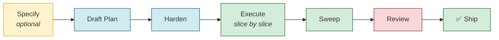

# How We Plan & Build

> **Purpose**: Overview of the planning and execution pipeline for this project.
> **Audience**: Developers and AI agents working on roadmap phases.

---

## The Pipeline

Every significant feature follows this flow:



### Key Files

| File | Purpose |
|------|---------|
| [AI-Plan-Hardening-Runbook.md](./AI-Plan-Hardening-Runbook.md) | Full runbook — prompts, templates, worked examples |
| [AI-Plan-Hardening-Runbook-Instructions.md](./AI-Plan-Hardening-Runbook-Instructions.md) | Step-by-step guide with copy-paste prompts |
| [DEPLOYMENT-ROADMAP.md](./DEPLOYMENT-ROADMAP.md) | Master tracker — all phases and status |

### Guardrail Integration

| Guardrail File | When It's Used |
|----------------|----------------|
| `.github/copilot-instructions.md` | Every agent session (loaded first) |
| `.github/instructions/architecture-principles.instructions.md` | Before any code change |
| `.github/instructions/project-profile.instructions.md` | Every session (project-specific quality standards — see CUSTOMIZATION.md) |
| `.github/instructions/*.instructions.md` | Domain-specific (loaded per-slice via Context Files) |
| `AGENTS.md` | When working with background services/workers |

### Agentic Capabilities

| Resource | Location | Purpose |
|----------|----------|---------|
| **Pipeline Prompts** (8) | `.github/prompts/step*.prompt.md` | Step-by-step pipeline workflow (Step 0–6 + Project Profile) |
| **Scaffolding Prompts** (14) | `.github/prompts/*.prompt.md` | Recipes for entities, services, tests, workers |
| **Pipeline Agents** (6) | `.github/agents/{specifier,preflight,plan-hardener,executor,reviewer-gate,shipper}.agent.md` | Click-through pipeline: Specify → Pre-flight → Plan → Execute → Review → Ship |
| **Reviewer Agents** (13) | `.github/agents/*.agent.md` | Specialized reviewers (security, architecture, API contracts, multi-tenancy, etc.) |
| **Skills** (8) | `.github/skills/*/SKILL.md` | Multi-step procedures (migrations, deploys, test sweeps, code review, etc.) |

> **AI Agent Discoverability**: Agents can list `.github/prompts/`, `.github/agents/`, and `.github/skills/` to discover all available capabilities. The `copilot-instructions.md` file catalogs everything. A `capabilities.json` file (if present) provides machine-readable discovery.

---

## Quick Start

1. **Specify your feature**: use `.github/prompts/step0-specify-feature.prompt.md` (or the Specifier agent)
2. **Add your phase** to `DEPLOYMENT-ROADMAP.md`
3. **Draft a plan** in `docs/plans/Phase-N-YOUR-FEATURE-PLAN.md`
4. **Execute automatically**: `pforge run-plan docs/plans/Phase-N-YOUR-PLAN.md` (Full Auto) or `--assisted` (interactive)
5. **Or use the manual pipeline** with prompts from `.github/prompts/step1-*.prompt.md` through `step6-*.prompt.md`
6. **Or use pipeline agents** — Specifier → Plan Hardener → Executor → Reviewer Gate → Shipper (handoff buttons)
7. **Monitor progress**: Dashboard at `localhost:3100/dashboard` (live slice cards, cost, session replay)
8. **Use scaffolding prompts** during execution for consistent code (`#file:.github/prompts/new-entity.prompt.md`)
9. **Run reviewer agents** for focused audits (`#file:.github/agents/security-reviewer.agent.md`)
10. **Update guardrails** after completion (new patterns → instruction files)

> **First time?** See [QUICKSTART-WALKTHROUGH.md](../QUICKSTART-WALKTHROUGH.md) for a hands-on tutorial.

See the [Instructions file](./AI-Plan-Hardening-Runbook-Instructions.md) for detailed copy-paste prompts.

---

## Plan Forge's Own Dev Plans Live On Another Branch

Plan Forge's own development uses the pipeline it ships, but those internal
`Phase-*-PLAN.md` files (active drafts, shipped phase records, internal
roadmaps, testbed findings) are **not** on `master`. They live on
[`planning/main`](https://github.com/srnichols/plan-forge/tree/planning/main/docs/plans)
so this template project's `master` stays clean for downstream users — what
you see in `docs/plans/` here is exactly what a consuming project gets.

| Branch | Contents | When |
|--------|----------|------|
| [`planning/main`](https://github.com/srnichols/plan-forge/tree/planning/main/docs/plans) | Active Plan Forge dev phases (`Phase-N-*-PLAN.md`), internal `DEPLOYMENT-ROADMAP.md`, cleanup findings, testbed findings | Current cycle (v3.x +) |
| [`planning/<topic>`](https://github.com/srnichols/plan-forge/branches/all?query=planning) | Short-lived topic branches forked off `planning/main` for in-flight DRAFTs | While DRAFT |
| [`archive/plans-v2.52.x`](https://github.com/srnichols/plan-forge/tree/archive/plans-v2.52.x/docs/plans) | 28 historical Phase files: CRUCIBLE-01..04, FORGE-SHOP-01..07 + ARC, TEMPER-01..07 + ARC, TESTBED-01..02 + ARC, HOTFIX-2.49.1 / 2.50.1, AUTO-UPDATE-01, SMITH-01 | v2.33 → v2.52.x |

To view a Plan Forge phase plan:

```bash
# Current cycle (v3.x +)
git show planning/main:docs/plans/Phase-39-AUDITOR-AUTOMATION-PLAN.md

# Or check the planning branch out locally
git fetch origin planning/main
git checkout planning/main -- docs/plans/

# Older cycles
git show archive/plans-v2.52.x:docs/plans/Phase-CRUCIBLE-01.md
```

> **Why this split?** See [CONTRIBUTING.md → Branch Model](../../CONTRIBUTING.md#branch-model) for the full rationale.

